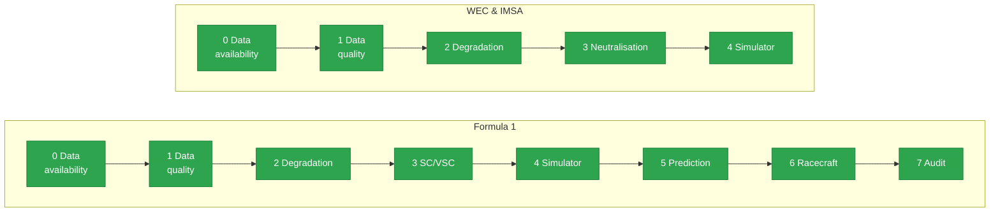

# motorsport-strategy-lab — Race Strategy Simulator & Decision Audit

<p align="center">
  
</p>

<p align="center">
  <a href="https://github.com/mohammedmedjadj/Motorsport-Strategy-Lab/actions/workflows/tests.yml"></a>
  <a href="LICENSE"></a>
  
  
  
</p>

<p align="center">
  <a href="reports/methodology.md">Methodology</a> ·
  <a href="#key-findings">Key Findings</a> ·
  <a href="reports/f1/audit_cases.md">Audit Cases</a> ·
  <a href="#setup">Installation</a> ·
  <a href="CONTRIBUTING.md">Contributing</a>
</p>

A motorsport race-strategy research project: a three-layer decision-support
system — tyre degradation model, safety-car probability model, Monte Carlo
strategy simulator — plus a retrospective audit that replays real strategy
calls through the simulator and checks what it would have recommended.

It started on **Formula 1** (via FastF1) and has since been extended to
**endurance racing, WEC and IMSA**, which FastF1 doesn't cover. Both series
needed a new ingestion path and their own fitted models, built to the same
standard as the F1 work: verified data availability, a cross-validated
degradation model, a Bayesian neutralisation model, a Monte Carlo simulator,
each with its own report and its own test suite.

**Status:** F1 is complete end to end (phases 0-7, including the audit and a
written methodology). WEC and IMSA cover the equivalent modelling phases
(0-4) but don't yet have an audit of real strategy calls or their own
methodology write-up — see the limitations under each series.
Jump to: [Formula 1](#formula-1) · [WEC](#wec) · [IMSA](#imsa) ·
[Methods](#mathematical-methods).

## Key Findings

> **Monaco's "guaranteed" safety car, measured rather than assumed —**
> **P = 0.44** [0.14, 0.77]. Only 3 of 7 editions since 2018 actually saw a
> Safety Car — notably less certain than the circuit's reputation suggests.
> ([`reports/f1/safety_car_phase3.md`](reports/f1/safety_car_phase3.md))

> **A caught bug: a degradation fit off by an order of magnitude —**
> **−0.53 s/lap, 13.9s RMSE → −0.0689 s/lap, 1.19s RMSE.** Road America
> 2024's first fit was nonsense: a field-wide standing-start effect on laps
> 2-3 was masquerading as tyre wear. Root-caused, fixed with a field-wide
> filter ahead of the per-car one, regression-tested against the real race.
> ([`reports/imsa/degradation_phase2.md`](reports/imsa/degradation_phase2.md))

> **What actually transfers across seasons — almost nothing, except one circuit —**
> **R² ≈ +0.21** at Bahrain (WEC), the one circuit in either series where a
> slope fit on two seasons predicts a third. Everywhere else checked, F1
> included, within-stint R² goes negative out of sample — the reason every
> coefficient in this project is carried as a distribution, never a point
> value. ([`reports/wec/degradation_phase2.md`](reports/wec/degradation_phase2.md))

## Why this project

Most public F1 data projects stop at "predict the pit-stop lap," a regression
that already exists in dozens of notebooks. Three things set this one apart:

1. Every output is a **distribution**, not a number. A pit window is a range
   of outcomes with probabilities attached, not a single best guess.
2. Tyre degradation and safety-car risk are modelled independently and then
   combined inside a **Monte Carlo simulator**, which is closer to how a
   strategy team actually reasons about a race than fitting one model to
   lap times and calling it done.
3. The results are checked against reality. Five documented race moments
   (a successful undercut, a missed one, a safety-car reshuffle) are replayed
   through the simulator and compared with what the strategists actually
   did — including the cases where the model disagrees with the outcome, or
   turns out to be wrong.

F1 data comes from [FastF1](https://github.com/theOehrly/Fast-F1); WEC and
IMSA data come from a community-maintained dataset (details under
[WEC](#wec) and [IMSA](#imsa)). Nothing is invented to fill a gap — if a
source doesn't have something, that's stated as a limitation, not patched
over.

## How it fits together




F1 runs the full pipeline through phase 7 (audit + written methodology); WEC
and IMSA currently stop at phase 4 (simulator) — see each series' own
"known limitations" for what an audit phase would need.

## Repository map

Each series is self-contained, but the two endurance series share code where
the underlying problem is genuinely the same:

```
src/degradation/   model.py (F1) | endurance.py + endurance_validation.py (WEC/IMSA, shared)
src/safety_car/    model.py (F1) | endurance.py (WEC/IMSA, shared)
src/simulator/      engine.py (F1) | endurance.py (WEC/IMSA, shared)
src/data/           F1 uses src/ingestion/ (FastF1); WEC/IMSA use base_loader.py + endurance_loader.py
data/derived/       f1/ | imsa/ | wec/ | endurance/ (cross-series neutralisation data)
reports/            f1/ | imsa/ | wec/ | methodology.md (F1 mini-paper)
```

WEC and IMSA share one loader and one degradation/neutralisation/simulator
module apiece, because both need the same three-way split — pit visit versus
tyre change versus driver stint — that FastF1's data model never forces on
the F1 side. What's never shared is the fitted numbers: coefficients,
posteriors, and simulator constants are always estimated per series, never
pooled.

---

## Formula 1

### Key results

Verstappen's real lap-17 covering stop at Barcelona 2024 (Case A) cost +3.2s
in median race time against the model's optimum, yet it held the highest
probability of being the best strategy (0.43) and the best odds of finishing
ahead of Norris (0.70) — a reminder that median race time alone mis-ranks
real decisions, which is exactly why the simulator's output is a distribution
rather than a single number.

At Singapore 2023 (Case C), the model calls Sainz's widely-praised safety-car
stop about 6.5 seconds "too early." That's not a bug so much as a known
blind spot made concrete: the simulator doesn't model the field bunching up
behind a safety car, and the audit turns that gap into a measured bias rather
than leaving it as a caveat.

Mercedes' Singapore 2023 VSC gamble (Case D) failed on track, but the model
says it was still the right bet — better expected time *and* better win
probability than staying out, regardless of how it played out that day.

Degradation slopes fitted on two seasons routinely fail to predict a third
season's stints — the within-stint R² frequently goes negative out of
sample — even though the identical pipeline scores 0.85 on synthetic data at
its noise floor. That's the reason every coefficient in this project is
carried as a distribution and never quoted as a point value. And on the
folklore side: Monaco's reputation for a "guaranteed" safety car holds up in
3 of 7 editions since 2018 (P = 0.44, credible interval [0.14, 0.77]) —
notably less certain than the reputation suggests.

Full numbers: [`reports/f1/`](reports/f1/), one report per phase.

### For the FastF1 community

Three pieces of this repo are meant to be reusable outside the project (see
`reports/methodology.md` for the fuller argument):

1. the flag-based cleaning layer (`src/ingestion/cleaning.py`), which keeps a
   per-reason count of every excluded lap instead of silently dropping rows;
2. the `TrackStatus` event extractor (`src/safety_car/dataset.py`), which
   maps SC/VSC/red-flag periods to race laps and guards against FastF1's
   fuzzy-matching silently substituting a cancelled event with the wrong one
   (`src/ingestion/loader.py`);
3. the measured circuit constants — pit losses, SC/VSC pace ratios — and the
   method used to recompute them from any race.

### System overview

| Layer                 | Module               | What it does                                                                                                  |
| --------------------- | -------------------- | ------------------------------------------------------------------------------------------------------------- |
| 1. Tyre degradation   | `src/degradation/` | Lap-time evolution vs tyre age, per compound and circuit                                                      |
| 2. Safety-car risk    | `src/safety_car/`  | SC/VSC deployment probability per circuit from`TrackStatus` history, with explicit uncertainty              |
| 3. Strategy simulator | `src/simulator/`   | Monte Carlo simulation combining layers 1-2 into a pit-window recommendation with a full outcome distribution |
| 4. Decision audit     | `src/audit/`       | Replays real race decision points and compares the model's call with what actually happened                   |

### Modelling extensions

Layered on top of the four core modules, each with its own tests and a
written justification in [`reports/f1/`](reports/f1/):

- **Vectorised Monte Carlo** — every draw evaluated in one broadcast pass
  instead of a Python loop; about 12x faster and bit-identical to the
  original per-draw results.
- **Optional quasi-Monte Carlo** (`simulate(..., sampler="qmc")`) — scrambled
  Sobol' sequences over the smooth part of the model. Cuts variance sharply
  when the underlying function is smooth, and is a measured no-op once
  safety-car jumps dominate — reported as such rather than oversold.
- **Multi-objective Pareto front** (`recommend.pareto_front`) — the exact set
  of non-dominated pit laps trading race time against track position, where
  the single-objective recommendation would otherwise collapse a real
  trade-off into one number.
- **Gaussian-process degradation** (`degradation.gp_model`) — a
  nonparametric check confirming the cross-season instability is a property
  of the data, not an artefact of assuming a polynomial shape.
- **Online Kalman filter** (`degradation.kalman`) — tracks the current tyre's
  degradation rate lap by lap, converging to the same answer as the
  retrospective fit while also catching a mid-stint change in wear rate.
- **Track-position value / overtaking difficulty** (`simulator.track_position`)
  — measured from real timing as the rate at which nose-to-tail cars swap order
  on green laps, per circuit. Monaco holds an adjacent rival with ~0.94
  probability over 15 laps vs ~0.57 at Barcelona. Unlike degradation it is
  **stable season to season** (it is track geometry), so it is a trustworthy
  circuit constant — and it is the racecraft primitive the adversarial rival
  model (next) is built on. See [`reports/f1/track_position.md`](reports/f1/track_position.md).
- **Adversarial rival**, for **all three series** (`simulator.adversarial` for
  F1, `simulator.adversarial_endurance` for WEC/IMSA, sharing one game-solving
  core) — the pit stop as a two-player game: the rival **reacts**, covering your
  undercut instead of following a frozen plan. Both cars run head-to-head lap by
  lap, the pit exchange is resolved, the lead locked in with the measured
  track-position stickiness, and the game solved (rival best-response,
  Stackelberg optimum). It quantifies what a frozen-rival simulator hides:
  in F1, assuming the rival won't cover overstates an undercut by ~8-9 points
  and the undercut is worth more at Monaco (sticky) than Barcelona (fluid); in
  endurance, the overstatement **scales with degradation** — up to ~0.44 at
  steep-wear Bahrain, ~0.08 at flat Watkins Glen. See
  [`reports/f1/adversarial_rival.md`](reports/f1/adversarial_rival.md) and the
  endurance simulator reports.
- **Inter-class traffic cost** (`simulator.traffic`, WEC/IMSA only —
  endurance's unique problem) — a prototype is forever lapping slower-class
  cars, and each one costs it time. Measured from the multi-class field by
  comparing start/finish crossing times (which solves the lapping problem
  without positions), now across **every in-scope season** (21 race-seasons,
  materialised reproducibly by `scripts/materialise_endurance_fields.py`) with a
  cross-season stability check: a HYPERCAR at Spa loses **~0.58 s/lap** in
  traffic vs clear air averaged over 2023-2025 (a single season swings 0.25-0.95
  — the earlier "+0.95" was Spa's steepest year alone), ~0.21 s per GT car
  directly ahead. Honestly non-uniform across circuits *and* seasons, with the
  spread now quantified rather than hidden. See the endurance simulator reports.
- **Multi-stop strategy**, WEC/IMSA (`simulator.multistop`) — the single-stop
  engine plans the *next* stop; a 6-24 h race needs 2-10. An exact dynamic
  program finds the minimum-time stop sequence under the hard fuel-tank
  constraint traded against tyre degradation, then runs it through the same
  neutralisation sampling for a full-race time distribution. The honest headline:
  **no measured endurance race is tyre-limited — every one is fuel-limited on
  stop count**, and the *break-even slope* says how much steeper degradation
  would have to be to change that (×4.3 at Bahrain, ×76 at Sebring). The measured
  traffic spread folds in here as calibrated, zero-mean race-time variance — it
  widens the uncertainty band without biasing which plan wins. See the endurance
  simulator reports.
- **Out-of-sample calibration**, for **all three series** (`src.prediction`) —
  the simulator prices every lap with a per-circuit Safety Car / Full Course
  Yellow probability; this asks whether those numbers actually *forecast*. Each
  race edition is left out, its probability formed from the other editions only,
  and graded with proper scoring rules (Brier, log-loss, Brier skill vs
  climatology). The honest answer: **per circuit they do not beat the base
  rate** — 6-8 F1 and 3-11 endurance editions are too few, so the point
  estimates are little more than the series rate. A built-in positive control
  (endurance FCY grouped by *series*, IMSA ~0.97 vs WEC ~0.73) does show clear
  skill, proving the harness detects real signal and rejects noise rather than
  always returning zero. A limitation the project measures about its own
  simulator. See [`reports/prediction/calibration.md`](reports/prediction/calibration.md).

### Data scope (MVP)

**Seasons 2023-2025** — the three most recent completed seasons, all inside
the 2022-2025 ground-effect regulation era so car and tyre behaviour stays
comparable across the set. 2022 itself is left out on purpose: early
ground-effect cars suffered porpoising that would add noise unrelated to
tyre wear, though it's a plausible robustness check for later.

**Four circuits, chosen to contrast the two things the system models:**

| Circuit             | Grand Prix   | Why it is in the set                                                                                                 |
| ------------------- | ------------ | -------------------------------------------------------------------------------------------------------------------- |
| Monaco              | Monaco GP    | Street circuit, among the highest historical SC rates, almost no overtaking — strategy is nearly all track position |
| Marina Bay          | Singapore GP | Street circuit with a near-100% historical SC rate — the hardest test for the SC-probability layer                  |
| Barcelona-Catalunya | Spanish GP   | Permanent circuit, low historical SC rate, high front-tyre stress — a clean read on the degradation layer           |
| Suzuka              | Japanese GP  | Permanent, high-load, low SC rate — contrasts with Barcelona on how degradation actually behaves                    |

Roughly a 2×2: high-SC/low-degradation street circuits against
low-SC/high-degradation permanent ones, which is precisely the trade-off the
simulator has to arbitrate between.

**Verified, not assumed.** The table in
[`reports/f1/data_availability_phase0.md`](reports/f1/data_availability_phase0.md),
generated by [`scripts/check_data_availability.py`](scripts/check_data_availability.py),
confirms real FastF1 loads (laps, track status, weather) for all 12
circuit-season combinations before the scope above was frozen. Any caveat
found along the way is listed there and restated in the methodology report's
limitations section.

### F1 phase plan & Definition of Done

Each phase stopped for explicit validation before the next one started.

| Phase                       | Deliverable                                      | Definition of Done                                                                                                                                                      |
| --------------------------- | ------------------------------------------------ | ----------------------------------------------------------------------------------------------------------------------------------------------------------------------- |
| 0. Setup & scoping          | Repo, environment, verified data scope           | All 12 candidate sessions load through FastF1 with laps,`TrackStatus`, and weather confirmed present                                                                  |
| 1. Ingestion pipeline       | `src/ingestion/` + tests + data quality report | One clean DataFrame per circuit-season; in/out laps and inaccurate laps handled; report states the % of laps excluded and why                                           |
| 2. Tyre degradation model   | `src/degradation/` + tests + figures           | Per-compound/per-circuit fits, cross-validated without mixing one race's laps across train/test; limitations (e.g. the fuel effect isn't fully isolated) stated plainly |
| 3. SC/VSC probability model | `src/safety_car/` + tests                      | Per-circuit probabilities with confidence intervals, and an explicit discussion of how much the small sample sizes limit them                                           |
| 4. Monte Carlo simulator    | `src/simulator/` + tests                       | Given a race state, produces a pit-window recommendation as an outcome distribution, seeded and reproducible                                                            |
| 5. Retrospective audit      | `reports/f1/audit_cases.md`                    | Real race moments replayed through the simulator, model vs. actual decision compared quantitatively, disagreements analysed honestly                                    |
| 6. Methodology report       | `reports/methodology.md`                       | Full write-up — motivation, method, results, limitations, future work — every number traceable to project output                                                      |
| 7. Packaging                | Final README, clean-clone check                  | Runs from a fresh clone; contribution ideas for the FastF1 community written up                                                                                         |

### F1 breadth layer — the whole calendar (Kaggle history)

The high-fidelity FastF1 model above is deep but four circuits. A complementary
**breadth layer** now fits the same net-slope degradation, pit loss and
reliability across the **whole F1 calendar** from a Kaggle per-lap export
(35 circuits, 2011-2024), trading compound/flag fidelity for coverage. Three
results worth naming:

- **Fuel/tyre confound solved, not just documented** (`degradation.f1_history`).
  Because F1 has had no refuelling since 2010, fuel mass is a whole-race function
  of the absolute lap while tyre age resets each stint, so a two-regressor fit
  **separates tyre wear from fuel burn** — impossible in endurance (every stop
  refuels). Isolated tyre wear is positive in **88%** of races.
- **Wet races are excluded via a real weather layer** (`weather.archive`,
  Open-Meteo) so a wet-to-dry track is never read as tyre wear.
- **Reliability / attrition** (`reliability.f1_reliability`) over 5 980 entries:
  permanent circuits finish better than street circuits, and the early hybrid
  era is the least reliable — both measured, not assumed.

See [`reports/f1/degradation_history.md`](reports/f1/degradation_history.md),
[`reports/f1/pit_loss_history.md`](reports/f1/pit_loss_history.md),
[`reports/f1/reliability.md`](reports/f1/reliability.md),
[`reports/f1/weather.md`](reports/f1/weather.md).

### F1 known limitations (stated up front)

- **Sample size for SC probability is structurally small** — about three
  usable races per circuit in the *FastF1 high-fidelity* window (the Kaggle
  breadth layer lifts degradation/pit-loss/reliability coverage to 35 circuits,
  but Kaggle carries no per-lap SC flag, so neutralisation calibration still
  needs FastF1). Wide intervals are reported as the honest answer.
- **Scrubbed (lightly-used) tyres** shift a stint's intercept, not its slope, so
  the degradation rate is unbiased by them; FastF1 handles them exactly via its
  `TyreLife` / `FreshTyre` columns.
- **Track evolution and traffic** are absorbed into the whole-race fuel/evolution
  term the breadth layer isolates; driver pace is a fixed effect.
- **2026 is walled off.** The new regulations (power unit, active aero + Manual
  Override Mode, lighter/narrower cars, less fuel, narrower tyres) are their own
  era; no pre-2026 fit transfers, and the Kaggle source stops at 2024.

---

## WEC

The World Endurance Championship needed its own ingestion path and its own
fitted models — FastF1 only covers Formula 1 — built to the same standard as
the F1 work above: verified data, a cross-validated degradation model, a
Bayesian neutralisation model, a Monte Carlo simulator.

### Data scope

**Four HYPERCAR circuits, two to three seasons each (2023-2025)** — the same
shape as the F1 scope, spanning short and long formats across three
continents:

| Circuit | Seasons          | Race | Why it is in the set                                                       |
| ------- | ---------------- | ---- | -------------------------------------------------------------------------- |
| Spa     | 2023, 2024, 2025 | 6h   | High-speed European circuit; the reference case for the whole build        |
| Fuji    | 2023, 2024, 2025 | 6h   | Different layout and climate from Spa                                      |
| Bahrain | 2023, 2024, 2025 | 8h   | The longest of the four scoped formats                                     |
| Imola   | 2024, 2025       | 6h   | HYPERCAR only started racing here in 2024 — checked directly, not assumed |

Le Mans 2024 was left out on purpose: the source holds only 43 HYPERCAR laps
for what should be a 300+ lap race, meaning the event is incomplete upstream.
Picking it anyway because it's the famous one would have poisoned every
model built on it — the same discipline that shaped the F1 scope in the
first place.

All 33 available HYPERCAR-class WEC races (2021-2026) went into the
neutralisation model, which wants as large a sample as it can get. The 11
race-seasons above (3+3+3+2) were the ones selected for degradation and
simulator work — as close to F1's 12 (four circuits, three seasons) as the
real calendar allows.

**What the verification caught before any model got built:** see
[`reports/wec/data_availability_phase0.md`](reports/wec/data_availability_phase0.md).
The source turned out to be one dataset covering IMSA, WEC, ELMS and ALMS
together, which made a separately-planned WEC API unnecessary. Two things had
to be caught early: the raw data mixes practice, qualifying and warm-up laps
in with race laps, and `stint_number` in the source means the *driver*
stint, not the tyre stint.

### System overview

| Layer                 | Module                                                                      | Key finding                                                                                                                                    |
| --------------------- | --------------------------------------------------------------------------- | ---------------------------------------------------------------------------------------------------------------------------------------------- |
| 0. Data               | `src/data/` (shared with IMSA)                                            | Pit visit, tyre change, and driver stint kept as three distinct signals rather than one                                                        |
| 1. Data quality       | [`reports/wec/data_quality_phase1.md`](reports/wec/data_quality_phase1.md) | 78.7% of raw laps kept across 11 race-seasons, mostly lost to neutralisation and ordinary traffic, not data gaps                               |
| 2. Tyre degradation   | `src/degradation/endurance.py`                                            | Bahrain's slope holds steady across three seasons (mean R² +0.21) — the one circuit, in either series, where degradation genuinely transfers |
| 3. Neutralisations    | `src/safety_car/endurance.py`                                             | A real Safety Car procedure exists alongside FCY and is used more often, at every scoped circuit (Spa: P=0.79 SC vs P=0.50 FCY)                |
| 4. Strategy simulator | `src/simulator/endurance.py`                                              | Both hazards sampled independently, F1's SC/VSC pattern; at Spa it's the fuel tank, not tyre wear, that ends up deciding the stop              |

Reports: [data availability](reports/wec/data_availability_phase0.md) ·
[data quality](reports/wec/data_quality_phase1.md) ·
[degradation](reports/wec/degradation_phase2.md) ·
[neutralisations](reports/wec/safety_car_phase3.md) ·
[simulator](reports/wec/simulator_phase4.md)

### Key results

Degradation slopes mostly don't transfer, whether the test holds out a
season or an entire circuit — with one real exception. Leave-one-season-out
per circuit (the same protocol as the F1 model) gives a near-zero or negative
mean R² at Spa (−0.006) and Imola (−0.042), and a modest positive one at Fuji
(+0.044). Bahrain breaks the pattern: its net slope sits in a tight
+0.042 to +0.049 s/lap band across three real seasons, and a pooled slope
explains around a fifth of a held-out season's within-stint variance every
time (mean R² +0.209) — the strongest transfer found anywhere in this
project, F1 included. A separate leave-one-circuit-out test, holding out an
entire track instead of a season, gives a negative mean R² (−0.012) with two
outright sign disagreements — a harder, different question with the same
broad answer.

A fuel/degradation split was attempted and abandoned once the data made
clear it wasn't identified: 84-99% of pit visits also change tyres, so the
two effects move together (correlation +0.95 to +1.00 after fixed effects)
at every circuit. Only the combined net slope is reported, gated behind a
`separable` flag that would flip on its own if a race with enough fuel-only
stops ever turned up.

Fuel is a binding constraint here in a way F1 never has to deal with. At Spa,
the tyres alone would want a stop near lap 106; the tank runs dry at lap 90,
and that's the boundary the simulator actually lands on — a regression test
pins the behaviour so it can't silently regress.

Pit loss varies by circuit about as much as it does in F1: Imola's 26.8s is a
third of Spa/Fuji/Bahrain's 63-81s, echoing the F1 project's own
Monaco-vs-Singapore contrast (19.1s vs 27.3s).

Building the leave-one-season-out analysis also surfaced a genuine
data-quality bug — a field-wide standing-start effect mislabelled "green" in
the source, which distorted one IMSA race's fit before a new trim caught it.
See [IMSA&#39;s key results](#imsa) for the full account; the fix changes WEC's
numbers too, most visibly at Imola.

### WEC phase plan & Definition of Done

| Phase                | Deliverable                                                                                                                     | Definition of Done                                                                                                                                                                 |
| -------------------- | ------------------------------------------------------------------------------------------------------------------------------- | ---------------------------------------------------------------------------------------------------------------------------------------------------------------------------------- |
| 0. Data availability | [`reports/wec/data_availability_phase0.md`](reports/wec/data_availability_phase0.md)                                           | Source verified by direct query; scope frozen at 4 circuits, 2-3 seasons each; both verification traps documented and regression-tested                                            |
| 1. Data quality      | [`reports/wec/data_quality_phase1.md`](reports/wec/data_quality_phase1.md)                                                     | Lap-level accounting for all 11 race-seasons, stage by stage, mirroring the F1 quality report                                                                                      |
| 2. Degradation       | [`reports/wec/degradation_phase2.md`](reports/wec/degradation_phase2.md) + `src/degradation/endurance_validation.py` + tests | Net slope per circuit-season with CIs; leave-one-season-out and leave-one-circuit-out both run and clearly distinguished; the fuel/degradation split reported only as a diagnostic |
| 3. Neutralisations   | [`reports/wec/safety_car_phase3.md`](reports/wec/safety_car_phase3.md) + tests                                                 | Per-circuit and series-wide Beta-Binomial/Gamma-Poisson posteriors on 33 races; SC and FCY told apart empirically, not assumed                                                     |
| 4. Simulator         | [`reports/wec/simulator_phase4.md`](reports/wec/simulator_phase4.md) + tests                                                   | Both neutralisation kinds modelled, fuel-range constraint enforced, one demo scenario per circuit, reproducible                                                                    |

### WEC known limitations

- No tyre compound survives in the source, so degradation is a single net
  slope rather than the per-compound curve F1 fits.
- SC and FCY are modelled as independent hazards, though in reality an FCY
  can escalate into an SC — the same caveat the F1 model states for its own
  SC/VSC pair.
- No rivals, no track position, and no driver-stint regulatory constraints
  (WEC requires three drivers minimum) in the simulator.
- Imola has only two seasons of HYPERCAR data, one fewer than the other
  three scoped circuits, so its leave-one-season-out result rests on a
  single fold in each direction.
- Imola's negative degradation slope and noticeably wider RMSE are reported
  as measured, not explained away.
- A **retrospective audit of real winners now exists** for both endurance
  series ([`reports/endurance_audit.md`](reports/endurance_audit.md)): 49 of 61
  scoped-race winners ran fuel-limited stints (WEC 25/28, IMSA 24/33),
  corroborating the multi-stop model's headline — that no scoped race is
  tyre-limited on stop count, which holds 21/21 circuits — against what teams
  actually did; the exceptions plausibly reflect neutralisation-shortened
  stints. A per-decision replay like
  F1's remains a natural next step.

---

## IMSA

The IMSA WeatherTech SportsCar Championship needed the same treatment as
WEC — FastF1 doesn't cover it either. IMSA shares its loader and model code
with WEC (`src/data/endurance_loader.py`, `src/degradation/endurance.py`,
`src/safety_car/endurance.py`, `src/simulator/endurance.py`), since both
series face the same pit-visit/tyre-change/driver-stint distinction, but
every number below comes from IMSA's own data and is never pooled with
WEC's.

### Data scope

**Four GTP circuits, one to three seasons each (2023-2025)**, chosen to span
sprint and endurance formats:

| Circuit      | Seasons             | Race length   | Why it is in the set                                                       |
| ------------ | ------------------- | ------------- | -------------------------------------------------------------------------- |
| Watkins Glen | 2023, 2024, 2025    | 364 min       | Mid-length road course; the reference case for the whole build             |
| Sebring      | 2023, 2024, 2025    | 723 min (12h) | The longest of the four scoped formats                                     |
| Mosport      | **2023 only** | 162 min       | GTP, the current top prototype class, raced here only in 2023 — see below |
| Road America | 2023, 2024, 2025    | 163 min       | Short sprint; surfaced a real data-quality bug, covered below              |

96 GTP-class races are available across IMSA 2021-2026 in total, and all went
into the neutralisation model. The 10 race-seasons above (3+3+1+3) were
selected for degradation and simulator work.

Mosport's single season isn't a gap in this pipeline — it's a verified fact
about the calendar. Checked directly against the source: Mosport ran DPi
(GTP's predecessor class) in 2022 and GTD/GTDPRO/LMP2 in 2024-2025, but no
GTP entry outside 2023. It's the IMSA equivalent of the COVID-era calendar
gaps already documented on the F1 side.

**What the verification caught:** see
[`reports/imsa/data_availability_phase0.md`](reports/imsa/data_availability_phase0.md).
Beyond the mixed-session and driver-stint traps shared with WEC (the #01 GTP
car made 13 pit visits across only 4 driver stints at Watkins Glen — the gap
is fuel-only stops), an earlier draft of that report claimed IMSA "ships no
weather" as a fact about the whole series, based on a single race. With four
races on hand, the truth turned out to be race-specific: two circuits have
full weather coverage, two have none.

### System overview

| Layer                 | Module                                                                        | Key finding                                                                                                                           |
| --------------------- | ----------------------------------------------------------------------------- | ------------------------------------------------------------------------------------------------------------------------------------- |
| 0. Data               | `src/data/` (shared with WEC)                                               | Pit visit, tyre change, and driver stint kept as three distinct signals rather than one                                               |
| 1. Data quality       | [`reports/imsa/data_quality_phase1.md`](reports/imsa/data_quality_phase1.md) | 69.1% of raw laps kept across 10 race-seasons; Road America 2024 alone accounts for most of the cars dropped outright                 |
| 2. Tyre degradation   | `src/degradation/endurance.py`                                              | Leave-one-season-out shows near-zero transfer at every circuit; Road America is significantly negative in all three of its editions   |
| 3. Neutralisations    | `src/safety_car/endurance.py`                                               | Full Course Yellow in 90-93% of races at every scoped circuit; zero Safety Car events across 63 races — genuinely different from WEC |
| 4. Strategy simulator | `src/simulator/endurance.py`                                                | Confidence tracks the degradation signal directly: decisive at Road America, honestly flat (under 2s spread) at Mosport               |

Reports: [data availability](reports/imsa/data_availability_phase0.md) ·
[data quality](reports/imsa/data_quality_phase1.md) ·
[degradation](reports/imsa/degradation_phase2.md) ·
[neutralisations](reports/imsa/safety_car_phase3.md) ·
[simulator](reports/imsa/simulator_phase4.md)

### Key results

Degradation slopes don't transfer here either, whether the test holds out a
season or a whole circuit. Leave-one-season-out per circuit — the exact F1
protocol, run on three real seasons at Watkins Glen, Sebring, and Road
America — gives mean within-stint R² of −0.011, −0.001, and +0.005: no
better than a flat line, sometimes worse. A separate leave-one-circuit-out
test lands at +0.002. Two different, both harder-than-they-look questions,
and the same answer from each: this project's central finding about
degradation instability isn't a quirk of Formula 1, since it shows up
independently in a second series tested two different ways.

A fuel/degradation split was tried here too, and rejected for the same
reason as WEC: 85-100% of pit visits also change tyres, leaving fuel and
tyre age correlated +0.83 to +1.00 after fixed effects at every circuit.
Only the net slope is reported.

Building the leave-one-season-out analysis surfaced a real bug. Road America
2024's first fit produced a nonsense slope of −0.53 s/lap with a 13.9-second
RMSE — an order of magnitude off every other race. The cause: laps 2 and 3 of
that 62-lap sprint are a field-wide standing-start effect, every car running
at roughly twice its normal pace, flagged "green" in the source data. The
existing per-car traffic trim couldn't catch it, because in such a short race
the anomaly compromises too large a share of each car's own laps and inflates
that car's own cutoff right along with it. The fix adds a field-wide filter
that runs before the per-car one (`src/degradation/endurance.py`), and it's
regression-tested against both a synthetic case and the real race.

IMSA and WEC turn out not to be interchangeable at all. An IMSA race is
almost certain to see a Full Course Yellow (P = 0.96 series-wide, and every
scoped circuit individually sits at 90-93%), and IMSA has never shown a
Safety Car in 63 races — while WEC prefers the Safety Car over FCY at every
one of its own scoped circuits.

The simulator's confidence follows the strength of the underlying signal
rather than defaulting to some fixed level of certainty: Road America, the
one circuit with a statistically significant slope in every season checked,
gives the most decisive recommendation of the four; Mosport, whose slope
covers zero, spreads under two seconds across every candidate pit lap and
says so rather than picking a winner anyway.

### IMSA phase plan & Definition of Done

| Phase                | Deliverable                                                                                                                       | Definition of Done                                                                                                                                                                 |
| -------------------- | --------------------------------------------------------------------------------------------------------------------------------- | ---------------------------------------------------------------------------------------------------------------------------------------------------------------------------------- |
| 0. Data availability | [`reports/imsa/data_availability_phase0.md`](reports/imsa/data_availability_phase0.md)                                           | Source verified by direct query; scope frozen at 4 circuits, 1-3 seasons each; both verification traps documented and regression-tested                                            |
| 1. Data quality      | [`reports/imsa/data_quality_phase1.md`](reports/imsa/data_quality_phase1.md)                                                     | Lap-level accounting for all 10 race-seasons, stage by stage, mirroring the F1 quality report                                                                                      |
| 2. Degradation       | [`reports/imsa/degradation_phase2.md`](reports/imsa/degradation_phase2.md) + `src/degradation/endurance_validation.py` + tests | Net slope per circuit-season with CIs; leave-one-season-out and leave-one-circuit-out both run and clearly distinguished; the fuel/degradation split reported only as a diagnostic |
| 3. Neutralisations   | [`reports/imsa/safety_car_phase3.md`](reports/imsa/safety_car_phase3.md) + tests                                                 | Per-circuit and series-wide Beta-Binomial/Gamma-Poisson posteriors on 63 races; the zero-Safety-Car case handled by the Jeffreys prior rather than hard-coded                      |
| 4. Simulator         | [`reports/imsa/simulator_phase4.md`](reports/imsa/simulator_phase4.md) + tests                                                   | Fuel-range constraint enforced, one demo scenario per circuit, reproducible                                                                                                        |

### IMSA known limitations

- Mosport has only one season of GTP data — a verified calendar fact, not a
  gap in this pipeline (see Data scope above) — so it has no
  leave-one-season-out result; the simulator's Mosport demo still runs on its
  single available fit.
- No tyre compound survives in the source, so degradation is a single net
  slope rather than a per-compound curve.
- No rivals, no track position, and no driver-stint regulatory constraints in
  the simulator; IMSA is heavily multi-class (GTP/GTD/GTDPRO/LMP2/LMP3), and
  a two-car rival abstraction wouldn't represent that honestly.
- Road America's negative degradation slope is reported as measured, a
  genuine open question rather than something smoothed over.
- A **retrospective audit of real winners now exists** across IMSA and WEC
  ([`reports/endurance_audit.md`](reports/endurance_audit.md)) — real winning
  stint lengths versus each circuit's fuel range. A per-decision replay like
  F1's remains a natural next step.

---

## Engineering rules (all three series)

- **No fabricated data.** Anything a source doesn't provide is documented as
  unavailable, never estimated silently.
- **No data leakage.** The decision models only ever use information that
  was knowable at the simulated moment of the race.
- **Uncertainty is first-class.** Every probability and recommendation ships
  with an interval or a distribution, never a bare point estimate.
- **Reproducibility.** Fixed seeds for all stochastic code, pinned dependency
  versions (`requirements.lock`), FastF1 cache enabled for F1; WEC and IMSA
  races are committed as derived CSVs so their tests run fully offline.
- **Tested.** `pytest` covers ingestion parsing and cleaning, degradation
  model non-regression, and simulator physical-consistency invariants, for
  all three series.
- **Typed and documented.** Docstrings and type hints throughout `src/`.
- **Nothing is pooled across series.** F1, WEC, and IMSA each get their own
  fitted coefficients, posteriors, and simulator constants; only the
  estimator code — and, for WEC/IMSA, the data schema — is shared.

## Repository structure

```
motorsport-strategy-lab/
  data/
    cache/              # FastF1 cache (gitignored)
    derived/
      f1/               # F1 derived laps, track status, sessions, model coefficients
      imsa/             # IMSA derived laps: 10 circuits, 33 race-seasons
      wec/              # WEC derived laps: 11 circuits, 28 race-seasons
      endurance/         # cross-series neutralisation flags (96 races, both series)
  src/
    ingestion/          # FastF1 loading, cleaning, validation (F1 only)
    data/               # multi-series loader interface + IMSA/WEC loader (shared)
    degradation/        # model.py (F1, OLS + LORO CV), gp_model.py, kalman.py;
                        #   endurance.py + endurance_validation.py (WEC/IMSA, shared)
    safety_car/         # model.py (F1 SC/VSC); endurance.py (WEC FCY+SC, IMSA FCY)
    simulator/          # engine.py (F1, vectorised + optional Sobol QMC),
                        #   recommend.py (Pareto front); endurance.py (WEC/IMSA)
    audit/              # F1 retrospective audit scripts
  notebooks/            # kaggle_demo.ipynb -- validated end-to-end demo,
                        #   published to Kaggle; never the source of truth
                        #   for a reported number, which always lives in
                        #   reports/ + the pytest artifact drift guards
  scripts/              # run_ingestion.py, run_degradation.py, run_safety_car.py,
                        #   run_simulator_demo.py (F1); run_endurance_flags.py +
                        #   run_endurance_models.py (WEC/IMSA data + model
                        #   artifacts); demo_extensions.py; generate_banner.py
  tests/                # pytest, all three series, 140+ tests
  reports/
    f1/                 # phase 0-4 reports, audit cases, figures
    imsa/               # phase 0-4 reports
    wec/                # phase 0-4 reports
    methodology.md      # F1 mini-paper
  assets/               # banner.png/svg, social-preview.png, fonts/ (OFL-licensed)
  .github/
    workflows/          # tests.yml, post-race-refresh.yml
    ISSUE_TEMPLATE/      # bug report + feature request
  README.md
  LICENSE               # CC BY-NC-SA 4.0
  CONTRIBUTING.md
  CITATION.cff
  pyproject.toml
  requirements.txt      # top-level deps; requirements.lock pins exact versions
```

## Setup

```bash
git clone <repo-url>
cd motorsport-strategy-lab
python -m venv .venv
.venv/Scripts/activate          # Windows; use .venv/bin/activate on Unix
pip install -r requirements.txt # or requirements.lock for exact pins
python scripts/check_data_availability.py   # populates the FastF1 cache (F1 only)
pytest
```

The first F1 run downloads several hundred MB into `data/cache/` (gitignored)
and is served from cache after that. WEC and IMSA races are already committed
as derived CSVs (`data/derived/wec/`, `data/derived/imsa/`), so their tests
run fully offline with no extra setup; `scripts/run_endurance_flags.py`
re-pulls the neutralisation dataset only if you want to refresh it.

## Automated post-race refresh

`.github/workflows/post-race-refresh.yml` re-runs the full F1 pipeline
(ingest → degradation → safety car → simulator → audit) on a schedule
(Mondays, after a race weekend) and on manual dispatch, gates the result
behind the test suite, and commits the regenerated artifacts **only when they
actually change** — figures excluded, since matplotlib's PNG timestamps would
otherwise diff on every run.

There is an honest tension worth naming: the rest of this project is built on
*reproducibility* — a frozen data scope, deterministic outputs, tests that
assert exact numbers. A live-refresh pipeline pulls the other way. So the
workflow is deliberately a **no-op until the scope moves forward**: over the
frozen `SEASONS` in `src/ingestion/config.py` the pipeline regenerates
byte-identical output and commits nothing. It starts producing real,
calendar-aligned commits once a new season enters scope (make `SEASONS`
include the live year to enable that). The WEC/IMSA side is intentionally left
out of the automation: its reports and several tests are pinned to exact race
counts, so an automatic data pull would fail the workflow's own test gate by
design — refreshing endurance data stays a manual, reviewed step.

## Mathematical methods

The three layers lean on a specific, deliberately chosen set of techniques
rather than a single off-the-shelf model:

**Degradation — fixed-effects linear regression.** Lap time is decomposed as
`a_{driver,race} + fuel_slope × lap_number + degradation(tyre_age)`, fit by
ordinary least squares via `numpy.linalg.lstsq`, with one dummy-variable
intercept per driver-race pair absorbing car pace, driver pace, and track
conditions that would otherwise confound the tyre-age effect. Standard errors
come from the classical homoscedastic formula, and a Moore-Penrose
pseudoinverse handles the rank-deficient cases (a driver-race seen on only
one tyre compound, for instance). The degree of the tyre-age polynomial
(linear or quadratic) is chosen per circuit by leave-one-race-out
cross-validation, scored on the *within-stint*, demeaned residual — because a
driver-race intercept fit on training data cannot be observed on a held-out
race, comparing raw lap times would silently leak information. Two robustness
checks sit alongside the OLS model: a Gaussian-process regression (RBF
kernel, hyperparameters fit by maximising the log marginal likelihood via
Cholesky factorisation) shows the polynomial assumption isn't the source of
the instability, and a Kalman filter (a local-linear-trend state-space model,
run lap by lap) tracks degradation online instead of retrospectively.

**Safety-car and neutralisation risk — conjugate Bayesian models.** Two
questions, two matching distributions: whether a race sees at least one
deployment is a **Beta-Binomial** (posterior mean `(k+0.5)/(n+1)` under a
Jeffreys prior), and the deployment rate per lap is a **Gamma-Poisson**, also
Jeffreys. With as few as three to eight editions of a circuit, a frequentist
point estimate would be false precision; the conjugate posterior gives an
exact credible interval instead, and a circuit that has never seen a safety
car still gets a small, non-zero, honestly wide probability rather than a
hard zero.

**The strategy simulator — Monte Carlo with variance reduction and exact
Pareto search.** Each candidate pit lap is evaluated over thousands of
simulated race continuations, with every source of uncertainty resampled
per draw: degradation and fuel coefficients from their confidence intervals,
neutralisation hazards from their Gamma posteriors, lap noise at the
cross-validated residual scale. Candidates share the same random draws
(common random numbers), so the comparison between two pit laps isn't
polluted by unrelated noise. An optional sampler replaces the i.i.d. draws
with a scrambled Sobol' low-discrepancy sequence, mapped to the model's
Normal marginals by the inverse CDF — a form of randomised quasi-Monte Carlo
that cuts estimator variance sharply when the underlying function is smooth,
and is honestly reported as a no-op when a jump process (a safety car) is
what actually drives the variance. Where a decision genuinely trades off two
objectives — race time against track position — the engine returns the exact
Pareto front by pairwise non-dominance rather than collapsing to one number;
on a small discrete grid of candidate laps this is exact, so a metaheuristic
like NSGA-II would buy nothing.

## License & attribution

This repository — code, derived data, reports and notebooks — is released
under **CC BY-NC-SA 4.0** (Attribution-NonCommercial-ShareAlike) — see
[`LICENSE`](LICENSE). Copyright Mohammed Reda Medjadj, 2026. In short: reuse
and adaptation are welcome with credit, but not for commercial purposes, and
any derivative must carry the same license. (This project was MIT-licensed
earlier; MIT's permissive terms allowed unattributed commercial reuse, which
no longer matches the intent now that the work is published more widely —
CC BY-NC-SA keeps it open for research and learning while requiring
attribution and blocking commercial appropriation.)

F1 data is accessed through [FastF1](https://github.com/theOehrly/Fast-F1),
which sources official Formula 1 live-timing data; this project is
unaffiliated with Formula 1, the FIA, or any team. WEC and IMSA data are
accessed through a community-maintained dataset
(`hf://datasets/tobil/imsa/imsa.duckdb`, maintained by "tobil" on Hugging
Face and itself released under the MIT License); this project is
unaffiliated with IMSA, the FIA World Endurance Championship, or any
competing team. All data is used for independent research and analysis; no
proprietary or non-public information is used anywhere in this project.
FastF1 and the upstream WEC/IMSA dataset remain under their own MIT terms;
this license applies to this project's own code, models, and derived
output.
