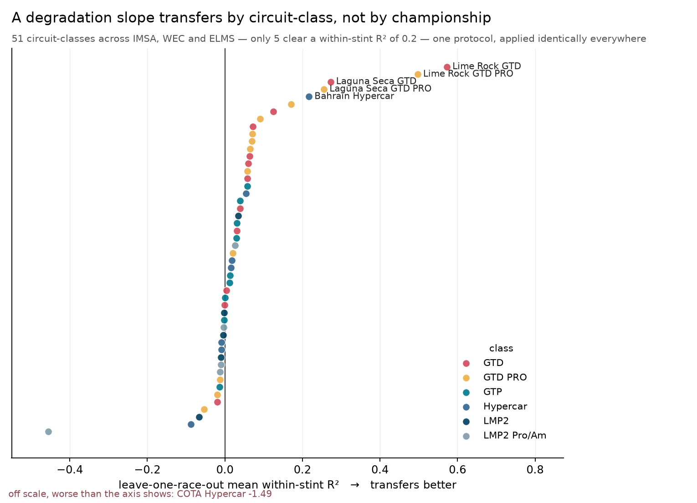
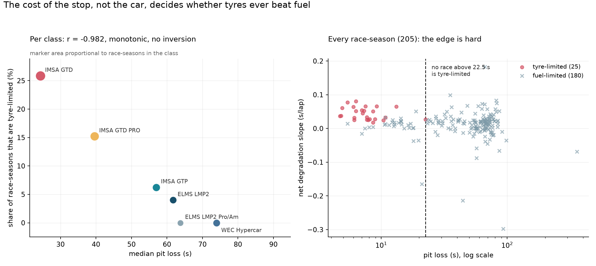
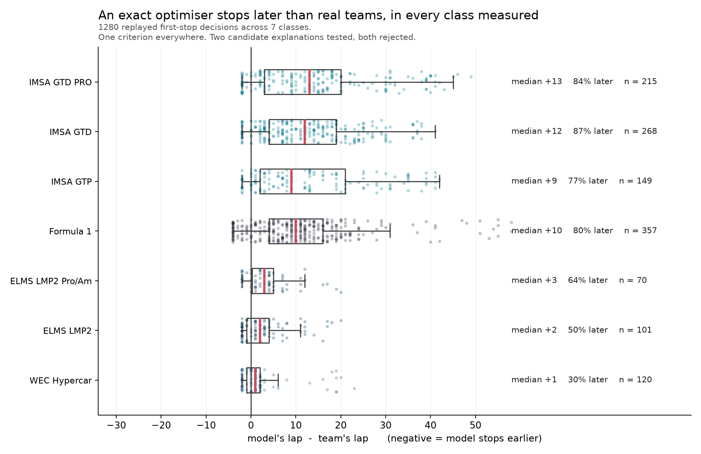

# Motorsport Strategy Lab

**Race strategy across four championships** — by Mohammed Reda Medjadj

<p align="center">
  
</p>

<p align="center">
  <a href="https://github.com/mohammedmedjadj/Motorsport-Strategy-Lab/actions/workflows/tests.yml"></a>
  <a href="LICENSE"></a>
  
  
  
</p>

<p align="center">
  <a href="https://mohammedmedjadj.github.io/Motorsport-Strategy-Lab/">Website</a> ·
  <a href="paper/main.tex">Paper</a> ·
  <a href="docs/full-readme.md">Full documentation</a> ·
  <a href="reports/">94 reports</a> ·
  <a href="outreach/">Open questions</a>
</p>

Fitted tyre degradation, Bayesian neutralisation risk, measured pit loss and
track position, an exact multi-stop dynamic program and a Monte Carlo engine —
applied to Formula 1, WEC, IMSA and ELMS under one protocol, across seven car
classes. Then 1,280 real pit-stop decisions replayed against all of it, three
rule-of-thumb baselines scored on the same decisions, and confidence intervals
on every headline.

Two of the three results are negative. The third is measured and unexplained,
after both candidate explanations were proposed here and tested here, and both
failed.

---

## Three results

<table>
<tr>
<td width="33%"></td>
<td width="33%"></td>
<td width="33%"></td>
</tr>
<tr>
<td valign="top"><b>Transfer belongs to the circuit-class, not the championship.</b> 51 circuit-classes, one protocol. GT3 at Lime Rock reaches R² <b>+0.573</b>; only 5 clear 0.2. Difference GT3 − prototype <b>+0.164</b> [+0.059, +0.312], permutation p = 0.0009. The near-spec control (ELMS LMP2 — one chassis, one engine, no BoP) fails too, so the instability is not the hardware.</td>
<td valign="top"><b>The cost of the stop sets the strategy regime, not the car.</b> Across 205 race-seasons: <b>r = −0.982</b> [−0.986, −0.745], monotonic, no inversion. 150 race-seasons above a 22.5 s pit loss contain no tyre-limited race at all. That edge is a maximum set by one race, so quote the rule and treat the number as an order of magnitude.</td>
<td valign="top"><b>An exact optimiser stops later than teams do, and nobody knows why.</b> 1,280 replayed first stops, seven classes, one criterion. Median +12 laps in IMSA GTD, +10 in F1. Track position: tested, rejected. Slope bias: tested, not detected.</td>
</tr>
</table>

**And a rule of thumb sits closer to real practice in 5 of the 7 classes.**

| class | optimiser | B1 interval | B2 threshold | B3 fuel |
|---|---|---|---|---|
| Formula 1 | 10 | 11 | **7** | — |
| IMSA GTP | 9 | 9 | 54 | 14 |
| IMSA GTD | 12 | **7** | 18 | 14 |
| IMSA GTD PRO | 12 | **9** | 33 | 15 |
| WEC Hypercar | 2 | 2 | 39 | **1** |
| ELMS LMP2 | **2** | 3 | 45 | 4 |
| ELMS LMP2 Pro/Am | 3 | **2** | 45 | 4 |

Median absolute lap error against the real stop, on 1,263 of the audit's 1,280
decisions. B1 wins four of these and uses no fitted quantity at all, only the
race length and the number of stops the tank forces.

Closer to what teams did is not the same as better. Everything here scores
agreement with practice, never which plan was faster. What it settles is
narrower: the 12-lap gap cannot come from the simpler methods lacking
information the optimiser has, because they have less and land nearer.

## Quick start

Everything except two Kaggle-fed layers runs offline from the clone. No API key,
no account, no download.

```bash
git clone https://github.com/mohammedmedjadj/Motorsport-Strategy-Lab.git
cd Motorsport-Strategy-Lab && pip install -r requirements.txt
python scripts/run_baseline_comparison.py
```

That replays 1,263 real decisions and prints the table above. About a minute.

```bash
python scripts/run_formal_tests.py       # intervals on every headline result
python scripts/make_headline_figures.py  # the three figures above
streamlit run demo/app.py                # after pip install -r demo/requirements.txt
```

Seven panels, one per modelled class, running the same simulator and the same
fitted models the reports use. To host it:
[`deploy/huggingface/`](deploy/huggingface/README.md).

## What underwrites it

No fabricated data anywhere. Every quantity is measured from published timing or
absent, and where a source lacks something that is a stated limitation rather
than a patched gap. Standard errors are cluster-robust throughout, on the
driver-race, referred to t(G−1).

Two estimators were built for this work, validated on synthetic races, and then
withdrawn when they failed on real fields. Both withdrawals are written up.

Every artifact derived from committed data is regenerated in CI, which fails on
any difference between the working tree and the repository — including files a
generator wrote that were never committed, a blind spot that once allowed three
weeks of silent drift. The paper contains no numbers of its own: every quantity
is a macro generated from the artifacts, so the manuscript cannot drift from the
data.

461 tests, including one file whose only job is to recompute each published
headline and assert the result appears in the document publishing it.

## Where the evidence is thin

Stated here rather than left for a reviewer to find. The full list is in
[`reports/cross_series/thin_evidence.md`](reports/cross_series/thin_evidence.md).

The 22.5 s cheap-stop threshold is a maximum set by a single race; drop that race
and it moves to 13.2 s. Lime Rock GTD PRO's +0.497 transfer score is the mean of
two folds that run from +0.357 to +0.638. The 14-fold track-position range has
three races behind its high end, at a circuit first run in 2023. And the
audit's central finding may not be a fair comparison at all: the model is offered
every remaining lap while a pit wall chooses among a handful inside a plan it has
already committed to. Testing that means changing the audit rather than the
model, and it is the first of the
[three questions](outreach/questions.md) this project would most like answered.

## Where it sits in the literature

There is a real body of work here, from Bekker and Lotz in 2009 through
Heilmeier's group at TUM, dynamic-programming treatments by Carrasco Heine and
Thraves, a Stackelberg formulation by Aguad and Thraves, and a recent wave of
learning-based approaches. Twelve papers, verified against their publication
records, are catalogued in
[`reports/cross_series/related_work.md`](reports/cross_series/related_work.md).

The modelling here is simpler than most of them. What that literature does not
do is validate: almost nobody tests whether the fitted parameters predict a
season they were not fitted to, and nobody confronts the optimiser with what
teams actually did at scale. The contribution is the validation, not the
machinery.

## Repository

```
src/          degradation, safety_car, simulator, audit, stats, weather, reporting
scripts/      one per pipeline stage; run_*.py write artifacts, make_*.py write figures
data/derived/ every committed artifact, one directory per series
reports/      94 documents, one branch per class, plus figures/ and cross_series/
paper/        main.tex (no digits) + numbers.tex (generated)
docs/         the website, and the long README
outreach/     one-pager, three methodological questions, a ready-to-file FastF1 issue
demo/         Streamlit app over the real simulators, driven headlessly by tests
```

Detail on any of it: [`docs/full-readme.md`](docs/full-readme.md).

## Data and licence

Formula 1 timing from [FastF1](https://github.com/theOehrly/Fast-F1). Endurance
timing from a community-maintained dataset. Weather from Open-Meteo. Two layers
read a third-party export this repository does not redistribute, described in
[`data/external/README.md`](data/external/README.md).

Released under CC BY-NC-SA 4.0. Citation details in
[`CITATION.cff`](CITATION.cff).
