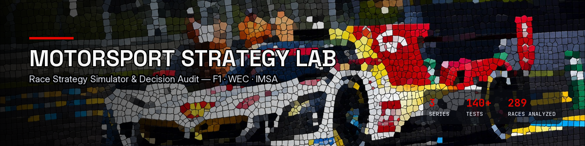
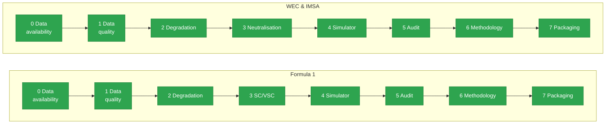

# Motorsport Strategy Lab — Race Strategy Simulator & Decision Audit (by Mohammed Reda Medjadj) (not the final version at all)

<p align="center">
  
</p>

<p align="center">
  <a href="https://github.com/mohammedmedjadj/Motorsport-Strategy-Lab/actions/workflows/tests.yml"></a>
  <a href="LICENSE"></a>
  
  
  
</p>

<p align="center">
  <a href="reports/f1/methodology.md">Methodology</a> ·
  <a href="#key-findings-across-all-four-series">Key Findings</a> ·
  <a href="reports/f1/audit_cases.md">Audit Cases</a> ·
  <a href="#the-interactive-demo">Live Demo</a> ·
  <a href="#setup">Installation</a> ·
  <a href="CONTRIBUTING.md">Contributing</a>
</p>

A motorsport race and strategy research project: a three-layer decision-support
system — tyre degradation model, safety-car probability model, Monte Carlo
strategy simulator — plus a retrospective audit that replays real strategy
calls through the simulator and checks what it would have recommended.

It started on **Formula 1** (via FastF1) and has since been extended to
**endurance racing, WEC and IMSA**, which FastF1 doesn't cover. Both series
needed a new ingestion path and their own fitted models, built to the same
standard as the F1 work: verified data availability, a cross-validated
degradation model, a Bayesian neutralisation model, a Monte Carlo simulator,
each with its own report and its own test suite.

A fourth series, [**ELMS**](#elms), is now modelled — both LMP2 classes scoped
separately ([methodology](reports/elms/methodology.md) ·
[phase 0](reports/elms/data_availability_phase0.md) ·
[results](reports/elms/results.md) ·
[crew-rating](reports/elms/crew_rating_findings.md)).

It was not added for breadth. It settled a question this project had carried
since its F1 phase: degradation slopes that fail to transfer between seasons
are **not** an artefact of BoP-adjusted manufacturer prototypes. ELMS's LMP2 is
near-spec — same chassis and engine for everyone — and its slopes fail to
transfer just as badly, every leave-one-race-out R² at or below zero. Whatever
drives the instability, it is not the car.

It also gives the amateur-driver question a second, independent test, and the
two **disagree in sign**: IMSA's GT3 comparison finds Pro/Am crews steeper by
+0.0040 s/lap, ELMS's finds them *shallower* by −0.0053, and neither survives
its own robustness checks. The simple "amateurs degrade tyres faster"
hypothesis is not supported. ALMS was examined and declined, with its reason
recorded.

The strongest result the fourth series bought is cross-series and could not
have been found in any one of them:
[**when tyres beat fuel**](reports/cross_series/when_tyres_beat_fuel.md) — an extra pit
stop is worth its cost only where the stop is *cheap* (no entry above 22.5 s
pit loss is tyre-limited in 205 race-seasons, p = 1.1e-14) **and** the
tyre is genuinely going away (p = 0.0013 among cheap-stop entries). Condition
on stop cost and the car class stops mattering — GT3 dominated the earlier,
narrower version of this finding only because GT3 racing is where cheap stops
are common.

A defect the same widening exposed, diagnosed and **not yet fixed**:
[**track evolution is an omitted variable**](reports/cross_series/track_evolution_omitted_variable.md).
41 of 210 endurance races fit a negative degradation slope, and at ELMS
Portimao 2023 — where the track dries by 17.8 s a lap over the race — the
model attributes that improvement to tyre age with its sign inverted. Adding a
lap-number term moves exactly the races that drift and leaves the others
untouched to four decimals, which is what a real omitted variable looks like.
The write-up states what it does and does not invalidate rather than quietly
carrying on.

Candidate sources beyond that are surveyed against this project's actual bar —
per-lap flags and tyre age, not just lap times — in
[`reports/new_series_survey_phase0.md`](reports/cross_series/new_series_survey_phase0.md).
**IMSA's two GT3 classes have since been built out**, each scoped separately:
**GTD** (Pro/Am, 60 race-seasons over 2021-2026, 13 circuits) and **GTD PRO**
(all-professional, 47 race-seasons over 2022-2026, 12 circuits), written up in
[`reports/imsa/gtd_findings.md`](reports/imsa/gtd/findings.md). IndyCar is
declined on evidence, with the check that produced the decision written down.

**Status:** F1, WEC and IMSA are complete end to end, phases 0-7 — data,
models, simulator, per-decision audit, a written methodology and a packaging
report. **ELMS** runs the same phases end to end, including its own
[methodology](reports/elms/methodology.md) — a near-spec control study rather
than a fourth restatement of the same pipeline. Every series keeps its own
documents at every phase
([methodology](reports/wec/methodology.md) ·
[packaging](reports/wec/packaging_phase7.md) for WEC;
[methodology](reports/imsa/methodology.md) ·
[packaging](reports/imsa/packaging_phase7.md) for IMSA), never merged into a
single "endurance" write-up. Known limitations are listed under each series.
Jump to: [Formula 1](#formula-1) · [WEC](#wec) · [IMSA](#imsa) ·
[Cross-series extensions](#modelling-extensions-across-series) ·
[Methods](#mathematical-methods).

## Why this project

Most public F1 data projects (and racing data projects in general) stop at "predict the pit-stop lap," a regression
that already exists in dozens of notebooks. Three things set this one apart:

1. Every output is a **distribution**, not a number. A pit window is a range
   of outcomes with probabilities attached, not a single best guess.
2. Tyre degradation and safety-car risk are modelled independently and then
   combined inside a **Monte Carlo simulator**, which is closer to how a
   strategy team actually reasons about a race than fitting one model to
   lap times and calling it done.
3. The results are checked against reality. Five documented race moments
   (a successful undercut, a missed one, a safety-car reshuffle) are replayed
   through the simulator and compared with what the strategists actually
   did — including the cases where the model disagrees with the outcome, or
   turns out to be wrong.

F1 data comes from [FastF1](https://github.com/theOehrly/Fast-F1); WEC and
IMSA data come from a community-maintained dataset (details under
[WEC](#wec) and [IMSA](#imsa)). Nothing is invented to fill a gap — if a
source doesn't have something, that's stated as a limitation, not patched
over.

## How it fits together


```mermaid
flowchart LR
    A[Data Ingestion<br/>FastF1 · WEC/IMSA dataset] --> B[Modeling<br/>Tyre Degradation]
    A --> C[Modeling<br/>Bayesian Neutralisation Risk]
    B --> D[Simulation<br/>Monte Carlo Strategy Engine]
    C --> D
    D --> E[Retrospective Audit<br/>replay real strategy calls]
```


```mermaid
flowchart LR
    subgraph F1["Formula 1"]
        direction LR
        f0["0 Data<br/>availability"] --> f1["1 Data<br/>quality"] --> f2["2 Degradation"] --> f3["3 SC/VSC"] --> f4["4 Simulator"] --> f5["5 Audit"] --> f6["6 Methodology"] --> f7["7 Packaging"]
    end
    subgraph END["WEC & IMSA"]
        direction LR
        e0["0 Data<br/>availability"] --> e1["1 Data<br/>quality"] --> e2["2 Degradation"] --> e3["3 Neutralisation"] --> e4["4 Simulator"] --> e5["5 Audit"] --> e6["6 Methodology"] --> e7["7 Packaging"]
    end
    classDef done fill:#2ea44f,stroke:#1a7f37,color:#fff
    classDef partial fill:#FFB800,stroke:#b58600,color:#1a1a1a
    class f0,f1,f2,f3,f4,f5,f6,f7 done
    class e0,e1,e2,e3,e4,e5,e6,e7 done
```

All four series run the full pipeline through phase 7. Each keeps its own
reports throughout, because they are
separate series and the data says so: across their committed races, WEC sees a
Safety Car in 19 of 33, ELMS in **23 of 29**, and IMSA in **0 of 63** — three
neutralisation regimes that no pooled model would describe.

## The interactive demo

`demo/app.py` is a Streamlit front-end over the **same measured models and
simulator engines** used everywhere else here — there is no separate or
simplified model built for the shop window. Pick a class, set a race state,
press Simulate, and it re-runs the real thing.

**Seven panels, one per modelled class:** F1, WEC Hypercar, IMSA GTP, IMSA
GTD, IMSA GTD PRO, ELMS LMP2, ELMS LMP2 Pro/Am. The class is the unit, not the
series — IMSA runs three classes at the same rounds whose tyre-change premiums
are 8.7 s, 17.6 s and 16.9 s, so a panel keyed on series alone would show one
class's model under another's name.

Each panel states its own class's caveats and quotes its own measured numbers.
Where two classes disagree — GTD against GTD PRO, and the two ELMS classes —
the panels say so rather than presenting one number.

The F1 panel enforces what the engine cannot know: until the car has used two
different dry compounds, running to the flag is excluded, because it is a
disqualification rather than a strategy. The endurance panels add the exact
multi-stop dynamic program alongside the next-stop simulation, and say plainly
when the remaining distance exceeds one tank.

**It is tested, headlessly, like everything else.**
[`tests/test_demo_app.py`](tests/test_demo_app.py) drives the real app with
Streamlit's `AppTest`, presses the real button and asserts on real output —
P(best) sums to 100%, no candidate stop lies beyond the fuel range, no-stop is
absent until the two-compound box is ticked, no two classes show the same
model, and every scoped class is reachable. Until that file existed, "the demo
works" was the one claim in this repository backed by nothing.

Run it with `pip install -r demo/requirements.txt && streamlit run demo/app.py`.
Deployment notes: [`demo/README.md`](demo/README.md).

---

## Repository map

Each series is self-contained, but the three endurance series share code where
the underlying problem is genuinely the same:

```
src/degradation/   model.py (F1) | endurance.py + endurance_validation.py (endurance, shared)
                   crew_rating.py (the IMSA and ELMS Pro/Am natural experiments)
src/safety_car/    model.py (F1) | endurance.py (endurance, shared)
src/simulator/     engine.py (F1) | endurance.py + multistop.py (endurance, shared)
src/data/          F1 uses src/ingestion/ (FastF1); endurance uses base_loader.py
                   + endurance_loader.py, scoped by endurance_scope.py
data/derived/      f1/ | wec/ | imsa/ | elms/ | endurance/ (cross-series artifacts)
reports/           f1/ | wec/ | imsa/ | elms/ | cross_series_synthesis.md
```

The three endurance series share one loader and one
degradation/neutralisation/simulator module apiece, because all three need the
same three-way split — pit visit versus tyre change versus driver stint — that
FastF1's data model never forces on the F1 side.

What is never shared is the fitted numbers. Coefficients, posteriors and
simulator constants are estimated **per class**, never pooled — six endurance
classes, not three series. That distinction is load-bearing rather than
fastidious: IMSA's GTP and GTD run the same rounds and disagree on this
project's headline endurance conclusion, and pooling them would have averaged
the disagreement away.

---

## Formula 1

### Key results

Verstappen's real lap-17 covering stop at Barcelona 2024 (Case A) gets three
different verdicts from three summaries of the same simulation: it costs
+4.97s in median race time against the model's optimum, it holds the highest
probability of being the best strategy of any candidate (0.416 against 0.025
for the median-optimal lap), and on the odds of finishing ahead of Norris it
is beaten by lap 22 (0.659 against 0.731). First, last-ish and middling for
one decision — which is exactly why the simulator reports a distribution
rather than a single number, and why no single-number verdict on that call,
flattering or not, should be believed on its own.

At Singapore 2023 (Case C), the model calls Sainz's widely-praised safety-car
stop about 5.9 seconds "too early." That's not a bug so much as a known
blind spot made concrete: the simulator doesn't model the field bunching up
behind a safety car, and the audit turns that gap into a measured bias rather
than leaving it as a caveat.

Mercedes' Singapore 2023 VSC gamble (Case D) failed on track, but the model
says it was still the right bet — better expected time *and* better win
probability than staying out, regardless of how it played out that day.

Degradation slopes fitted on two seasons routinely fail to predict a third
season's stints — the within-stint R² frequently goes negative out of
sample — even though the identical pipeline scores 0.85 on synthetic data at
its noise floor. That's the reason every coefficient in this project is
carried as a distribution and never quoted as a point value. And on the
folklore side: Monaco's reputation for a "guaranteed" safety car holds up in
3 of 7 editions since 2018 (P = 0.44, credible interval [0.14, 0.77]) —
notably less certain than the reputation suggests.

Full numbers: [`reports/f1/`](reports/f1/), one report per phase.

### For the FastF1 community

Three pieces of this repo are meant to be reusable outside the project (see
`reports/methodology.md` for the fuller argument):

1. the flag-based cleaning layer (`src/ingestion/cleaning.py`), which keeps a
   per-reason count of every excluded lap instead of silently dropping rows;
2. the `TrackStatus` event extractor (`src/safety_car/dataset.py`), which
   maps SC/VSC/red-flag periods to race laps and guards against FastF1's
   fuzzy-matching silently substituting a cancelled event with the wrong one
   (`src/ingestion/loader.py`);
3. the measured circuit constants — pit losses, SC/VSC pace ratios — and the
   method used to recompute them from any race.

### System overview

| Layer                 | Module               | What it does                                                                                                  |
| --------------------- | -------------------- | ------------------------------------------------------------------------------------------------------------- |
| 1. Tyre degradation   | `src/degradation/` | Lap-time evolution vs tyre age, per compound and circuit                                                      |
| 2. Safety-car risk    | `src/safety_car/`  | SC/VSC deployment probability per circuit from`TrackStatus` history, with explicit uncertainty              |
| 3. Strategy simulator | `src/simulator/`   | Monte Carlo simulation combining layers 1-2 into a pit-window recommendation with a full outcome distribution |
| 4. Decision audit     | `src/audit/`       | Replays real race decision points and compares the model's call with what actually happened                   |

### Modelling extensions

Layered on top of the four core modules, each with its own tests and a
written justification in [`reports/f1/`](reports/f1/):

- **Vectorised Monte Carlo** — every draw evaluated in one broadcast pass
  instead of a Python loop; about 12x faster and bit-identical to the
  original per-draw results.
- **Optional quasi-Monte Carlo** (`simulate(..., sampler="qmc")`) — scrambled
  Sobol' sequences over the smooth part of the model. Cuts variance sharply
  when the underlying function is smooth, and is a measured no-op once
  safety-car jumps dominate — reported as such rather than oversold.
- **Multi-objective Pareto front** (`recommend.pareto_front`) — the exact set
  of non-dominated pit laps trading race time against track position, where
  the single-objective recommendation would otherwise collapse a real
  trade-off into one number.
- **Gaussian-process degradation** (`degradation.gp_model`) — a
  nonparametric check confirming the cross-season instability is a property
  of the data, not an artefact of assuming a polynomial shape.
- **Online Kalman filter** (`degradation.kalman`) — tracks the current tyre's
  degradation rate lap by lap, converging to the same answer as the
  retrospective fit while also catching a mid-stint change in wear rate.
- **Track-position value / overtaking difficulty** (`simulator.track_position`)
  — measured from real timing as the rate at which nose-to-tail cars swap order
  on green laps, per circuit. Monaco holds an adjacent rival with ~0.94
  probability over 15 laps vs ~0.57 at Barcelona. Unlike degradation it is
  **stable season to season** (it is track geometry), so it is a trustworthy
  circuit constant — and it is the racecraft primitive the adversarial-rival
  model is built on (see "Modelling extensions across series" below).
  See [`reports/f1/track_position.md`](reports/f1/track_position.md).

### Data scope (MVP)

**Modelling seasons 2023-2025** — all inside the 2022-2025 ground-effect
regulation era, so car and tyre behaviour stays comparable across the set.
2022 itself is left out on purpose: early ground-effect cars suffered
porpoising that would add noise unrelated to tyre wear, though it's a
plausible robustness check for later.

**Ingestion, separately, is rolling and already includes 2026** (Suzuka and
Monaco; Barcelona and Singapore fall later in the reshuffled 2026 calendar
and are picked up automatically once run). Ingestion is deliberately
era-blind — a race is collected the same way whichever formula it was run
under — while every *fitted* quantity stops at the 2026 regulation boundary
and treats the new era as a held-out test set instead. See "2026 is walled
off" under the limitations below.

**Four circuits, chosen to contrast the two things the system models:**

| Circuit             | Grand Prix   | Why it is in the set                                                                                                 |
| ------------------- | ------------ | -------------------------------------------------------------------------------------------------------------------- |
| Monaco              | Monaco GP    | Street circuit, among the highest historical SC rates, almost no overtaking — strategy is nearly all track position |
| Marina Bay          | Singapore GP | Street circuit with a near-100% historical SC rate — the hardest test for the SC-probability layer                  |
| Barcelona-Catalunya | Spanish GP   | Permanent circuit, low historical SC rate, high front-tyre stress — a clean read on the degradation layer           |
| Suzuka              | Japanese GP  | Permanent, high-load, low SC rate — contrasts with Barcelona on how degradation actually behaves                    |

Roughly a 2×2: high-SC/low-degradation street circuits against
low-SC/high-degradation permanent ones, which is precisely the trade-off the
simulator has to arbitrate between.

**Verified, not assumed.** The table in
[`reports/f1/data_availability_phase0.md`](reports/f1/data_availability_phase0.md),
generated by [`scripts/check_data_availability.py`](scripts/check_data_availability.py),
confirms real FastF1 loads (laps, track status, weather) for all 12
circuit-season combinations before the scope above was frozen. Any caveat
found along the way is listed there and restated in the methodology report's
limitations section.

### F1 phase plan & Definition of Done

Each phase stopped for explicit validation before the next one started.

| Phase                       | Deliverable                                      | Definition of Done                                                                                                                                                      |
| --------------------------- | ------------------------------------------------ | ----------------------------------------------------------------------------------------------------------------------------------------------------------------------- |
| 0. Setup & scoping          | Repo, environment, verified data scope           | All 12 candidate sessions load through FastF1 with laps,`TrackStatus`, and weather confirmed present                                                                  |
| 1. Ingestion pipeline       | `src/ingestion/` + tests + data quality report | One clean DataFrame per circuit-season; in/out laps and inaccurate laps handled; report states the % of laps excluded and why                                           |
| 2. Tyre degradation model   | `src/degradation/` + tests + figures           | Per-compound/per-circuit fits, cross-validated without mixing one race's laps across train/test; limitations (e.g. the fuel effect isn't fully isolated) stated plainly |
| 3. SC/VSC probability model | `src/safety_car/` + tests                      | Per-circuit probabilities with confidence intervals, and an explicit discussion of how much the small sample sizes limit them                                           |
| 4. Monte Carlo simulator    | `src/simulator/` + tests                       | Given a race state, produces a pit-window recommendation as an outcome distribution, seeded and reproducible                                                            |
| 5. Retrospective audit      | `reports/f1/audit_cases.md`                    | Real race moments replayed through the simulator, model vs. actual decision compared quantitatively, disagreements analysed honestly                                    |
| 6. Methodology report       | `reports/methodology.md`                       | Full write-up — motivation, method, results, limitations, future work — every number traceable to project output                                                      |
| 7. Packaging                | Final README, clean-clone check                  | Runs from a fresh clone; contribution ideas for the FastF1 community written up                                                                                         |

### F1 breadth layer — the whole calendar (Kaggle history)

The high-fidelity FastF1 model above is deep but four circuits. A complementary
**breadth layer** now fits the same net-slope degradation, pit loss and
reliability across the **whole F1 calendar** from a Kaggle per-lap export
(35 circuits, 2011-2024), trading compound/flag fidelity for coverage. Three
results worth naming:

- **Fuel/tyre confound solved, not just documented** (`degradation.f1_history`).
  Because F1 has had no refuelling since 2010, fuel mass is a whole-race function
  of the absolute lap while tyre age resets each stint, so a two-regressor fit
  **separates tyre wear from fuel burn** — impossible in endurance (every stop
  refuels). Isolated tyre wear is positive in **88%** of races.
- **Wet races are excluded via a real weather layer** (`weather.archive`,
  Open-Meteo) so a wet-to-dry track is never read as tyre wear.
- **Reliability / attrition** (`reliability.f1_reliability`) over 5 980 entries:
  permanent circuits finish better than street circuits, and the early hybrid
  era is the least reliable — both measured, not assumed.

See [`reports/f1/degradation_history.md`](reports/f1/degradation_history.md),
[`reports/f1/pit_loss_history.md`](reports/f1/pit_loss_history.md),
[`reports/f1/reliability.md`](reports/f1/reliability.md),
[`reports/f1/weather.md`](reports/f1/weather.md).

### F1 known limitations (stated up front)

- **Sample size for SC probability is structurally small** — about three
  usable races per circuit in the *FastF1 high-fidelity* window (the Kaggle
  breadth layer lifts degradation/pit-loss/reliability coverage to 35 circuits,
  but Kaggle carries no per-lap SC flag, so neutralisation calibration still
  needs FastF1). Wide intervals are reported as the honest answer.
- **Scrubbed (lightly-used) tyres** shift a stint's intercept, not its slope, so
  the degradation rate is unbiased by them; FastF1 handles them exactly via its
  `TyreLife` / `FreshTyre` columns.
- **Track evolution and traffic** are absorbed into the whole-race fuel/evolution
  term the breadth layer isolates; driver pace is a fixed effect.
- **2026 is walled off — and now measured rather than asserted.** The new
  regulations (power unit, active aero + Manual Override Mode, lighter/narrower
  cars, less fuel, narrower tyres) are their own era, so no fitted coefficient
  pools across the boundary (`REGULATION_ERA_START` in
  `src/ingestion/config.py`): degradation, the simulator's circuit constants
  and the overtaking constant are all fit on 2023-2025 only. That is not
  fussiness — pooling 2026 into Suzuka's fit *halves* its tyre-age slope
  (HARD +0.131 → +0.066 s/lap) and flips the cross-validated degree selection.
  With Suzuka 2026 and Monaco 2026 now ingested, the wall itself is testable
  for the first time, and the answer is split: a pre-era fit predicts Suzuka
  2026 **better** than it predicts any pre-era Suzuka season, and Monaco 2026
  **worse** than any pre-era Monaco season. Two races is far too few to
  conclude anything about the new formula; it is already enough to justify not
  pooling the coefficients. See the era-transfer table in
  [`reports/f1/degradation_phase2.md`](reports/f1/degradation_phase2.md).
  (The Kaggle breadth layer is unaffected — its source stops at 2024.)

---

## IMSA

IMSA is modelled as **three separate classes**, never pooled. They share a
loader and model code; they share no fitted number. The split is not
bookkeeping: the prototype and the GT3 classes **disagree on this project's
headline endurance conclusion**. "Every measured race is fuel-limited on stop
count" holds for GTP (one exception, Laguna Seca) and fails for GTD, which is
tyre-limited at five circuits and takes six stops against a fuel minimum of
two at Laguna Seca. Pooling them would have averaged that away.

**Three branches, each with its own directory and its own complete tables**
— [`reports/imsa/gtp/`](reports/imsa/gtp/) ·
[`reports/imsa/gtd/`](reports/imsa/gtd/) ·
[`reports/imsa/gtdpro/`](reports/imsa/gtdpro/), indexed by
[`reports/imsa/README.md`](reports/imsa/README.md).

| class | what it is | race-seasons | circuits | seasons | median slope | every race |
|---|---|---|---|---|---|---|
| **GTP** | manufacturer prototype (Hypercar-adjacent) | 33 | 10 | 2023–2026 | +0.0166 s/lap | [slopes](reports/imsa/gtp/degradation_all_races.md) · [strategy](reports/imsa/gtp/strategy_all_races.md) |
| **GTD** | GT3, **Pro/Am** (mandatory bronze/silver driver) | 60 | 13 | 2021–2026 | +0.0200 s/lap | [slopes](reports/imsa/gtd/degradation_all_races.md) · [strategy](reports/imsa/gtd/strategy_all_races.md) |
| **GTD PRO** | GT3, **all-professional** line-ups | 47 | 12 | 2022–2026 | +0.0190 s/lap | [slopes](reports/imsa/gtdpro/degradation_all_races.md) · [strategy](reports/imsa/gtdpro/strategy_all_races.md) |

GTD and GTD PRO are the *same cars under the same Balance of Performance*.
Keeping them apart is what makes the crew-rating question measurable at all:
the class boundary *is* the crew rating, so no external driver-rating data is
needed. Results in
[`reports/imsa/gtd_findings.md`](reports/imsa/gtd/findings.md) §6.

The IMSA WeatherTech SportsCar Championship needed the same treatment as
WEC — FastF1 doesn't cover it either. IMSA shares its loader and model code
with WEC (`src/data/endurance_loader.py`, `src/degradation/endurance.py`,
`src/safety_car/endurance.py`, `src/simulator/endurance.py`), since both
series face the same pit-visit/tyre-change/driver-stint distinction, but
every number below comes from IMSA's own data and is never pooled with
WEC's.

### Data scope

#### GTP (prototypes)

**10 circuits over 2023-2026, 33 race-seasons.** The table below lists the
four the build started from, chosen to span sprint and endurance formats; the
scope was later widened to every eligible GTP race the source carries:

| Circuit      | Seasons             | Race length   | Why it is in the set                                                       |
| ------------ | ------------------- | ------------- | -------------------------------------------------------------------------- |
| Watkins Glen | 2023, 2024, 2025    | 364 min       | Mid-length road course; the reference case for the whole build             |
| Sebring      | 2023, 2024, 2025    | 723 min (12h) | The longest of the four scoped formats                                     |
| Mosport      | **2023 only** | 162 min       | GTP, the current top prototype class, raced here only in 2023 — see below |
| Road America | 2023, 2024, 2025    | 163 min       | Short sprint; surfaced a real data-quality bug, covered below              |

63 GTP-class races are available across IMSA 2021-2026 in total, and all went
into the neutralisation model (matching the "63 races pooled" in
[`reports/imsa/safety_car_phase3.md`](reports/imsa/gtp/safety_car_phase3.md)). The
10 race-seasons above (3+3+1+3) were selected for degradation and simulator
work.

Mosport's single season isn't a gap in this pipeline — it's a verified fact
about the calendar. Checked directly against the source: Mosport ran DPi
(GTP's predecessor class) in 2022 and GTD/GTDPRO/LMP2 in 2024-2025, but no
GTP entry outside 2023. It's the IMSA equivalent of the COVID-era calendar
gaps already documented on the F1 side.

**What the verification caught:** see
[`reports/imsa/data_availability_phase0.md`](reports/imsa/data_availability_phase0.md).
Beyond the mixed-session and driver-stint traps shared with WEC (the #01 GTP
car made 13 pit visits across only 4 driver stints at Watkins Glen — the gap
is fuel-only stops), an earlier draft of that report claimed IMSA "ships no
weather" as a fact about the whole series, based on a single race. With four
races on hand, the truth turned out to be race-specific: two circuits have
full weather coverage, two have none.

### System overview

| Layer                 | Module                                                                        | Key finding                                                                                                                           |
| --------------------- | ----------------------------------------------------------------------------- | ------------------------------------------------------------------------------------------------------------------------------------- |
| 0. Data               | `src/data/` (shared with WEC)                                               | Pit visit, tyre change, and driver stint kept as three distinct signals rather than one                                               |
| 1. Data quality       | [`reports/imsa/data_quality_phase1.md`](reports/imsa/gtp/data_quality_phase1.md) | 73.2% of raw laps kept across 140 race-seasons in three classes; Road America 2024 alone accounts for most of the cars dropped outright                 |
| 2. Tyre degradation   | `src/degradation/endurance.py`                                              | Leave-one-race-out shows near-zero transfer at every GTP circuit (−0.014 to +0.058); Road America fits negative in two of its three GTP editions   |
| 3. Neutralisations    | `src/safety_car/endurance.py`                                               | Full Course Yellow in 61 of 63 races — 100% at 14 of 17 events; **zero Safety Car events across all 63** — genuinely different from WEC |
| 4. Strategy simulator | `src/simulator/endurance.py`                                                | Confidence tracks the degradation signal directly: decisive at Road America, honestly flat (under 2s spread) at Mosport               |
| 5. Decision audit     | `src/audit/endurance_cases.py`                                              | Three real stop decisions replayed; model confidence at the recommended lap orders exactly as Road America > Watkins Glen > Mosport   |

Reports: [data availability](reports/imsa/data_availability_phase0.md) ·
[data quality](reports/imsa/gtp/data_quality_phase1.md) ·
[degradation](reports/imsa/gtp/degradation_phase2.md) ·
[neutralisations](reports/imsa/gtp/safety_car_phase3.md) ·
[simulator](reports/imsa/gtp/simulator_phase4.md) ·
[decision audit](reports/imsa/gtp/audit_cases.md) ·
[methodology](reports/imsa/methodology.md)

### Key results

Degradation slopes don't transfer in the prototype class either. Leave-one-
race-out per circuit — the exact F1 protocol — gives mean within-stint R²
between **−0.014 and +0.058** across GTP's nine measured circuits: Sebring
−0.002, Road America +0.001, Watkins Glen +0.013, up to Laguna Seca +0.058.
No better than a flat line, sometimes worse. A separate leave-one-circuit-out
test agrees. Two different, both harder-than-they-look questions, and the same
answer from each: this project's central finding about degradation instability
isn't a quirk of Formula 1.

**The GT3 classes are the exception, and finding them changed the picture.**
IMSA's Lime Rock reaches a mean R² of **+0.573** in GTD and +0.497 in GTD PRO,
and Laguna Seca +0.273 and +0.256 — the four best transfers anywhere in this
project, ahead of WEC's Bahrain (+0.217), which held that title until the GT3
classes were scoped. Short circuits with cheap stops transfer; long ones with
expensive stops do not. It is the same axis the cross-series pit-loss rule
turns on, arrived at independently.

A fuel/degradation split was tried here too, and rejected for the same
reason as WEC: 85-100% of pit visits also change tyres, leaving fuel and
tyre age correlated +0.83 to +1.00 after fixed effects at every circuit.
Only the net slope is reported.

Building the leave-one-season-out analysis surfaced a real bug. Road America
2024's first fit produced a nonsense slope of −0.53 s/lap with a 13.9-second
RMSE — an order of magnitude off every other race. The cause: laps 2 and 3 of
that 62-lap sprint are a field-wide standing-start effect, every car running
at roughly twice its normal pace, flagged "green" in the source data. The
existing per-car traffic trim couldn't catch it, because in such a short race
the anomaly compromises too large a share of each car's own laps and inflates
that car's own cutoff right along with it. The fix adds a field-wide filter
that runs before the per-car one (`src/degradation/endurance.py`), and it's
regression-tested against both a synthetic case and the real race.

IMSA and WEC turn out not to be interchangeable at all. An IMSA race is
almost certain to see a Full Course Yellow (P = 0.96 series-wide, and every
scoped circuit individually sits at 90-93%), and IMSA has never shown a
Safety Car in 63 races — while WEC prefers the Safety Car over FCY at every
one of its own scoped circuits.

The simulator's confidence follows the strength of the underlying signal
rather than defaulting to some fixed level of certainty: Road America, the
one circuit with a statistically significant slope in every season checked,
gives the most decisive recommendation of the four; Mosport, whose slope
covers zero, spreads under two seconds across every candidate pit lap and
says so rather than picking a winner anyway.

### IMSA phase plan & Definition of Done

| Phase                | Deliverable                                                                                                                       | Definition of Done                                                                                                                                                                 |
| -------------------- | --------------------------------------------------------------------------------------------------------------------------------- | ---------------------------------------------------------------------------------------------------------------------------------------------------------------------------------- |
| 0. Data availability | [`reports/imsa/data_availability_phase0.md`](reports/imsa/data_availability_phase0.md)                                           | Source verified by direct query; scope frozen at 4 circuits, 1-3 seasons each; both verification traps documented and regression-tested                                            |
| 1. Data quality      | [`reports/imsa/data_quality_phase1.md`](reports/imsa/gtp/data_quality_phase1.md)                                                     | Lap-level accounting for all 10 race-seasons, stage by stage, mirroring the F1 quality report                                                                                      |
| 2. Degradation       | [`reports/imsa/degradation_phase2.md`](reports/imsa/gtp/degradation_phase2.md) + `src/degradation/endurance_validation.py` + tests | Net slope per circuit-season with CIs; leave-one-season-out and leave-one-circuit-out both run and clearly distinguished; the fuel/degradation split reported only as a diagnostic |
| 3. Neutralisations   | [`reports/imsa/safety_car_phase3.md`](reports/imsa/gtp/safety_car_phase3.md) + tests                                                 | Per-circuit and series-wide Beta-Binomial/Gamma-Poisson posteriors on 63 races; the zero-Safety-Car case handled by the Jeffreys prior rather than hard-coded                      |
| 4. Simulator         | [`reports/imsa/simulator_phase4.md`](reports/imsa/gtp/simulator_phase4.md) + tests                                                   | Fuel-range constraint enforced, one demo scenario per circuit, reproducible                                                                                                        |
| 5. Decision audit    | [`reports/imsa/audit_cases.md`](reports/imsa/gtp/audit_cases.md) + `src/audit/endurance_cases.py` + tests                          | Three real stop decisions, states rebuilt from committed laps, replayed through the single-stop engine and compared quantitatively                                                 |
| 6. Methodology       | [`reports/imsa/methodology.md`](reports/imsa/methodology.md)                                                                     | Full write-up — motivation, method, results, threats to validity, future work — every number traceable to project output, IMSA-only, never pooled with WEC                       |
| 7. Packaging         | [`reports/imsa/packaging_phase7.md`](reports/imsa/packaging_phase7.md)                                                           | Runs from a fresh clone (104 endurance-scoped tests, offline); IMSA's own reproduction commands; upstream contribution ideas, including the one question worth asking the source  |

### IMSA known limitations

- Mosport has only one season of GTP data — a verified calendar fact, not a
  gap in this pipeline (see Data scope above) — so it has no
  leave-one-season-out result; the simulator's Mosport demo still runs on its
  single available fit.
- No tyre compound survives in the source, so degradation is a single net
  slope rather than a per-compound curve.
- No rivals, no track position, and no driver-stint regulatory constraints in
  the simulator; IMSA is heavily multi-class (GTP/GTD/GTDPRO/LMP2/LMP3), and
  a two-car rival abstraction wouldn't represent that honestly.
- Road America's negative degradation slope is reported as measured, a
  genuine open question rather than something smoothed over.
- A **retrospective audit of real winners now exists** across IMSA and WEC
  ([`reports/endurance_audit.md`](reports/cross_series/endurance_audit.md)) — real winning
  stint lengths versus each circuit's fuel range.
- A **per-decision audit, the IMSA analogue of F1's Phase 5, now exists**
  ([`reports/imsa/audit_cases.md`](reports/imsa/gtp/audit_cases.md)): three real
  stop decisions (an opportunistic FCY-onset stop at Watkins Glen, a routine
  green-flag stop at Road America, an opportunistic FCY stop at the flat-
  signal Mosport) replayed through the single-stop engine. Model confidence
  at the recommended lap tracks the strength of each circuit's own
  degradation signal exactly as Phase 4's demo scenarios found — decisive at
  Road America (P(best) 0.92), still decisive at Watkins Glen (0.79), and
  honestly uncertain at Mosport (0.34 on a 581s spread), where the "outside
  the window" verdict is a real but low-confidence preference rather than a
  confident correction.

---

## ELMS

The European Le Mans Series is modelled as **two separate classes**, never
pooled — `LMP2` and `LMP2 Pro/Am`. It shares its source and this project's
code with WEC and IMSA, and shares no fitted number with either.

ELMS was not added for breadth. It was added because it is the one series that
could **falsify a hypothesis this project had carried since its F1 phase**, and
it did.

**Two branches, each with its own directory and its own complete tables** —
[`reports/elms/lmp2/`](reports/elms/lmp2/) ·
[`reports/elms/lmp2_proam/`](reports/elms/lmp2_proam/), indexed by
[`reports/elms/README.md`](reports/elms/README.md).

| class | what it is | race-seasons | circuits | seasons | median slope | every race |
|---|---|---|---|---|---|---|
| **LMP2** | near-spec Oreca 07 / Gibson, professional crews from 2023 | 25 | 9 | 2021–2025 | +0.0161 s/lap | [slopes](reports/elms/lmp2/degradation_all_races.md) · [strategy](reports/elms/lmp2/strategy_all_races.md) |
| **LMP2 Pro/Am** | the same car, mandatory bronze-rated driver | 17 | 8 | 2023–2025 | +0.0205 s/lap | [slopes](reports/elms/lmp2_proam/degradation_all_races.md) · [strategy](reports/elms/lmp2_proam/strategy_all_races.md) |

Before 2023 the `LMP2` label covers every entry rather than the professional
subset. Every comparison between the two classes is restricted to 2023 on for
that reason, and the restriction is enforced in code
(`src/degradation/crew_rating.py`), not remembered.

### Data scope

**52,472 race laps across 42 race-seasons, 69.6% kept for modelling** (median
per race). Nine circuits, all European:

| circuit | LMP2 | LMP2 Pro/Am |
|---|---|---|
| Aragon | 2023 | 2023 |
| Barcelona | 2022–2025 | 2023–2025 |
| Imola | 2022, 2024, 2025 | 2024, 2025 |
| Monza | 2022 | — |
| Mugello | 2024 | 2024 |
| Paul Ricard | 2022–2025 | 2023–2025 |
| Portimao | 2021–2025 | 2023–2025 |
| Silverstone | 2025 | 2025 |
| Spa | 2021–2025 | 2023–2025 |

Fields run 7–17 cars, so the cluster-robust `t(G−1)` reference is doing real
work rather than being a formality: at 7 cars it is a `t(6)`, whose 95%
interval is 22% wider than the normal's.

### Key results

**The control experiment, and it came back negative.** LMP2 is close to a
one-make formula — one chassis, one engine — where Hypercar and GTP are
manufacturer prototypes equalised by Balance of Performance. Degradation
slopes that fail to transfer between seasons had an obvious candidate cause in
heterogeneous, BoP-adjusted machinery. They still fail on a near-spec field.
Leave-one-race-out mean within-stint R² is at or below zero at every circuit
(Portimao **−0.067** for LMP2, **−0.455** for Pro/Am), so a slope fitted on a
circuit's other seasons explains **none** of the held-out season's
within-stint variance. **The instability is not the car.** A hypothesis
carried since the F1 phase, closed by a negative control — which is the most
useful thing this series contributed.

**A third neutralisation regime.** 23 of 29 ELMS races see a Safety Car, at a
posterior rate of 0.01592/lap, against WEC's 0.00605 and IMSA's prior floor of
0.00004 — IMSA records none at all. Three series, three regimes, and the same
conclusion every time this project has checked: a pooled "endurance"
neutralisation model would describe none of them.

**The second crew-rating experiment, and it disagrees with IMSA's.** Pro/Am
crews degrade **−0.0053 s/lap *less*** than professionals over 17 matched
pairs (p = 0.148), the opposite sign to IMSA's +0.0040 (p = 0.032). Neither
survives its own robustness checks. See
[`reports/elms/crew_rating_findings.md`](reports/elms/crew_rating_findings.md).

**Fuel and degradation are not separable in a single ELMS race** — 0 of 42
clear the threshold, against IMSA's 6 of 140 and WEC's 0 of 28. No ELMS round
in scope is long enough to need the fuel-only splash stops that make IMSA's
Sebring the one exception anywhere in this project.

**Almost entirely fuel-limited.** Median pit loss **64.8 s** against a 24-lap
fuel range — an expensive stop on a short tank. The one exception anywhere in
ELMS is LMP2 at Mugello, whose 9.2 s pit loss is the cheapest in the series
and which takes six stops against a fuel minimum of four. It is one of the
nine entries behind the cross-series pit-loss rule.

### ELMS phase plan & Definition of Done

| Phase                | Deliverable                                                                       | Definition of Done                                                                                                                              |
| -------------------- | --------------------------------------------------------------------------------- | ----------------------------------------------------------------------------------------------------------------------------------------------- |
| 0. Data availability | [`reports/elms/data_availability_phase0.md`](reports/elms/data_availability_phase0.md) | Source verified by direct query; both LMP2 classes scoped separately, with the pre-2023 label change documented and regression-tested        |
| 1. Data quality      | [`reports/elms/data_quality_phase1.md`](reports/elms/data_quality_phase1.md)           | Lap-level accounting for all 42 race-seasons, stage by stage, mirroring the WEC and IMSA quality reports                                     |
| 2. Degradation       | [`reports/elms/degradation_phase2.md`](reports/elms/degradation_phase2.md)             | Net slope per circuit-season with cluster-robust CIs; the near-spec control result reported whichever way it came out                        |
| 3. Neutralisations   | [`reports/elms/safety_car_phase3.md`](reports/elms/safety_car_phase3.md)               | Series-wide Beta-Binomial/Gamma-Poisson posteriors on 29 races; SC and FCY told apart empirically, and ELMS's own regime not pooled with either |
| 4. Simulator         | [`reports/elms/simulator_phase4.md`](reports/elms/simulator_phase4.md)                 | Fuel-range constraint enforced, both classes modelled separately, reproducible                                                              |
| 5. Decision audit    | [`reports/elms/audit_cases.md`](reports/elms/audit_cases.md)                           | Mugello 2024's double Safety Car stop replayed in both classes through the single-stop engine                                                |
| 6. Methodology       | [`reports/elms/methodology.md`](reports/elms/methodology.md) + [`results.md`](reports/elms/results.md) + [`crew_rating_findings.md`](reports/elms/crew_rating_findings.md) | Full write-up — the falsifiable prediction stated before the fit, the result that closed it, threats to validity including one unfixed defect and one published figure that was wrong; ELMS-only, never pooled |
| 7. Packaging         | [`reports/elms/packaging_phase7.md`](reports/elms/packaging_phase7.md)                 | Runs from a fresh clone, offline; ELMS's own reproduction commands                                                                           |

### ELMS known limitations

- **The negative slopes are a model defect, not a measurement.** 7 of 25 LMP2
  and 5 of 17 Pro/Am races fit a negative net slope, and Portimao 2023 fits
  −0.213 s/lap for a tyre that is wearing, because the track dries by 17.8 s a
  lap over the race and the model carries no race-time term. Two corrections
  were built for this, both validated on synthetic data and both **withdrawn
  because the real-data refit was worse**. Read every ELMS slope as a lower
  bound. Full diagnosis, including what is honestly not known:
  [`reports/track_evolution_omitted_variable.md`](reports/cross_series/track_evolution_omitted_variable.md).
- No tyre compound survives in the source, so degradation is a single net
  slope rather than a per-compound curve.
- Nine circuits, all European, and no round longer than four hours — so ELMS
  says nothing about the 12- and 24-hour formats where WEC and IMSA differ
  most.
- The pit-stop comparison between the two classes shows a 10.3 s difference in
  tyre-change premium, but their *fuel-only* stops also differ by 9.2 s, which
  no driver rating should change. That is reported as unexplained rather than
  as a crew finding.
- No rivals and no track position in the simulator, as with WEC and IMSA.

---

## WEC

**One modelled class, Hypercar**, so WEC needs no class branch — the series
directory *is* the class directory. Complete per-race tables:
[`reports/wec/hypercar/`](reports/wec/hypercar/), indexed by
[`reports/wec/README.md`](reports/wec/README.md).

The World Endurance Championship needed its own ingestion path and its own
fitted models — FastF1 only covers Formula 1 — built to the same standard as
the F1 work above: verified data, a cross-validated degradation model, a
Bayesian neutralisation model, a Monte Carlo simulator.

### Data scope

**Four HYPERCAR circuits, two to three seasons each (2023-2025)** — the same
shape as the F1 scope, spanning short and long formats across three
continents:

| Circuit | Seasons          | Race | Why it is in the set                                                       |
| ------- | ---------------- | ---- | -------------------------------------------------------------------------- |
| Spa     | 2023, 2024, 2025 | 6h   | High-speed European circuit; the reference case for the whole build        |
| Fuji    | 2023, 2024, 2025 | 6h   | Different layout and climate from Spa                                      |
| Bahrain | 2023, 2024, 2025 | 8h   | The longest of the four scoped formats                                     |
| Imola   | 2024, 2025       | 6h   | HYPERCAR only started racing here in 2024 — checked directly, not assumed |

Le Mans 2024 was left out on purpose: the source holds only 43 HYPERCAR laps
for what should be a 300+ lap race, meaning the event is incomplete upstream.
Picking it anyway because it's the famous one would have poisoned every
model built on it — the same discipline that shaped the F1 scope in the
first place.

All 33 available HYPERCAR-class WEC races (2021-2026) went into the
neutralisation model, which wants as large a sample as it can get. The 11
race-seasons above (3+3+3+2) were the ones selected for degradation and
simulator work — as close to F1's 12 (four circuits, three seasons) as the
real calendar allows.

**What the verification caught before any model got built:** see
[`reports/wec/data_availability_phase0.md`](reports/wec/data_availability_phase0.md).
The source turned out to be one dataset covering IMSA, WEC, ELMS and ALMS
together, which made a separately-planned WEC API unnecessary. Two things had
to be caught early: the raw data mixes practice, qualifying and warm-up laps
in with race laps, and `stint_number` in the source means the *driver*
stint, not the tyre stint.

### System overview

| Layer                 | Module                                                                      | Key finding                                                                                                                                    |
| --------------------- | --------------------------------------------------------------------------- | ---------------------------------------------------------------------------------------------------------------------------------------------- |
| 0. Data               | `src/data/` (shared with IMSA)                                            | Pit visit, tyre change, and driver stint kept as three distinct signals rather than one                                                        |
| 1. Data quality       | [`reports/wec/data_quality_phase1.md`](reports/wec/data_quality_phase1.md) | 78.7% of raw laps kept across 11 race-seasons, mostly lost to neutralisation and ordinary traffic, not data gaps                               |
| 2. Tyre degradation   | `src/degradation/endurance.py`                                            | Bahrain transfers best in WEC (mean R² +0.217 over four folds); four IMSA GT3 circuit-classes transfer better still, so the earlier "only circuit anywhere" claim is retired |
| 3. Neutralisations    | `src/safety_car/endurance.py`                                             | A real Safety Car procedure exists alongside FCY and is used more often, at every scoped circuit (Spa: P=0.79 SC vs P=0.50 FCY)                |
| 4. Strategy simulator | `src/simulator/endurance.py`                                              | Both hazards sampled independently, F1's SC/VSC pattern; at Spa it's the fuel tank, not tyre wear, that ends up deciding the stop              |
| 5. Decision audit     | `src/audit/endurance_cases.py`                                            | Three real stop decisions replayed; opportunistic SC-onset stops confirmed at both Bahrain and the anomalous-slope Imola                       |

Reports: [data availability](reports/wec/data_availability_phase0.md) ·
[data quality](reports/wec/data_quality_phase1.md) ·
[degradation](reports/wec/degradation_phase2.md) ·
[neutralisations](reports/wec/safety_car_phase3.md) ·
[simulator](reports/wec/simulator_phase4.md) ·
[decision audit](reports/wec/audit_cases.md) ·
[reliability/attrition](reports/wec/reliability.md) ·
[methodology](reports/wec/methodology.md)

### Key results

Degradation slopes mostly don't transfer, whether the test holds out a season
or an entire circuit — with one real exception inside WEC. Leave-one-race-out
per circuit (the same protocol as the F1 model) gives a mean within-stint R²
at or near zero almost everywhere: Imola −0.009, Le Mans −0.008, Sebring
+0.016, Spa +0.018, Fuji +0.055. Interlagos is negative at −0.087 and **COTA
collapses to −1.490**, which is far worse than predicting the mean and is a
symptom of the unmodelled track-evolution term rather than a measurement.

Bahrain breaks the pattern, and is the reason this project believed for a
while that transfer was possible somewhere: a pooled slope explains about a
fifth of a held-out race's within-stint variance (**mean R² +0.217**), the
best of any WEC circuit. Its net slope is *not* as stable as this section once
claimed, though — across four seasons it runs +0.030, +0.052, +0.058, +0.049,
a spread of nearly two to one rather than the tight band reported when only
three seasons were in scope.

**And Bahrain is no longer the strongest transfer in the project.** Widening to
IMSA's GT3 classes found four circuit-classes above it, led by **Lime Rock GTD
at +0.573** and GTD PRO at +0.497, with Laguna Seca's two GT3 classes at +0.273
and +0.256. Short circuits with cheap stops transfer better than long ones with
expensive stops — the same axis the cross-series pit-loss rule turns on. The
claim "the strongest transfer found anywhere, F1 included" was true of the
scope that existed when it was written and has not been true since.

A separate leave-one-circuit-out test, holding out an entire track instead of a
season, gives a negative mean R² with outright sign disagreements — a harder,
different question with the same broad answer.

A fuel/degradation split was attempted and abandoned once the data made
clear it wasn't identified: 84-99% of pit visits also change tyres, so the
two effects move together (correlation +0.95 to +1.00 after fixed effects)
at every circuit. Only the combined net slope is reported, gated behind a
`separable` flag that would flip on its own if a race with enough fuel-only
stops ever turned up.

Fuel is a binding constraint here in a way F1 never has to deal with. Every one
of WEC's 11 measured circuit-seasons takes exactly its fuel-minimum stop count
— the only class in the project with no tyre-limited race anywhere — and the
tank is what decides where the stop falls, not the tyre. The *break-even
slope*, how much steeper degradation would have to be before an extra stop
paid, runs from **×4.3 at Bahrain to ×62 at Interlagos**. A regression test
pins the fuel boundary so it cannot silently regress.

Pit loss varies by circuit far more than it does in F1: **Imola's 17.8 s and
COTA's 21.0 s against Sebring's 91.1 s** — a five-fold spread, where F1's own
Monaco-vs-Singapore contrast is 19.1 s against 27.3 s. That spread is not
cosmetic. It is the variable the cross-series rule turns out to run on, and
WEC sits at the expensive end of it at every circuit but two.

Building the leave-one-season-out analysis also surfaced a genuine
data-quality bug — a field-wide standing-start effect mislabelled "green" in
the source, which distorted one IMSA race's fit before a new trim caught it.
See [IMSA&#39;s key results](#imsa) for the full account; the fix changes WEC's
numbers too, most visibly at Imola.

### WEC phase plan & Definition of Done

| Phase                | Deliverable                                                                                                                     | Definition of Done                                                                                                                                                                 |
| -------------------- | ------------------------------------------------------------------------------------------------------------------------------- | ---------------------------------------------------------------------------------------------------------------------------------------------------------------------------------- |
| 0. Data availability | [`reports/wec/data_availability_phase0.md`](reports/wec/data_availability_phase0.md)                                           | Source verified by direct query; scope frozen at 4 circuits, 2-3 seasons each; both verification traps documented and regression-tested                                            |
| 1. Data quality      | [`reports/wec/data_quality_phase1.md`](reports/wec/data_quality_phase1.md)                                                     | Lap-level accounting for all 11 race-seasons, stage by stage, mirroring the F1 quality report                                                                                      |
| 2. Degradation       | [`reports/wec/degradation_phase2.md`](reports/wec/degradation_phase2.md) + `src/degradation/endurance_validation.py` + tests | Net slope per circuit-season with CIs; leave-one-season-out and leave-one-circuit-out both run and clearly distinguished; the fuel/degradation split reported only as a diagnostic |
| 3. Neutralisations   | [`reports/wec/safety_car_phase3.md`](reports/wec/safety_car_phase3.md) + tests                                                 | Per-circuit and series-wide Beta-Binomial/Gamma-Poisson posteriors on 33 races; SC and FCY told apart empirically, not assumed                                                     |
| 4. Simulator         | [`reports/wec/simulator_phase4.md`](reports/wec/simulator_phase4.md) + tests                                                   | Both neutralisation kinds modelled, fuel-range constraint enforced, one demo scenario per circuit, reproducible                                                                    |
| 5. Decision audit    | [`reports/wec/audit_cases.md`](reports/wec/audit_cases.md) + `src/audit/endurance_cases.py` + tests                          | Three real stop decisions, states rebuilt from committed laps, replayed through the single-stop engine and compared quantitatively                                                 |
| 6. Methodology       | [`reports/wec/methodology.md`](reports/wec/methodology.md)                                                                     | Full write-up — motivation, method, results, threats to validity, future work — every number traceable to project output, WEC-only, never pooled with IMSA                       |
| 7. Packaging         | [`reports/wec/packaging_phase7.md`](reports/wec/packaging_phase7.md)                                                           | Runs from a fresh clone (104 endurance-scoped tests, offline); WEC's own reproduction commands; upstream contribution ideas written up for the endurance data community           |

### WEC known limitations

- No tyre compound survives in the source, so degradation is a single net
  slope rather than the per-compound curve F1 fits.
- SC and FCY are modelled as independent hazards, though in reality an FCY
  can escalate into an SC — the same caveat the F1 model states for its own
  SC/VSC pair.
- No rivals, no track position, and no driver-stint regulatory constraints
  (WEC requires three drivers minimum) in the simulator.
- Imola has only two seasons of HYPERCAR data, one fewer than the other
  three scoped circuits, so its leave-one-season-out result rests on a
  single fold in each direction.
- Imola's negative degradation slope and noticeably wider RMSE are reported
  as measured, not explained away.
- A **retrospective audit of real winners now exists** for both endurance
  series ([`reports/endurance_audit.md`](reports/cross_series/endurance_audit.md)): 49 of 61
  scoped-race winners ran fuel-limited stints (WEC 25/28, IMSA 24/33),
  corroborating the multi-stop model's headline — that no scoped race is
  tyre-limited on stop count, which holds 21/21 circuits — against what teams
  actually did; the exceptions plausibly reflect neutralisation-shortened
  stints.
- A **per-decision audit, the WEC analogue of F1's Phase 5, now exists**
  ([`reports/wec/audit_cases.md`](reports/wec/audit_cases.md)): three real
  stop decisions (an opportunistic Safety Car-onset stop at Bahrain, a
  routine green-flag stop at Bahrain, an opportunistic SC stop at the
  anomalous-slope Imola) replayed through the single-stop engine. Both
  opportunistic SC stops land inside the model's window (P(best) 0.84 and
  0.91); the routine Bahrain stop is technically "outside" but by 4.33s
  against an 819s p10-p90 spread — noise at endurance race-time scale, the
  audit's own stated caveat about its 0.5s window tolerance (inherited
  unchanged from F1) being a much stricter bar here.
- A **reliability/attrition layer, WEC's analogue of the F1 breadth layer's
  finding**, now exists ([`reports/wec/reliability.md`](reports/wec/reliability.md)):
  results-level Kaggle history (3035 car-entries, 2011-2023, all classes) gives
  the classified-finish rate by class and by race duration. HYPERCAR finishes
  87.6% of the time; the falsifiable positive control (finish rate should drop
  as races get longer) holds — 24h races finish at 71.2% against 90.5-94.4%
  for 4-8h races.

---

## Modelling extensions across series

Four more extensions sit outside any single series section on purpose — either
because they span several championships, or because the problem they solve is
specific to endurance racing and has no F1 analogue. Each one states the
series it actually covers, because they differ:

- **Adversarial rival**, for **F1, WEC and IMSA** (`simulator.adversarial` for
  F1, `simulator.adversarial_endurance` for endurance, sharing one game-solving
  core; the endurance form is quantified on WEC and IMSA, not yet on ELMS) — the pit stop as a two-player game: the rival **reacts**, covering your
  undercut instead of following a frozen plan. Both cars run head-to-head lap by
  lap, the pit exchange is resolved, the lead locked in with the measured
  track-position stickiness (see F1's [track-position value](#formula-1)
  above), and the game solved (rival best-response, Stackelberg optimum). It
  quantifies what a frozen-rival simulator hides: in F1, assuming the rival
  won't cover overstates an undercut by ~8-9 points and the undercut is worth
  more at Monaco (sticky) than Barcelona (fluid); in endurance, the
  overstatement **scales with degradation** — up to ~0.44 at steep-wear
  Bahrain, ~0.08 at flat Watkins Glen. See
  [`reports/f1/adversarial_rival.md`](reports/f1/adversarial_rival.md) and the
  endurance simulator reports.
- **Inter-class traffic cost** (`simulator.traffic`, **endurance only — WEC,
  IMSA and ELMS** — since F1 has no multi-class field) — a prototype is forever
  lapping slower-class cars, and each one costs it time. Measured from the
  multi-class field by comparing start/finish crossing times, which solves the
  lapping problem without needing positions, across **105 race-seasons**
  (materialised reproducibly by `scripts/materialise_endurance_fields.py`) with
  a cross-season stability check. A HYPERCAR at Spa loses **0.81 s/lap** in
  traffic against clear air averaged over five seasons, ~0.25 s per GT car
  directly ahead — but the season-to-season standard deviation is **0.48 s**,
  on a range from 0.25 s in 2023 to 1.67 s in 2022. Honestly non-uniform across
  circuits *and* seasons, with the spread quantified rather than hidden: any
  single season's figure is close to meaningless on its own, which is why the
  simulator folds this in as variance rather than as a point correction. See
  the endurance simulator reports.
- **Multi-stop strategy**, **endurance only — WEC, IMSA and ELMS**
  (`simulator.multistop`) — the
  single-stop engine plans the *next* stop; a 6-24 h race needs 2-10. An exact
  dynamic program finds the minimum-time stop sequence under the hard
  fuel-tank constraint traded against tyre degradation, then runs it through
  the same neutralisation sampling for a full-race time distribution. The
  headline this produced was **"no measured endurance race is tyre-limited —
  every one is fuel-limited on stop count"**, and *that claim is now known to
  be false*. It was true of the prototype classes it was measured on and was
  stated as a fact about endurance racing. Widening to GT3 and to ELMS found
  **25 of 205 race-seasons tyre-limited**, concentrated in the cheap-stop
  classes: 15 of 58 IMSA GTD, 7 of 46 GTD PRO, 2 of 32 GTP, 1 of 25 ELMS LMP2,
  and **none at all** in either WEC Hypercar or ELMS LMP2 Pro/Am. The
  *break-even slope* says how much steeper degradation would have to be to flip
  a race, and it spans **×1.0 at ELMS Mugello to ×807 at ELMS Portimao** —
  nearly three orders of magnitude between two circuits in the same
  championship. The measured traffic
  spread folds in as calibrated, zero-mean race-time variance: it widens the
  uncertainty band without biasing which plan wins. See
  [`reports/when_tyres_beat_fuel.md`](reports/cross_series/when_tyres_beat_fuel.md) and the
  endurance simulator reports.
- **Out-of-sample calibration**, for **F1, WEC and IMSA** (`src.prediction`;
  ELMS is not a separate calibration target) —
  the simulator prices every lap with a per-circuit Safety Car / Full Course
  Yellow probability; this asks whether those numbers actually *forecast*. Each
  race edition is left out, its probability formed from the other editions only,
  and graded with proper scoring rules (Brier, log-loss, Brier skill vs
  climatology). The honest answer: **per circuit they do not beat the base
  rate** — 6-8 F1 and 3-11 endurance editions are too few, so the point
  estimates are little more than the series rate. A built-in positive control
  (endurance FCY grouped by *series*, IMSA ~0.97 vs WEC ~0.27) does show clear
  skill, proving the harness detects real signal and rejects noise rather than
  always returning zero. A limitation the project measures about its own
  simulator. See [`reports/prediction/calibration.md`](reports/prediction/calibration.md).

---

## What four series say that one cannot

The strongest results in this project are **comparisons**, and none of them
could have been produced inside a single championship. Full write-up:
[`reports/cross_series_synthesis.md`](reports/cross_series/synthesis.md).

> **The pit stop decides the strategy regime, not the car.** Across six
> populations the correlation between a class's median pit loss and the share
> of its races where an extra stop beats the fuel minimum is **−0.982**,
> across all 205 planned race-seasons, and the ordering has **no inversions**.
> WEC Hypercar, at a 74-second stop, is fuel-limited in all 27 of its races;
> IMSA GTD, at 24 seconds, is tyre-limited in 15 of 58. This overturned the
> project's own published conclusion twice — "every measured race is
> fuel-limited" was a fact about *expensive stops* stated as a fact about
> endurance racing.

> **The tyre-change premium is the car, not the crew.** Holding the GT3 car
> fixed and changing only the driver rating moves it 17.6 s → 16.9 s; changing
> the car moves it 8.7 s → 17.6 s. Measuring this required IMSA's GTD PRO to
> be scoped as a class in its own right.

> **No consistent crew effect on tyre wear.** Two natural experiments with the
> same design disagree in sign — IMSA **+0.0040** s/lap (44 pairs, p = 0.032),
> ELMS **−0.0053** (17 pairs, p = 0.148). Only IMSA's clears 5%, and it clears
> it once: a sign test, dropping the in-progress season, and dropping the races
> hit by the known track-evolution defect each put it back above the line
> (0.096 / 0.094 / 0.054). One test alone would have been written up as a
> trend. Computed by `src/degradation/crew_rating.py`, pinned by
> `tests/test_crew_rating.py` — which exists because these numbers were once
> produced by hand and drifted.

> **Slope instability is not the machinery.** ELMS LMP2 is near-spec — one
> chassis, one engine — and its slopes fail to transfer between seasons
> exactly as the Balance-of-Performance classes do. A hypothesis carried since
> the F1 phase, closed by a negative control.

## Key findings across all four series

Having gone through F1, WEC, IMSA and ELMS individually above, nine results
stood out enough to pull back up here — each one measured, sourced, and (where it
matters) later corrected rather than quietly kept:

> **The published confidence intervals were about twice too narrow —**
> **median 2.23x wider once corrected** (range 1.48-2.93x), at every circuit
> and for every compound. Lap times inside one car's race are not
> independent observations, so the classical OLS standard error counted the
> same information repeatedly. Switching to cluster-robust standard errors
> changed no point estimate — only what was claimed about their precision.
> Downstream the effect splits: across 48 decision points the P10-P90
> race-time band widens by a median of just 3% (safety-car risk, not
> coefficient uncertainty, dominates that spread) but the **recommended pit
> lap changes in 16 of 48 cases**. The time output was never badly wrong;
> the decision output was.
> ([`reports/f1/degradation_phase2.md`](reports/f1/degradation_phase2.md))

> **A filter that was measuring away the thing it measured —**
> **up to 25% of the endurance degradation slope.** The traffic trim cut the
> slowest 10% of each car's laps, and within a stint the slowest laps are
> the oldest-tyre laps. On synthetic races with a known +0.080 s/lap slope
> it recovered +0.060 at realistic traffic noise; trimming the first-pass
> *residual* instead recovers +0.0802. Independent sign that the fix moves
> estimates toward physical sense rather than merely upward: IMSA races with
> a negative slope — tyres apparently getting faster with age — fall from 11
> to 5. It also flipped a published finding, at exactly one circuit.
> ([WEC](reports/wec/methodology.md) · [IMSA](reports/imsa/methodology.md))

> **Monaco's "guaranteed" safety car, measured rather than assumed —**
> **P = 0.44** [0.14, 0.77]. Only 3 of 7 editions since 2018 actually saw a
> Safety Car — notably less certain than the circuit's reputation suggests.
> ([`reports/f1/safety_car_phase3.md`](reports/f1/safety_car_phase3.md))

> **A caught bug: a degradation fit off by an order of magnitude —**
> **−0.53 s/lap, 13.9s RMSE → −0.0689 s/lap, 1.19s RMSE.** Road America
> 2024's first fit was nonsense: a field-wide standing-start effect on laps
> 2-3 was masquerading as tyre wear. Root-caused, fixed with a field-wide
> filter ahead of the per-car one, regression-tested against the real race.
> ([`reports/imsa/degradation_phase2.md`](reports/imsa/gtp/degradation_phase2.md))

> **What actually transfers across seasons — almost nothing, and it is the
> short circuits —** **R² +0.573** at IMSA's Lime Rock (GTD), +0.497 (GTD PRO),
> +0.273 and +0.256 at Laguna Seca, then **+0.217** at WEC's Bahrain. Everywhere
> else checked — F1 included, and all of ELMS — within-stint R² sits at or below
> zero out of sample, reaching **−1.49** at WEC's COTA. Bahrain was reported as
> the project's one exception for as long as only F1 and WEC existed; the GT3
> classes overturned that, and the pattern that replaced it is that transfer
> tracks circuit length and stop cost, not machinery. This is why every
> coefficient here is carried as a distribution, never a point value.
> ([`reports/wec/degradation_phase2.md`](reports/wec/degradation_phase2.md))

> **"Nothing generalises" was itself an overclaim — it depends what "nothing" is —**
> the same leave-one-out test applied to **pit loss** (never run before this
> pass) shows it transfers well almost everywhere (relative RMSE 0.13-0.54
> at 20 of 21 circuits) — the opposite conclusion from degradation, because
> pit loss is closer to a fixed procedural quantity than a fitted trend.
> The one large exception, **WEC COTA** (relative RMSE 1.10), traces to a
> real race-format change — 120 laps in 2025 versus 183 in 2024 — and is
> also the single worst-transferring circuit for degradation (R² −6.33):
> two independent estimators flagging the same circuit-season pair.
> ([`reports/generalization_audit.md`](reports/cross_series/generalization_audit.md))

> **Three endurance series, three different hazards entirely —**
> IMSA sees a Full Course Yellow in **61 of 63** races and has **never** shown
> a Safety Car in any of them. WEC prefers the Safety Car, in 19 of 33. ELMS
> is the most Safety-Car-dominated of the three, in **23 of 29**, at a
> posterior rate of 0.0159/lap against WEC's 0.0060 and IMSA's prior floor of
> 0.00004. "Endurance racing" isn't one hazard model, and a pooled one would
> describe none of the three.
> ([`reports/imsa/safety_car_phase3.md`](reports/imsa/gtp/safety_car_phase3.md))

> **Ignoring how a rival reacts flatters your own plan by a measurable amount —**
> On a worked Barcelona duel, a frozen-rival simulator overstates a naive
> undercut's win probability by **0.143** if the rival can only choose *when*
> to pit, rising to **0.187** once it can also choose *which tyre* — the
> rival's realistic response is an earlier stop onto softs, undercutting the
> undercut. ([`reports/f1/adversarial_rival.md`](reports/f1/adversarial_rival.md))

> **The retrospective audit corroborates the simulator, and both were
> over-generalised —** **160 of 209** audited race winners across WEC, IMSA and
> ELMS ran a fuel-limited longest stint (at the 3-lap tolerance the audit uses;
> see the [sensitivity sweep](reports/cross_series/fuel_limited_sensitivity.md)). The
> multi-stop model agrees on the same races. What both were once read as
> saying — "strategy is fuel-limited, not tyre-limited, in endurance racing" —
> is **not** what they say: 49 of the 209 winners were not fuel-limited, and
> the multi-stop model finds 25 of 205 race-seasons tyre-limited, concentrated
> in the cheap-stop classes. The corroboration is real; the generalisation drawn
> from it was the error.
> ([`reports/endurance_audit.md`](reports/cross_series/endurance_audit.md))

---

## Engineering rules (all four series)

- **No fabricated data.** Anything a source doesn't provide is documented as
  unavailable, never estimated silently.
- **No data leakage.** The decision models only ever use information that
  was knowable at the simulated moment of the race.
- **Uncertainty is first-class.** Every probability and recommendation ships
  with an interval or a distribution, never a bare point estimate.
- **Reproducibility.** Fixed seeds for all stochastic code, pinned dependency
  versions (`requirements.lock`), FastF1 cache enabled for F1; WEC, IMSA and
  ELMS races are committed as derived CSVs so their tests run fully offline.
- **Tested.** `pytest` covers ingestion parsing and cleaning, degradation
  model non-regression, and simulator physical-consistency invariants, for all
  four series — plus a layer of guards that check the *reports* still quote
  what the artifacts say, added after published figures were found to have
  drifted from the data they were computed from.
- **Typed and documented.** Docstrings and type hints throughout `src/`.
- **Nothing is pooled across series, or across classes.** F1, WEC, IMSA and
  ELMS each get their own fitted coefficients, posteriors, and simulator
  constants, and so does each of the six endurance classes; only the
  estimator code — and, for WEC/IMSA, the data schema — is shared.

## Repository structure

```
Motorsport-Strategy-Lab/
  data/
    cache/              # FastF1 cache (gitignored)
    derived/
      f1/               # F1 derived laps + track status, one file per round,
                        #   26 circuits x 2022-2026; model coefficients
      imsa/             # IMSA derived laps: 3 classes, 140 race-seasons
      wec/              # WEC derived laps: 11 circuits, 28 race-seasons
      elms/             # ELMS derived laps: 2 classes, 42 race-seasons
      endurance/        # cross-series artifacts: flags, fits, plans, traffic
  src/
    ingestion/          # FastF1 loading, cleaning, validation (F1 only);
                        #   config.py holds the frozen calendar, keyed per season
    data/               # multi-series loader + endurance_scope.py (the endurance
                        #   scope) + coverage.py (which layer covers which race)
    degradation/        # model.py (F1, OLS + LORO CV), gp_model.py, kalman.py;
                        #   endurance.py + endurance_validation.py (shared);
                        #   crew_rating.py (the two Pro/Am natural experiments)
    safety_car/         # model.py (F1 SC/VSC); endurance.py (WEC+ELMS FCY/SC,
                        #   IMSA FCY only)
    simulator/          # engine.py (F1, vectorised + optional Sobol QMC),
                        #   recommend.py (Pareto front); endurance.py, multistop.py
    audit/              # F1 decision audit; endurance_cases.py (per-decision),
                        #   endurance_state.py (winner-vs-fuel-range audit)
    reporting/          # class_reports.py -- generates the per-class tables
  notebooks/            # kaggle_demo.ipynb -- validated end-to-end demo,
                        #   published to Kaggle; never the source of truth
                        #   for a reported number, which always lives in
                        #   reports/ + the pytest artifact drift guards
  demo/                 # app.py -- Streamlit UI over the real simulators;
                        #   one panel per modelled class (7 of them), driven
                        #   headlessly by tests/test_demo_app.py
  scripts/              # run_ingestion.py + run_ingestion_waves.py (the whole
                        #   F1 calendar, across FastF1's hourly rate limit),
                        #   run_degradation.py, run_safety_car.py,
                        #   run_simulator_demo.py (F1); run_endurance_flags.py +
                        #   run_endurance_models.py + run_multistop.py
                        #   (endurance); run_class_reports.py (per-class tables);
                        #   run_generalization_audit.py,
                        #   run_fuel_limited_sensitivity.py,
                        #   run_sc_contamination_check.py (adversarial audit
                        #   pass); demo_extensions.py; generate_banner.py
  tests/                # pytest, across four series and six classes, 315
                        #   tests -- incl. the demo, driven headlessly by
                        #   test_demo_app.py, and the report-staleness guards
                        #   that check prose still matches the artifacts
  reports/              # one branch per modelled class -- see reports/README.md
    f1/                 # phase 0-5 + extensions (breadth layer, adversarial
                        #   rival, track position), audit cases, methodology.md
    imsa/               # README.md + series-level phase 0, methodology, packaging
      gtp/              #   the prototype class: phase reports + complete tables
      gtd/              #   GT3 Pro/Am: findings.md, audit cases, complete tables
      gtdpro/           #   GT3 all-pro: complete tables
    elms/               # README.md + phase reports covering both classes together
      lmp2/             #   complete tables
      lmp2_proam/       #   complete tables
    wec/                # README.md + phase 0-7, audit cases, reliability,
      hypercar/         #   methodology; one class, so one branch
    cross_series/       # results that need more than one championship: the
                        #   synthesis, when_tyres_beat_fuel, the endurance audit,
                        #   the track-evolution defect, the adversarial pass
    prediction/         # out-of-sample calibration backtest
  assets/               # banner.png/svg, social-preview.png, fonts/ (OFL-licensed)
  .github/
    workflows/          # tests.yml, post-race-refresh.yml
    ISSUE_TEMPLATE/      # bug report + feature request
  README.md
  LICENSE               # CC BY-NC-SA 4.0
  CONTRIBUTING.md
  CITATION.cff
  pyproject.toml
  requirements.txt      # top-level deps; requirements.lock pins exact versions
```

## Setup

```bash
git clone https://github.com/mohammedmedjadj/Motorsport-Strategy-Lab.git
cd Motorsport-Strategy-Lab
python -m venv .venv
.venv/Scripts/activate          # Windows; use .venv/bin/activate on Unix
pip install -r requirements.txt # or requirements.lock for exact pins
python scripts/check_data_availability.py   # populates the FastF1 cache (F1 only)
pytest
```

The first F1 run downloads several hundred MB into `data/cache/` (gitignored)
and is served from cache after that. All endurance races are already
committed as derived CSVs (`data/derived/wec/`, `data/derived/imsa/`,
`data/derived/elms/`), so their tests run fully offline with no extra setup; `scripts/run_endurance_flags.py`
re-pulls the neutralisation dataset only if you want to refresh it.

## Automated post-race refresh

`.github/workflows/post-race-refresh.yml` re-runs the full F1 pipeline
(ingest → degradation → safety car → simulator → audit) on a schedule
(Mondays, after a race weekend) and on manual dispatch, gates the result
behind the test suite, and commits the regenerated artifacts **only when they
actually change** — figures excluded, since matplotlib's PNG timestamps would
otherwise diff on every run.

There is an honest tension worth naming: the rest of this project is built on
*reproducibility* — deterministic outputs, tests that assert exact numbers. A
live-refresh pipeline pulls the other way. The resolution is that `SEASONS`
in `src/ingestion/config.py` is **rolling** (`2023 … current year`), so the
scope extends itself on 1 January each year and the refresh only ever commits
when regenerating actually changes a byte. Over a scope whose races are all
already ingested, the pipeline reproduces its own output exactly and commits
nothing.

**Current status, stated plainly: no 2026 F1 data has been ingested.** The
scheduled refresh has not been able to reach the timing API from GitHub's
hosted runners — FastF1's primary endpoint returns an error there, it falls
back to its livetiming mirror (which only serves in-progress sessions), and
every race then fails with `SessionNotAvailableError`, including seasons
finished years ago. That is an access problem outside this repository, not a
pipeline bug, and it is why `data/derived/f1/` still ends at 2025. The
pipeline is built to survive it rather than paper over it: a season with no
ingested data is skipped with a warning instead of crashing the degradation
step (`src/degradation/dataset.py`), and a *total* ingest failure now refuses
to write at all rather than overwriting good committed data with an empty
result (`src/ingestion/pipeline.py`). Both behaviours are regression-tested;
the second exists because the workflow did once auto-commit exactly that
regression, which was caught and reverted.

The WEC/IMSA side is intentionally left out of the automation: its reports
and several tests are pinned to exact race counts, so an automatic data pull
would fail the workflow's own test gate by design — refreshing endurance data
stays a manual, reviewed step. (This is also why WEC and IMSA *do* have 2026
races committed while F1 does not: their ingestion never depended on the F1
timing API.)

## Mathematical methods

The three layers lean on a specific, deliberately chosen set of techniques
rather than a single off-the-shelf model:

**Degradation — fixed-effects linear regression.** Lap time is decomposed as
`a_{driver,race} + fuel_slope × lap_number + degradation(tyre_age)`, fit by
ordinary least squares via `numpy.linalg.lstsq`, with one dummy-variable
intercept per driver-race pair absorbing car pace, driver pace, and track
conditions that would otherwise confound the tyre-age effect. Standard errors
come from the classical homoscedastic formula, and a Moore-Penrose
pseudoinverse handles the rank-deficient cases (a driver-race seen on only
one tyre compound, for instance). The degree of the tyre-age polynomial
(linear or quadratic) is chosen per circuit by leave-one-race-out
cross-validation, scored on the *within-stint*, demeaned residual — because a
driver-race intercept fit on training data cannot be observed on a held-out
race, comparing raw lap times would silently leak information. Two robustness
checks sit alongside the OLS model: a Gaussian-process regression (RBF
kernel, hyperparameters fit by maximising the log marginal likelihood via
Cholesky factorisation) shows the polynomial assumption isn't the source of
the instability, and a Kalman filter (a local-linear-trend state-space model,
run lap by lap) tracks degradation online instead of retrospectively.

**Safety-car and neutralisation risk — conjugate Bayesian models.** Two
questions, two matching distributions: whether a race sees at least one
deployment is a **Beta-Binomial** (posterior mean `(k+0.5)/(n+1)` under a
Jeffreys prior), and the deployment rate per lap is a **Gamma-Poisson**, also
Jeffreys. With as few as three to eight editions of a circuit, a frequentist
point estimate would be false precision; the conjugate posterior gives an
exact credible interval instead, and a circuit that has never seen a safety
car still gets a small, non-zero, honestly wide probability rather than a
hard zero.

**The strategy simulator — Monte Carlo with variance reduction and exact
Pareto search.** Each candidate pit lap is evaluated over thousands of
simulated race continuations, with every source of uncertainty resampled
per draw: degradation and fuel coefficients from their confidence intervals,
neutralisation hazards from their Gamma posteriors, lap noise at the
cross-validated residual scale. Candidates share the same random draws
(common random numbers), so the comparison between two pit laps isn't
polluted by unrelated noise. An optional sampler replaces the i.i.d. draws
with a scrambled Sobol' low-discrepancy sequence, mapped to the model's
Normal marginals by the inverse CDF — a form of randomised quasi-Monte Carlo
that cuts estimator variance sharply when the underlying function is smooth,
and is honestly reported as a no-op when a jump process (a safety car) is
what actually drives the variance. Where a decision genuinely trades off two
objectives — race time against track position — the engine returns the exact
Pareto front by pairwise non-dominance rather than collapsing to one number;
on a small discrete grid of candidate laps this is exact, so a metaheuristic
like NSGA-II would buy nothing.

## License & attribution

This repository — code, derived data, reports and notebooks — is released
under **CC BY-NC-SA 4.0** (Attribution-NonCommercial-ShareAlike) — see
[`LICENSE`](LICENSE). Copyright Mohammed Reda Medjadj, 2026. In short: reuse
and adaptation are welcome with credit, but not for commercial purposes, and
any derivative must carry the same license. (This project was MIT-licensed
earlier; MIT's permissive terms allowed unattributed commercial reuse, which
no longer matches the intent now that the work is published more widely —
CC BY-NC-SA keeps it open for research and learning while requiring
attribution and blocking commercial appropriation.)

F1 data is accessed through [FastF1](https://github.com/theOehrly/Fast-F1),
which sources official Formula 1 live-timing data; this project is
unaffiliated with Formula 1, the FIA, or any team. WEC and IMSA data are
accessed through a community-maintained dataset
(`hf://datasets/tobil/imsa/imsa.duckdb`, maintained by "tobil" on Hugging
Face and itself released under the MIT License); this project is
unaffiliated with IMSA, the FIA World Endurance Championship, or any
competing team. All data is used for independent research and analysis; no
proprietary or non-public information is used anywhere in this project.
FastF1 and the upstream WEC/IMSA dataset remain under their own MIT terms;
this license applies to this project's own code, models, and derived
output.
