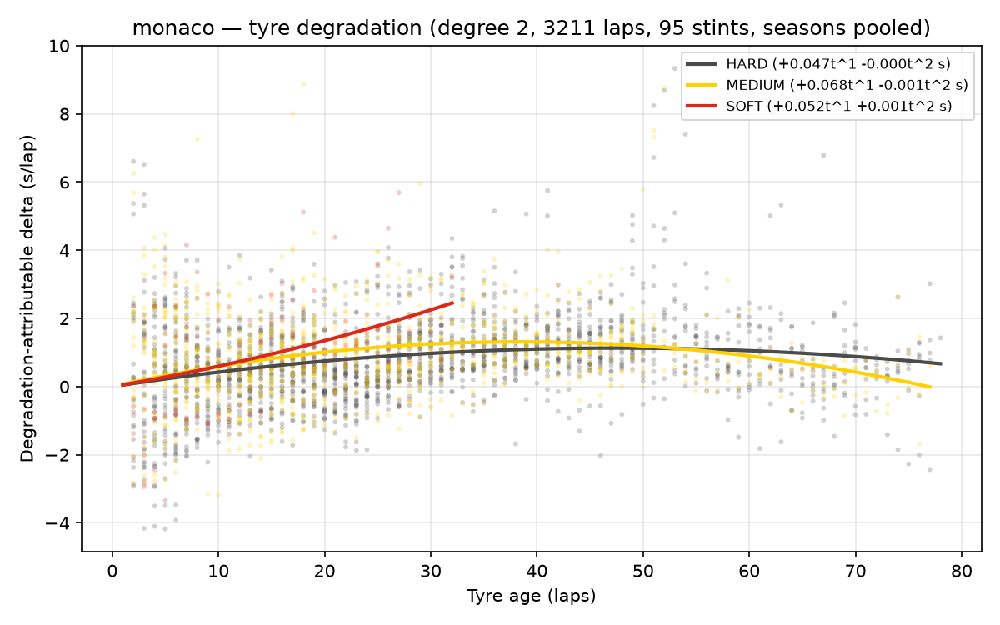
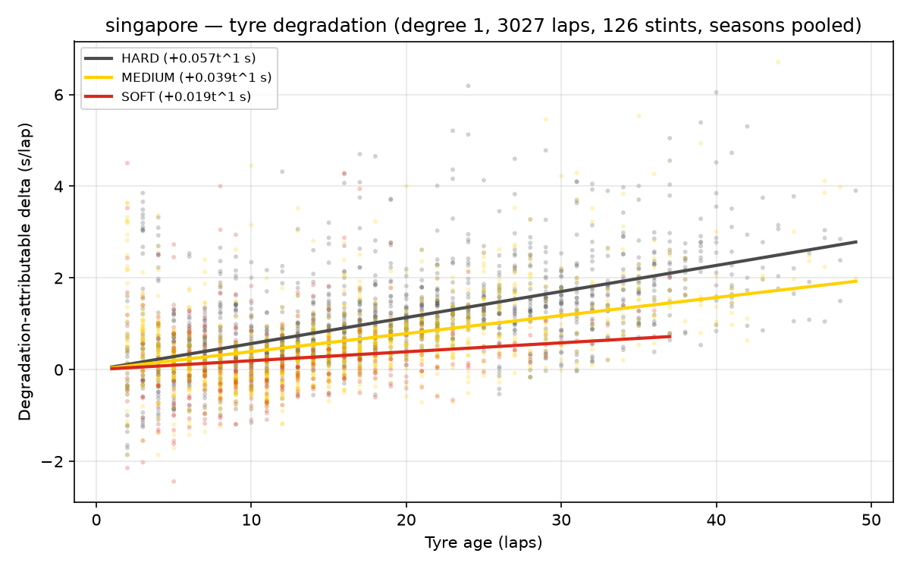
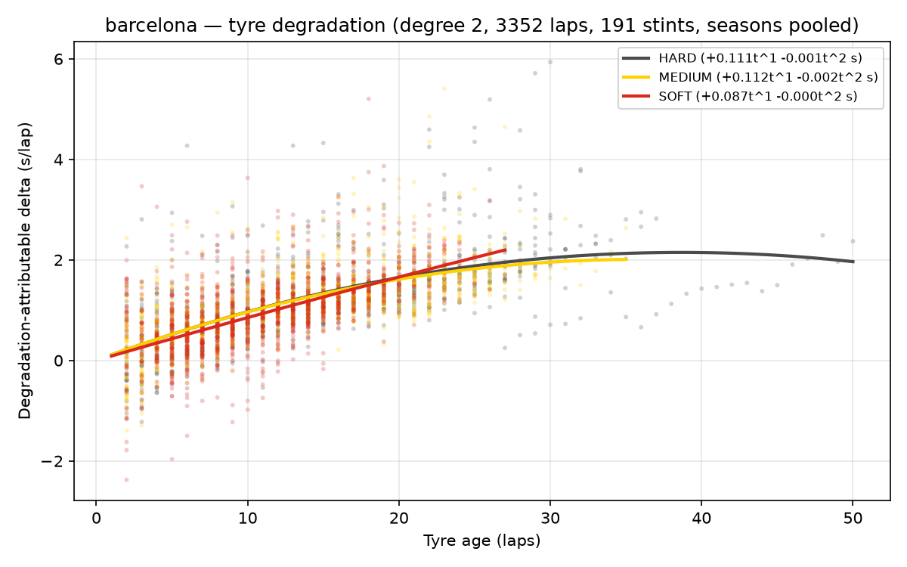
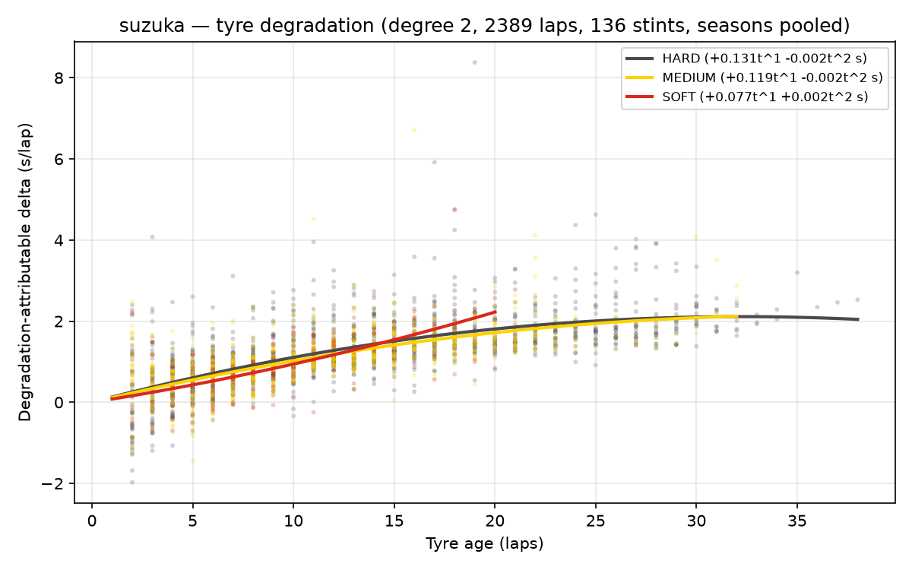

# Phase 2 — Tyre degradation model

Fixed-effects OLS per circuit (seasons pooled): `lap_time = a_driver_race + fuel*lap_number + deg_compound(tyre_age)`.
Degree (linear vs quadratic tyre-age term) selected per circuit by
leave-one-race-out CV RMSE on **within-stint demeaned** lap times —
the honest metric, since driver-race intercepts cannot transfer to an
unseen race. Data filters: pace laps, dry compounds, traffic trim at
1.1x driver median, stints with >= 5 laps.

## monaco

Frame: 3271 pace laps -> 3271 dry -> 3241 after traffic trim -> 3211 in stints >= 5 laps (95 stints, 55 driver-races).

**Selected degree: 2** (CV RMSE 1.262s vs 1.308s for degree 1). Overall fit R² = 0.616 (inflated by fixed effects; see CV).

Fuel-burn proxy: -0.0526 s/lap [-0.0562, -0.0489].

Degradation coefficients (s per lap of tyre age, 95% CI):

| Compound | t^1 | t^2 |
|---|---|---|
| HARD | +0.0474 [+0.0377, +0.0572] | -0.0005 [-0.0006, -0.0004] |
| MEDIUM | +0.0684 [+0.0563, +0.0804] | -0.0009 [-0.0011, -0.0007] |
| SOFT | +0.0521 [-0.0149, +0.1191] | +0.0008 [-0.0018, +0.0034] |

CV folds (degree 2):

| Test race | RMSE (s) | within-stint R² | laps | stints |
|---|---|---|---|---|
| 2023_monaco | 1.181 | -0.071 | 911 | 27 |
| 2024_monaco | 1.310 | 0.322 | 1156 | 22 |
| 2025_monaco | 1.295 | -0.030 | 1144 | 46 |

## singapore

Frame: 3032 pace laps -> 3032 dry -> 3031 after traffic trim -> 3027 in stints >= 5 laps (126 stints, 58 driver-races).

**Selected degree: 1** (CV RMSE 0.834s vs 0.859s for degree 2). Overall fit R² = 0.720 (inflated by fixed effects; see CV).

Fuel-burn proxy: -0.0498 s/lap [-0.0522, -0.0474].

Degradation coefficients (s per lap of tyre age, 95% CI):

| Compound | t^1 |
|---|---|
| HARD | +0.0568 [+0.0523, +0.0613] |
| MEDIUM | +0.0393 [+0.0349, +0.0437] |
| SOFT | +0.0195 [+0.0101, +0.0289] |

CV folds (degree 1):

| Test race | RMSE (s) | within-stint R² | laps | stints |
|---|---|---|---|---|
| 2023_singapore | 0.892 | -0.064 | 829 | 42 |
| 2024_singapore | 0.706 | -0.131 | 1093 | 41 |
| 2025_singapore | 0.905 | 0.026 | 1105 | 43 |

## barcelona

Frame: 3370 pace laps -> 3370 dry -> 3370 after traffic trim -> 3352 in stints >= 5 laps (191 stints, 59 driver-races).

**Selected degree: 2** (CV RMSE 0.565s vs 0.568s for degree 1). Overall fit R² = 0.792 (inflated by fixed effects; see CV).

Fuel-burn proxy: -0.0570 s/lap [-0.0583, -0.0556].

Degradation coefficients (s per lap of tyre age, 95% CI):

| Compound | t^1 | t^2 |
|---|---|---|
| HARD | +0.1111 [+0.0999, +0.1223] | -0.0014 [-0.0018, -0.0011] |
| MEDIUM | +0.1119 [+0.0985, +0.1252] | -0.0016 [-0.0021, -0.0010] |
| SOFT | +0.0875 [+0.0720, +0.1030] | -0.0002 [-0.0009, +0.0005] |

CV folds (degree 2):

| Test race | RMSE (s) | within-stint R² | laps | stints |
|---|---|---|---|---|
| 2023_barcelona | 0.537 | -0.034 | 1195 | 61 |
| 2024_barcelona | 0.597 | 0.023 | 1192 | 62 |
| 2025_barcelona | 0.562 | 0.059 | 965 | 68 |

## suzuka

Frame: 2418 pace laps -> 2418 dry -> 2412 after traffic trim -> 2389 in stints >= 5 laps (136 stints, 56 driver-races).

**Selected degree: 2** (CV RMSE 0.635s vs 0.666s for degree 1). Overall fit R² = 0.953 (inflated by fixed effects; see CV).

Fuel-burn proxy: -0.0811 s/lap [-0.0833, -0.0789].

Degradation coefficients (s per lap of tyre age, 95% CI):

| Compound | t^1 | t^2 |
|---|---|---|
| HARD | +0.1310 [+0.1174, +0.1446] | -0.0020 [-0.0025, -0.0016] |
| MEDIUM | +0.1186 [+0.1024, +0.1348] | -0.0016 [-0.0023, -0.0010] |
| SOFT | +0.0773 [+0.0384, +0.1163] | +0.0017 [-0.0009, +0.0042] |

CV folds (degree 2):

| Test race | RMSE (s) | within-stint R² | laps | stints |
|---|---|---|---|---|
| 2023_suzuka | 0.639 | -0.145 | 661 | 47 |
| 2024_suzuka | 0.620 | -0.043 | 739 | 48 |
| 2025_suzuka | 0.648 | -0.582 | 989 | 41 |

## Interpreting the CV numbers (read before using the coefficients)

- **CV RMSE (~0.55-1.3 s/lap)** is the lap-level noise any consumer of
  this model must expect around a pace prediction; Phase 4 uses it as
  the stochastic lap-noise scale per circuit.
- **Within-stint R² is frequently negative on real data**, while the
  identical pipeline scores ~0.85 on synthetic data at its noise floor
  (see `tests/test_degradation.py`). Meaning: a degradation trend
  fitted on two seasons often predicts a third season's within-stint
  evolution no better than a flat line. Season-specific conditions
  (temperatures, resurfacing, tyre-construction changes) materially
  move the true slope. This is a finding, not a failure — and it is
  the reason the simulator treats degradation as uncertain.
- **Consequence for Phase 4:** coefficients enter the simulator as
  distributions (via their CIs), never as trusted point values, and
  pit-window recommendations inherit that uncertainty.
- **Consequence for Phase 5:** real strategists' decisions must not be
  audited as if the true degradation slope had been knowable in-race.

## Limitations (stated, not hidden)

- **Fuel and tyre age are separated only through the fixed-effects
  structure** (stints starting at different lap numbers); the fuel
  slope is a proxy that also absorbs track evolution, which grips up
  over the race. The two cannot be fully disentangled from timing
  data alone.
- **Classical (homoscedastic) standard errors**; lap-time noise is
  heteroscedastic (traffic, weather drift), so CIs are approximate.
- **Track temperature is not a regressor** in the MVP; its effect is
  absorbed by race fixed effects (between races) and residual noise
  (within a race).
- **Compound allocation is not random**: teams fit HARD when they
  plan long stints. Slopes are descriptive of observed usage, not
  causal effects of compound choice.
- Within-stint R² is low where degradation is genuinely small
  (street circuits): when the true signal is ~0.02 s/lap, noise
  dominates and R² near zero is the honest outcome, not a failure.
