# Phase 2 — Tyre degradation model

Fixed-effects OLS per circuit (seasons pooled): `lap_time = a_driver_race + fuel*lap_number + deg_compound(tyre_age)`.
Degree (linear vs quadratic tyre-age term) selected per circuit by
leave-one-race-out CV RMSE on **within-stint demeaned** lap times —
the honest metric, since driver-race intercepts cannot transfer to an
unseen race. Data filters: pace laps, dry compounds, traffic trim at
1.1x driver median, stints with >= 5 laps.

## austin

Frame: 3374 pace laps -> 3374 dry -> 3374 after traffic trim -> 3355 in stints >= 5 laps (184 stints, 76 driver-races).

**Selected degree: 1** (CV RMSE 0.566s vs 2.648s for degree 2). Overall fit R² = 0.896 (inflated by fixed effects; see CV).

Fuel-burn proxy: -0.0634 s/lap [-0.0665, -0.0603].

Degradation coefficients (s per lap of tyre age, 95% CI):

| Compound | t^1 |
|---|---|
| HARD | +0.0517 [+0.0429, +0.0604] |
| MEDIUM | +0.0436 [+0.0371, +0.0500] |
| SOFT | +0.0603 [+0.0484, +0.0723] |

CV folds (degree 1):

| Test race | RMSE (s) | within-stint R² | laps | stints |
|---|---|---|---|---|
| 2022_austin | 0.546 | 0.011 | 738 | 51 |
| 2023_austin | 0.597 | -0.061 | 878 | 54 |
| 2024_austin | 0.597 | 0.026 | 849 | 40 |
| 2025_austin | 0.526 | -0.179 | 890 | 39 |

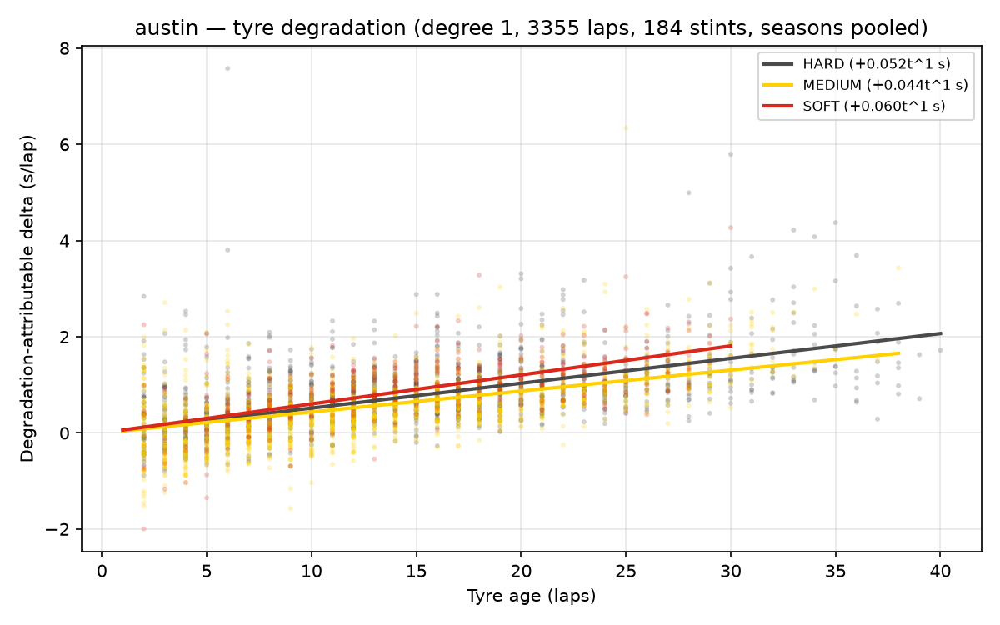

## bahrain

Frame: 3638 pace laps -> 3638 dry -> 3638 after traffic trim -> 3608 in stints >= 5 laps (259 stints, 80 driver-races).

**Selected degree: 2** (CV RMSE 0.452s vs 0.453s for degree 1). Overall fit R² = 0.896 (inflated by fixed effects; see CV).

Fuel-burn proxy: -0.0744 s/lap [-0.0778, -0.0709].

Degradation coefficients (s per lap of tyre age, 95% CI):

| Compound | t^1 | t^2 |
|---|---|---|
| HARD | +0.1326 [+0.1103, +0.1549] | -0.0003 [-0.0011, +0.0006] |
| MEDIUM | +0.1410 [+0.1163, +0.1657] | -0.0006 [-0.0015, +0.0003] |
| SOFT | +0.1140 [+0.0917, +0.1364] | +0.0012 [+0.0001, +0.0023] |

CV folds (degree 2):

| Test race | RMSE (s) | within-stint R² | laps | stints |
|---|---|---|---|---|
| 2022_bahrain | 0.500 | 0.326 | 845 | 75 |
| 2023_bahrain | 0.393 | 0.274 | 862 | 65 |
| 2024_bahrain | 0.441 | 0.167 | 988 | 62 |
| 2025_bahrain | 0.475 | 0.262 | 913 | 57 |

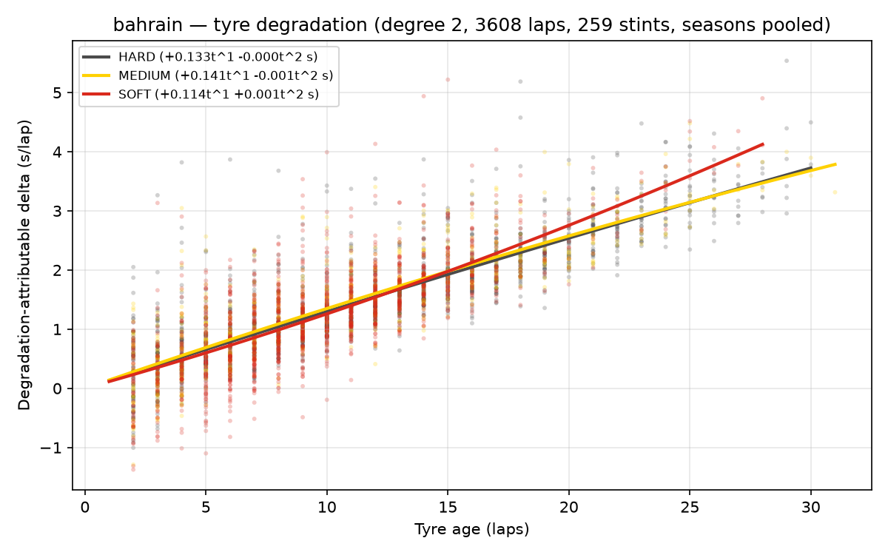

## baku

Frame: 3185 pace laps -> 3185 dry -> 3185 after traffic trim -> 3174 in stints >= 5 laps (156 stints, 79 driver-races).

**Selected degree: 1** (CV RMSE 0.705s vs 0.816s for degree 2). Overall fit R² = 0.859 (inflated by fixed effects; see CV).

Fuel-burn proxy: -0.0749 s/lap [-0.0809, -0.0690].

Degradation coefficients (s per lap of tyre age, 95% CI):

| Compound | t^1 |
|---|---|
| HARD | +0.0227 [+0.0151, +0.0303] |
| MEDIUM | +0.0131 [+0.0022, +0.0239] |
| SOFT | +0.0197 [-0.0010, +0.0404] |

CV folds (degree 1):

| Test race | RMSE (s) | within-stint R² | laps | stints |
|---|---|---|---|---|
| 2022_baku | 0.641 | 0.068 | 722 | 45 |
| 2023_baku | 0.643 | 0.465 | 793 | 37 |
| 2024_baku | 0.690 | 0.237 | 852 | 36 |
| 2025_baku | 0.845 | 0.307 | 796 | 37 |

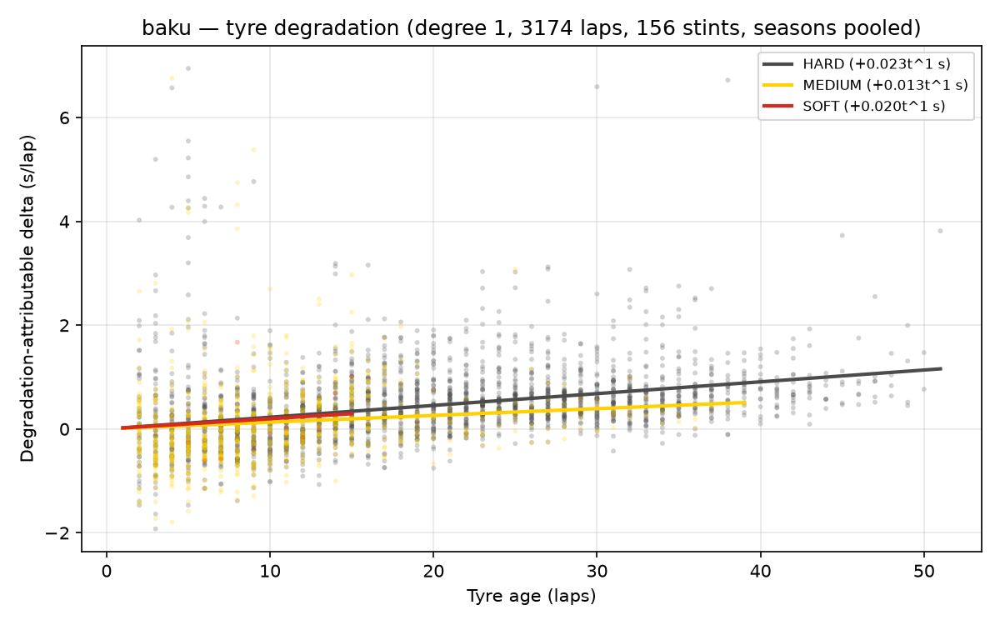

## barcelona

Frame: 4416 pace laps -> 4416 dry -> 4416 after traffic trim -> 4394 in stints >= 5 laps (261 stints, 79 driver-races).

**Selected degree: 1** (CV RMSE 0.616s vs 0.616s for degree 2). Overall fit R² = 0.969 (inflated by fixed effects; see CV).

Fuel-burn proxy: -0.0544 s/lap [-0.0568, -0.0519].

Degradation coefficients (s per lap of tyre age, 95% CI):

| Compound | t^1 |
|---|---|
| HARD | +0.0729 [+0.0514, +0.0944] |
| MEDIUM | +0.0818 [+0.0703, +0.0932] |
| SOFT | +0.0818 [+0.0701, +0.0935] |

CV folds (degree 1):

| Test race | RMSE (s) | within-stint R² | laps | stints |
|---|---|---|---|---|
| 2022_barcelona | 0.751 | 0.100 | 1042 | 70 |
| 2023_barcelona | 0.565 | -0.146 | 1195 | 61 |
| 2024_barcelona | 0.582 | 0.072 | 1192 | 62 |
| 2025_barcelona | 0.566 | 0.045 | 965 | 68 |

## hungaroring

Frame: 4749 pace laps -> 4749 dry -> 4747 after traffic trim -> 4724 in stints >= 5 laps (215 stints, 78 driver-races).

**Selected degree: 1** (CV RMSE 0.709s vs 0.726s for degree 2). Overall fit R² = 0.777 (inflated by fixed effects; see CV).

Fuel-burn proxy: -0.0445 s/lap [-0.0479, -0.0410].

Degradation coefficients (s per lap of tyre age, 95% CI):

| Compound | t^1 |
|---|---|
| HARD | +0.0605 [+0.0522, +0.0688] |
| MEDIUM | +0.0593 [+0.0523, +0.0662] |
| SOFT | +0.0907 [+0.0665, +0.1150] |

CV folds (degree 1):

| Test race | RMSE (s) | within-stint R² | laps | stints |
|---|---|---|---|---|
| 2022_hungaroring | 0.888 | 0.040 | 1118 | 59 |
| 2023_hungaroring | 0.545 | 0.043 | 1124 | 54 |
| 2024_hungaroring | 0.733 | 0.054 | 1209 | 54 |
| 2025_hungaroring | 0.671 | -0.136 | 1273 | 48 |

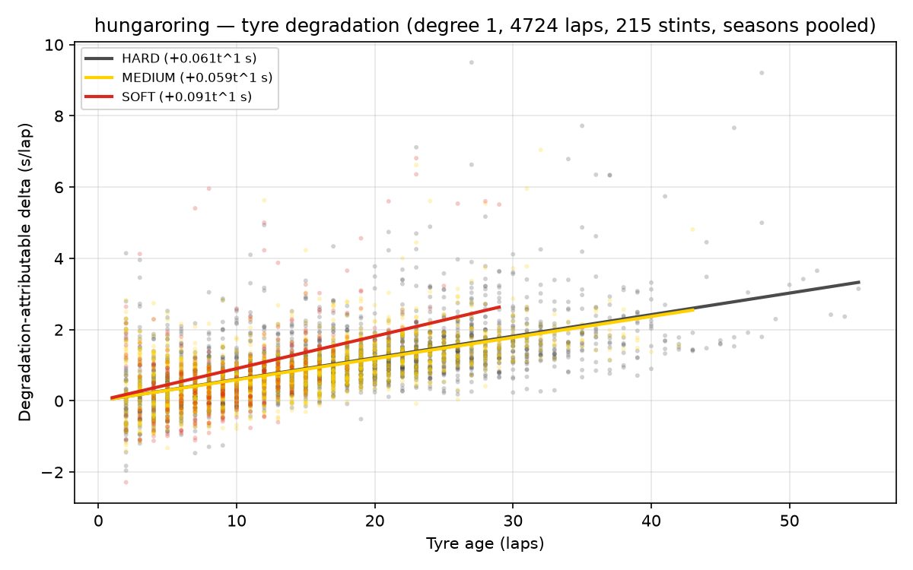

## imola

Frame: 2820 pace laps -> 2820 dry -> 2818 after traffic trim -> 2811 in stints >= 5 laps (122 stints, 58 driver-races).

**Selected degree: 1** (CV RMSE 0.880s vs 0.931s for degree 2). Overall fit R² = 0.563 (inflated by fixed effects; see CV).

Fuel-burn proxy: -0.0434 s/lap [-0.0509, -0.0359].

Degradation coefficients (s per lap of tyre age, 95% CI):

| Compound | t^1 |
|---|---|
| HARD | +0.0423 [+0.0296, +0.0550] |
| MEDIUM | +0.0140 [+0.0003, +0.0277] |
| SOFT | -0.0496 [-0.1225, +0.0233] |

CV folds (degree 1):

| Test race | RMSE (s) | within-stint R² | laps | stints |
|---|---|---|---|---|
| 2022_imola | 1.373 | -0.156 | 724 | 23 |
| 2024_imola | 0.722 | -0.532 | 1148 | 44 |
| 2025_imola | 0.543 | -0.002 | 939 | 55 |

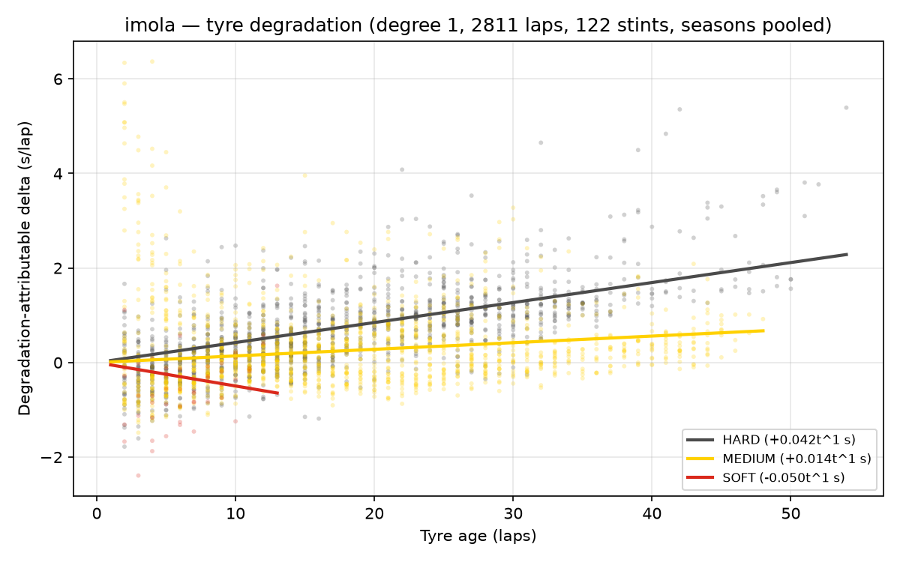

## interlagos

Frame: 2922 pace laps -> 2922 dry -> 2914 after traffic trim -> 2907 in stints >= 5 laps (158 stints, 53 driver-races).

**Selected degree: 1** (CV RMSE 0.504s vs 0.524s for degree 2). Overall fit R² = 0.824 (inflated by fixed effects; see CV).

Fuel-burn proxy: -0.0380 s/lap [-0.0409, -0.0350].

Degradation coefficients (s per lap of tyre age, 95% CI):

| Compound | t^1 |
|---|---|
| HARD | +0.0649 [+0.0589, +0.0708] |
| MEDIUM | +0.0587 [+0.0530, +0.0644] |
| SOFT | +0.0445 [+0.0376, +0.0515] |

CV folds (degree 1):

| Test race | RMSE (s) | within-stint R² | laps | stints |
|---|---|---|---|---|
| 2022_interlagos | 0.480 | 0.049 | 900 | 58 |
| 2023_interlagos | 0.573 | 0.022 | 978 | 50 |
| 2025_interlagos | 0.458 | 0.179 | 1029 | 50 |

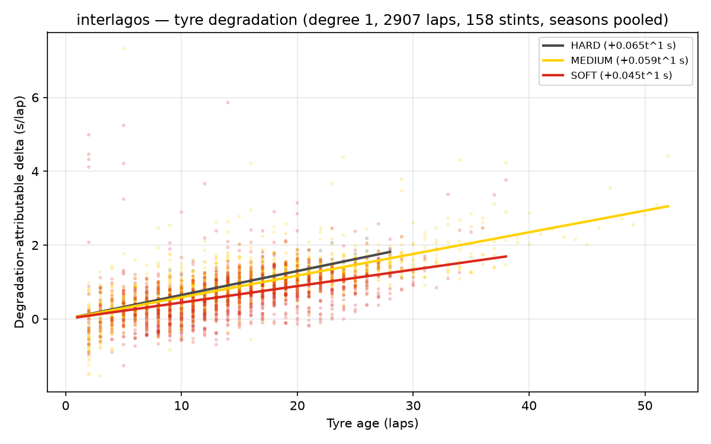

## jeddah

Frame: 2981 pace laps -> 2981 dry -> 2981 after traffic trim -> 2931 in stints >= 5 laps (137 stints, 74 driver-races).

**Selected degree: 1** (CV RMSE 0.696s vs 0.700s for degree 2). Overall fit R² = 0.773 (inflated by fixed effects; see CV).

Fuel-burn proxy: -0.0696 s/lap [-0.0758, -0.0634].

Degradation coefficients (s per lap of tyre age, 95% CI):

| Compound | t^1 |
|---|---|
| HARD | +0.0090 [-0.0004, +0.0185] |
| MEDIUM | +0.0125 [+0.0032, +0.0217] |
| SOFT | -0.0013 [-0.0471, +0.0445] |

CV folds (degree 1):

| Test race | RMSE (s) | within-stint R² | laps | stints |
|---|---|---|---|---|
| 2022_jeddah | 0.671 | 0.454 | 588 | 36 |
| 2023_jeddah | 0.656 | 0.408 | 803 | 40 |
| 2024_jeddah | 0.753 | 0.485 | 742 | 27 |
| 2025_jeddah | 0.703 | -0.119 | 798 | 34 |

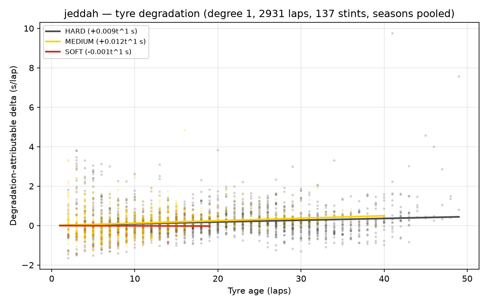

## las_vegas

Frame: 2219 pace laps -> 2219 dry -> 2219 after traffic trim -> 2205 in stints >= 5 laps (131 stints, 57 driver-races).

**Selected degree: 1** (CV RMSE 0.744s vs 0.764s for degree 2). Overall fit R² = 0.828 (inflated by fixed effects; see CV).

Fuel-burn proxy: -0.0839 s/lap [-0.0888, -0.0790].

Degradation coefficients (s per lap of tyre age, 95% CI):

| Compound | t^1 |
|---|---|
| HARD | +0.0366 [+0.0235, +0.0497] |
| MEDIUM | +0.0443 [+0.0301, +0.0586] |

CV folds (degree 1):

| Test race | RMSE (s) | within-stint R² | laps | stints |
|---|---|---|---|---|
| 2023_las_vegas | 0.974 | 0.171 | 633 | 43 |
| 2024_las_vegas | 0.759 | -0.135 | 812 | 54 |
| 2025_las_vegas | 0.498 | 0.349 | 760 | 34 |

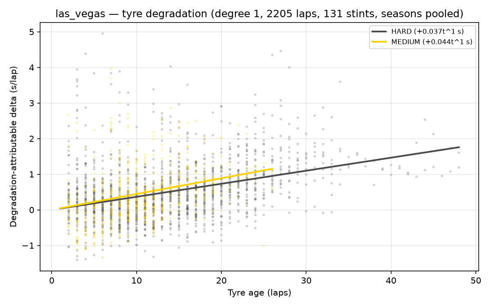

## losail

Frame: 2328 pace laps -> 2328 dry -> 2328 after traffic trim -> 2292 in stints >= 5 laps (154 stints, 55 driver-races).

**Selected degree: 2** (CV RMSE 0.558s vs 0.558s for degree 1). Overall fit R² = 0.882 (inflated by fixed effects; see CV).

Fuel-burn proxy: -0.0814 s/lap [-0.0873, -0.0754].

Degradation coefficients (s per lap of tyre age, 95% CI):

| Compound | t^1 | t^2 |
|---|---|---|
| HARD | +0.0073 [-0.0278, +0.0425] | +0.0009 [-0.0007, +0.0026] |
| MEDIUM | +0.0394 [+0.0150, +0.0637] | -0.0010 [-0.0017, -0.0003] |
| SOFT | +0.2106 [+0.0851, +0.3362] | -0.0051 [-0.0098, -0.0004] |

CV folds (degree 2):

| Test race | RMSE (s) | within-stint R² | laps | stints |
|---|---|---|---|---|
| 2023_losail | 0.629 | 0.144 | 748 | 64 |
| 2024_losail | 0.594 | 0.462 | 656 | 35 |
| 2025_losail | 0.450 | 0.140 | 888 | 55 |

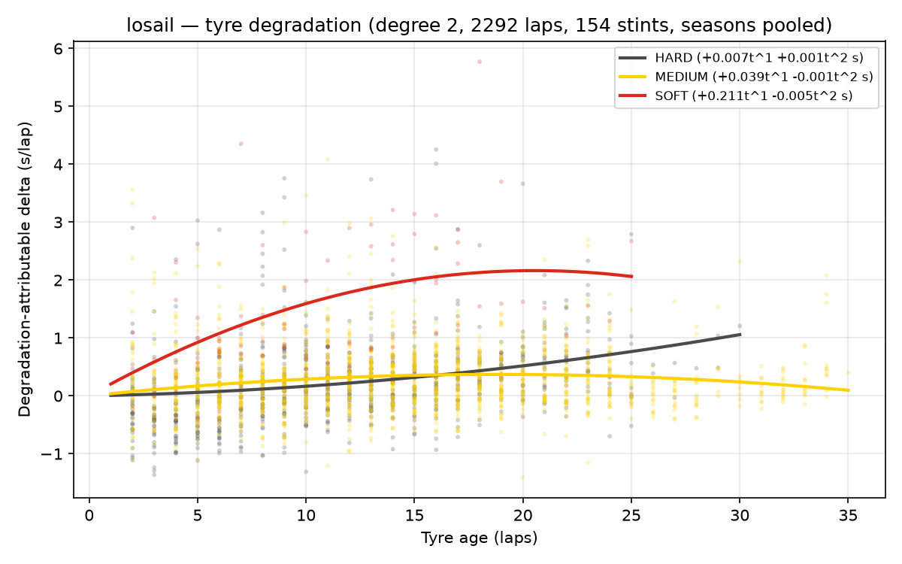

## melbourne

Frame: 2436 pace laps -> 2434 dry -> 2417 after traffic trim -> 2314 in stints >= 5 laps (108 stints, 55 driver-races).

**Selected degree: 1** (CV RMSE 0.737s vs 0.758s for degree 2). Overall fit R² = 0.780 (inflated by fixed effects; see CV).

Fuel-burn proxy: -0.0514 s/lap [-0.0563, -0.0466].

Degradation coefficients (s per lap of tyre age, 95% CI):

| Compound | t^1 |
|---|---|
| HARD | -0.0038 [-0.0140, +0.0065] |
| MEDIUM | +0.0238 [+0.0113, +0.0363] |
| SOFT | -0.1792 [-0.3650, +0.0066] |

CV folds (degree 1):

| Test race | RMSE (s) | within-stint R² | laps | stints |
|---|---|---|---|---|
| 2022_melbourne | 0.786 | 0.364 | 791 | 37 |
| 2023_melbourne | 0.775 | 0.483 | 685 | 20 |
| 2024_melbourne | 0.651 | -0.452 | 838 | 51 |

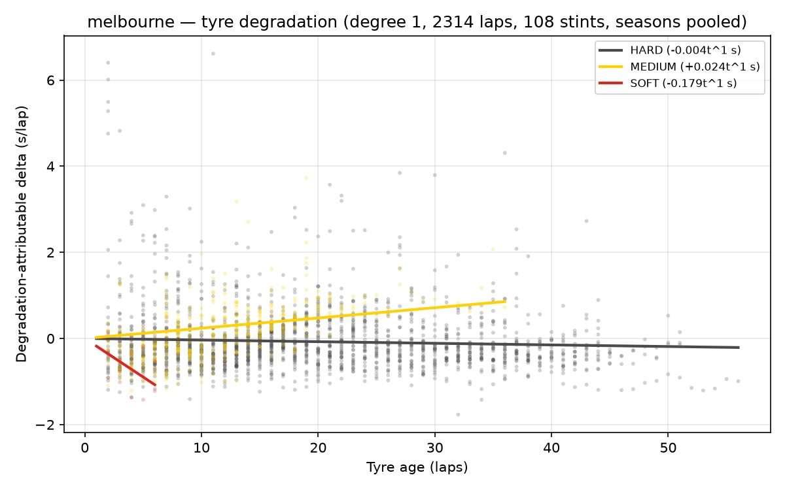

## mexico_city

Frame: 4491 pace laps -> 4491 dry -> 4478 after traffic trim -> 4458 in stints >= 5 laps (169 stints, 76 driver-races).

**Selected degree: 2** (CV RMSE 0.551s vs 0.558s for degree 1). Overall fit R² = 0.815 (inflated by fixed effects; see CV).

Fuel-burn proxy: -0.0394 s/lap [-0.0424, -0.0363].

Degradation coefficients (s per lap of tyre age, 95% CI):

| Compound | t^1 | t^2 |
|---|---|---|
| HARD | +0.0615 [+0.0455, +0.0774] | -0.0006 [-0.0009, -0.0002] |
| MEDIUM | +0.0455 [+0.0325, +0.0586] | -0.0001 [-0.0005, +0.0002] |
| SOFT | +0.0075 [-0.0117, +0.0267] | +0.0012 [+0.0005, +0.0019] |

CV folds (degree 2):

| Test race | RMSE (s) | within-stint R² | laps | stints |
|---|---|---|---|---|
| 2022_mexico_city | 0.603 | -0.018 | 1275 | 42 |
| 2023_mexico_city | 0.531 | -0.018 | 1036 | 46 |
| 2024_mexico_city | 0.565 | -0.066 | 1045 | 36 |
| 2025_mexico_city | 0.504 | 0.024 | 1102 | 45 |

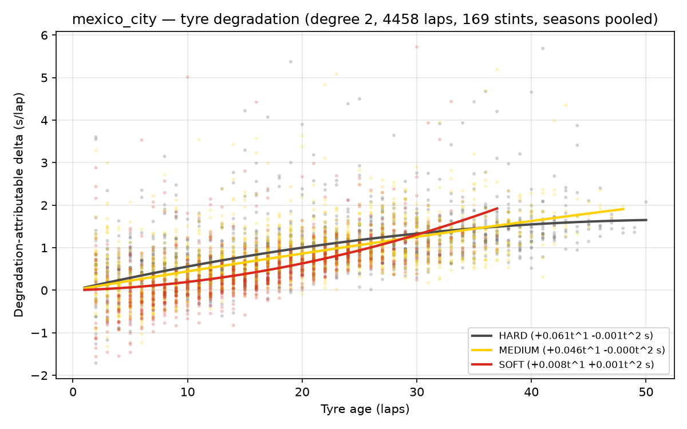

## miami

Frame: 3645 pace laps -> 3339 dry -> 3339 after traffic trim -> 3297 in stints >= 5 laps (154 stints, 77 driver-races).

**Selected degree: 1** (CV RMSE 0.497s vs 0.503s for degree 2). Overall fit R² = 0.886 (inflated by fixed effects; see CV).

Fuel-burn proxy: -0.0531 s/lap [-0.0558, -0.0503].

Degradation coefficients (s per lap of tyre age, 95% CI):

| Compound | t^1 |
|---|---|
| HARD | +0.0194 [+0.0128, +0.0260] |
| MEDIUM | +0.0208 [+0.0137, +0.0278] |
| SOFT | +0.0271 [+0.0112, +0.0429] |

CV folds (degree 1):

| Test race | RMSE (s) | within-stint R² | laps | stints |
|---|---|---|---|---|
| 2022_miami | 0.637 | 0.278 | 797 | 42 |
| 2023_miami | 0.466 | 0.251 | 1066 | 37 |
| 2024_miami | 0.429 | 0.223 | 908 | 45 |
| 2025_miami | 0.457 | -0.327 | 526 | 30 |

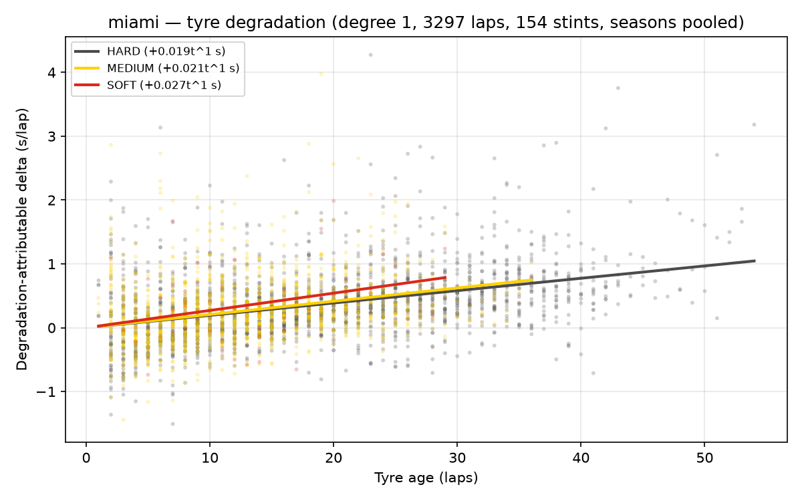

## monaco

Frame: 3870 pace laps -> 3772 dry -> 3724 after traffic trim -> 3682 in stints >= 5 laps (114 stints, 72 driver-races).

**Selected degree: 1** (CV RMSE 1.355s vs 1.384s for degree 2). Overall fit R² = 0.671 (inflated by fixed effects; see CV).

Fuel-burn proxy: -0.0564 s/lap [-0.0714, -0.0414].

Degradation coefficients (s per lap of tyre age, 95% CI):

| Compound | t^1 |
|---|---|
| HARD | +0.0139 [-0.0035, +0.0313] |
| MEDIUM | +0.0150 [-0.0041, +0.0342] |
| SOFT | +0.0503 [+0.0031, +0.0975] |

CV folds (degree 1):

| Test race | RMSE (s) | within-stint R² | laps | stints |
|---|---|---|---|---|
| 2022_monaco | 1.583 | 0.183 | 471 | 19 |
| 2023_monaco | 1.223 | -0.148 | 911 | 27 |
| 2024_monaco | 1.309 | 0.323 | 1156 | 22 |
| 2025_monaco | 1.306 | -0.046 | 1144 | 46 |

## montreal

Frame: 3471 pace laps -> 3436 dry -> 3431 after traffic trim -> 3418 in stints >= 5 laps (168 stints, 78 driver-races).

**Selected degree: 1** (CV RMSE 0.906s vs 0.928s for degree 2). Overall fit R² = 0.755 (inflated by fixed effects; see CV).

Fuel-burn proxy: -0.0394 s/lap [-0.0422, -0.0365].

Degradation coefficients (s per lap of tyre age, 95% CI):

| Compound | t^1 |
|---|---|
| HARD | +0.0187 [+0.0110, +0.0265] |
| MEDIUM | -0.0010 [-0.0197, +0.0176] |
| SOFT | +0.0083 [-0.0169, +0.0336] |

CV folds (degree 1):

| Test race | RMSE (s) | within-stint R² | laps | stints |
|---|---|---|---|---|
| 2022_montreal | 0.594 | -0.076 | 994 | 49 |
| 2023_montreal | 0.461 | -0.058 | 1024 | 49 |
| 2024_montreal | 2.013 | 0.079 | 240 | 20 |
| 2025_montreal | 0.555 | 0.057 | 1154 | 49 |

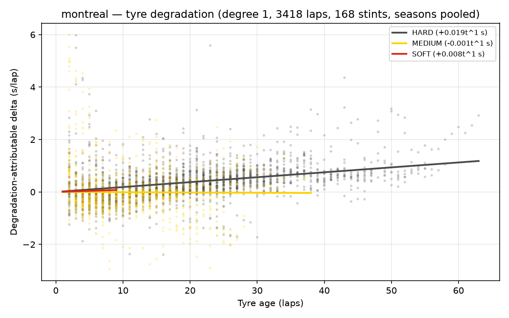

## monza

Frame: 3392 pace laps -> 3392 dry -> 3392 after traffic trim -> 3376 in stints >= 5 laps (164 stints, 77 driver-races).

**Selected degree: 1** (CV RMSE 0.537s vs 0.600s for degree 2). Overall fit R² = 0.911 (inflated by fixed effects; see CV).

Fuel-burn proxy: -0.0515 s/lap [-0.0553, -0.0477].

Degradation coefficients (s per lap of tyre age, 95% CI):

| Compound | t^1 |
|---|---|
| HARD | +0.0347 [+0.0261, +0.0433] |
| MEDIUM | +0.0306 [+0.0230, +0.0381] |
| SOFT | +0.0065 [-0.0105, +0.0234] |

CV folds (degree 1):

| Test race | RMSE (s) | within-stint R² | laps | stints |
|---|---|---|---|---|
| 2022_monza | 0.461 | 0.034 | 734 | 39 |
| 2023_monza | 0.601 | -0.552 | 864 | 44 |
| 2024_monza | 0.526 | 0.038 | 906 | 47 |
| 2025_monza | 0.561 | 0.030 | 872 | 34 |

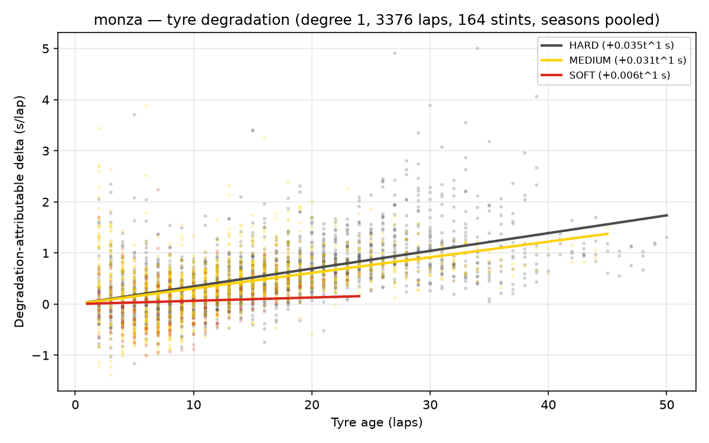

## red_bull_ring

Frame: 4391 pace laps -> 4073 dry -> 4073 after traffic trim -> 4054 in stints >= 5 laps (206 stints, 76 driver-races).

**Selected degree: 1** (CV RMSE 0.455s vs 0.499s for degree 2). Overall fit R² = 0.758 (inflated by fixed effects; see CV).

Fuel-burn proxy: -0.0314 s/lap [-0.0335, -0.0293].

Degradation coefficients (s per lap of tyre age, 95% CI):

| Compound | t^1 |
|---|---|
| HARD | +0.0604 [+0.0559, +0.0649] |
| MEDIUM | +0.0584 [+0.0533, +0.0635] |
| SOFT | +0.0461 [+0.0136, +0.0786] |

CV folds (degree 1):

| Test race | RMSE (s) | within-stint R² | laps | stints |
|---|---|---|---|---|
| 2022_red_bull_ring | 0.446 | 0.156 | 758 | 42 |
| 2023_red_bull_ring | 0.443 | 0.130 | 1073 | 55 |
| 2024_red_bull_ring | 0.450 | 0.228 | 1239 | 62 |
| 2025_red_bull_ring | 0.481 | 0.101 | 984 | 47 |

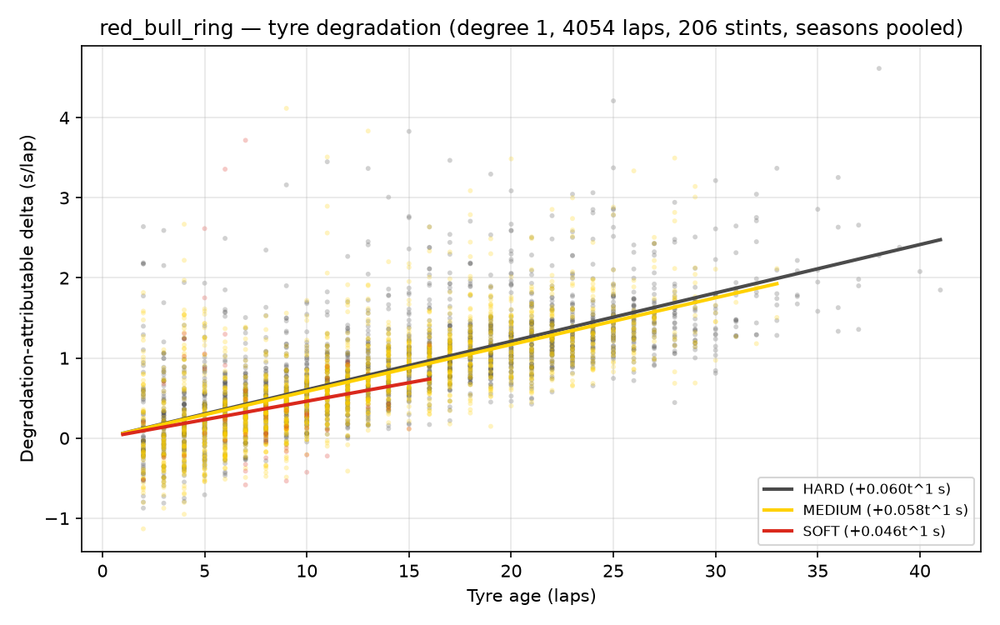

## ricard

Frame: 780 pace laps -> 780 dry -> 780 after traffic trim -> 775 in stints >= 5 laps (43 stints, 20 driver-races).

**Selected degree: 1** (CV RMSE nans vs nans for degree 2). Overall fit R² = 0.758 (inflated by fixed effects; see CV).

Fuel-burn proxy: -0.0660 s/lap [-0.0819, -0.0502].

Degradation coefficients (s per lap of tyre age, 95% CI):

| Compound | t^1 |
|---|---|
| HARD | +0.0672 [+0.0406, +0.0938] |
| MEDIUM | +0.0497 [+0.0330, +0.0665] |

CV folds (degree 1):

| Test race | RMSE (s) | within-stint R² | laps | stints |
|---|---|---|---|---|

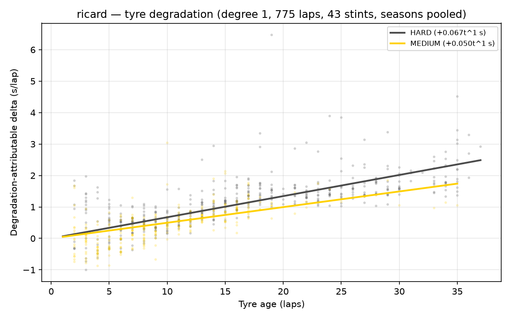

## shanghai

Frame: 1681 pace laps -> 1681 dry -> 1681 after traffic trim -> 1675 in stints >= 5 laps (98 stints, 39 driver-races).

**Selected degree: 2** (CV RMSE 0.654s vs 0.669s for degree 1). Overall fit R² = 0.943 (inflated by fixed effects; see CV).

Fuel-burn proxy: -0.0739 s/lap [-0.0798, -0.0679].

Degradation coefficients (s per lap of tyre age, 95% CI):

| Compound | t^1 | t^2 |
|---|---|---|
| HARD | +0.1089 [+0.0810, +0.1368] | -0.0014 [-0.0019, -0.0008] |
| MEDIUM | +0.1350 [+0.0843, +0.1858] | -0.0017 [-0.0041, +0.0007] |
| SOFT | +0.1048 [-0.0168, +0.2264] | -0.0007 [-0.0085, +0.0071] |

CV folds (degree 2):

| Test race | RMSE (s) | within-stint R² | laps | stints |
|---|---|---|---|---|
| 2024_shanghai | 0.542 | -0.483 | 678 | 49 |
| 2025_shanghai | 0.766 | -0.539 | 942 | 43 |

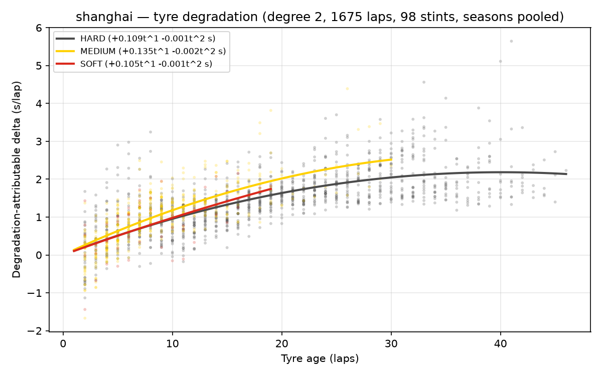

## silverstone

Frame: 2229 pace laps -> 2229 dry -> 2185 after traffic trim -> 2155 in stints >= 5 laps (136 stints, 71 driver-races).

**Selected degree: 1** (CV RMSE 1.102s vs 1.141s for degree 2). Overall fit R² = 0.650 (inflated by fixed effects; see CV).

Fuel-burn proxy: -0.0625 s/lap [-0.0679, -0.0571].

Degradation coefficients (s per lap of tyre age, 95% CI):

| Compound | t^1 |
|---|---|
| HARD | +0.0443 [+0.0224, +0.0662] |
| MEDIUM | +0.0523 [+0.0326, +0.0721] |
| SOFT | +0.0546 [+0.0290, +0.0802] |

CV folds (degree 1):

| Test race | RMSE (s) | within-stint R² | laps | stints |
|---|---|---|---|---|
| 2022_silverstone | 0.546 | -0.032 | 613 | 41 |
| 2023_silverstone | 0.532 | -0.197 | 784 | 42 |
| 2024_silverstone | 1.502 | -0.207 | 633 | 38 |
| 2025_silverstone | 1.829 | 0.013 | 125 | 15 |

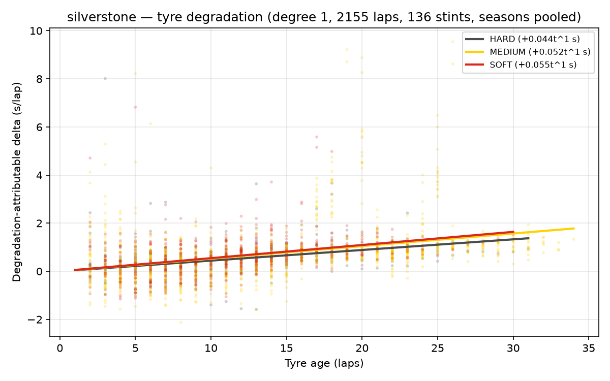

## singapore

Frame: 3307 pace laps -> 3307 dry -> 3305 after traffic trim -> 3299 in stints >= 5 laps (142 stints, 72 driver-races).

**Selected degree: 1** (CV RMSE 1.238s vs 1.245s for degree 2). Overall fit R² = 0.933 (inflated by fixed effects; see CV).

Fuel-burn proxy: -0.0524 s/lap [-0.0580, -0.0468].

Degradation coefficients (s per lap of tyre age, 95% CI):

| Compound | t^1 |
|---|---|
| HARD | +0.0546 [+0.0446, +0.0647] |
| MEDIUM | +0.0278 [+0.0134, +0.0422] |
| SOFT | +0.0001 [-0.0206, +0.0209] |

CV folds (degree 1):

| Test race | RMSE (s) | within-stint R² | laps | stints |
|---|---|---|---|---|
| 2022_singapore | 2.392 | 0.044 | 272 | 16 |
| 2023_singapore | 0.879 | -0.034 | 829 | 42 |
| 2024_singapore | 0.771 | -0.351 | 1093 | 41 |
| 2025_singapore | 0.909 | 0.018 | 1105 | 43 |

## spa

Frame: 2604 pace laps -> 2534 dry -> 2534 after traffic trim -> 2503 in stints >= 5 laps (170 stints, 76 driver-races).

**Selected degree: 2** (CV RMSE 0.844s vs 0.890s for degree 1). Overall fit R² = 0.928 (inflated by fixed effects; see CV).

Fuel-burn proxy: -0.0912 s/lap [-0.0984, -0.0840].

Degradation coefficients (s per lap of tyre age, 95% CI):

| Compound | t^1 | t^2 |
|---|---|---|
| HARD | +0.1532 [+0.1027, +0.2037] | -0.0030 [-0.0047, -0.0014] |
| MEDIUM | +0.1766 [+0.1224, +0.2308] | -0.0036 [-0.0050, -0.0022] |
| SOFT | +0.1037 [+0.0280, +0.1794] | -0.0002 [-0.0042, +0.0037] |

CV folds (degree 2):

| Test race | RMSE (s) | within-stint R² | laps | stints |
|---|---|---|---|---|
| 2022_spa | 0.663 | -0.038 | 616 | 51 |
| 2023_spa | 1.071 | -0.118 | 633 | 46 |
| 2024_spa | 0.536 | -0.163 | 722 | 52 |
| 2025_spa | 1.106 | -0.369 | 532 | 21 |

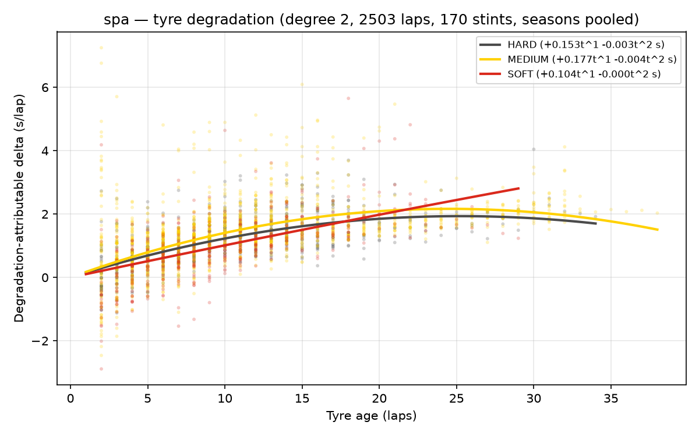

## suzuka

Frame: 2418 pace laps -> 2418 dry -> 2412 after traffic trim -> 2389 in stints >= 5 laps (136 stints, 56 driver-races).

**Selected degree: 2** (CV RMSE 0.635s vs 0.666s for degree 1). Overall fit R² = 0.953 (inflated by fixed effects; see CV).

Fuel-burn proxy: -0.0811 s/lap [-0.0867, -0.0756].

Degradation coefficients (s per lap of tyre age, 95% CI):

| Compound | t^1 | t^2 |
|---|---|---|
| HARD | +0.1310 [+0.0941, +0.1679] | -0.0020 [-0.0030, -0.0011] |
| MEDIUM | +0.1186 [+0.0831, +0.1541] | -0.0016 [-0.0028, -0.0005] |
| SOFT | +0.0773 [-0.0111, +0.1658] | +0.0017 [-0.0044, +0.0077] |

CV folds (degree 2):

| Test race | RMSE (s) | within-stint R² | laps | stints |
|---|---|---|---|---|
| 2023_suzuka | 0.639 | -0.145 | 661 | 47 |
| 2024_suzuka | 0.620 | -0.043 | 739 | 48 |
| 2025_suzuka | 0.648 | -0.582 | 989 | 41 |

## yas_marina

Frame: 3927 pace laps -> 3927 dry -> 3927 after traffic trim -> 3910 in stints >= 5 laps (191 stints, 79 driver-races).

**Selected degree: 1** (CV RMSE 0.478s vs 0.479s for degree 2). Overall fit R² = 0.844 (inflated by fixed effects; see CV).

Fuel-burn proxy: -0.0529 s/lap [-0.0557, -0.0501].

Degradation coefficients (s per lap of tyre age, 95% CI):

| Compound | t^1 |
|---|---|
| HARD | +0.0567 [+0.0515, +0.0619] |
| MEDIUM | +0.0770 [+0.0665, +0.0876] |
| SOFT | +0.1225 [+0.1072, +0.1378] |

CV folds (degree 1):

| Test race | RMSE (s) | within-stint R² | laps | stints |
|---|---|---|---|---|
| 2022_yas_marina | 0.582 | 0.073 | 994 | 51 |
| 2023_yas_marina | 0.413 | 0.028 | 1025 | 54 |
| 2024_yas_marina | 0.425 | 0.069 | 851 | 40 |
| 2025_yas_marina | 0.494 | 0.011 | 1040 | 46 |

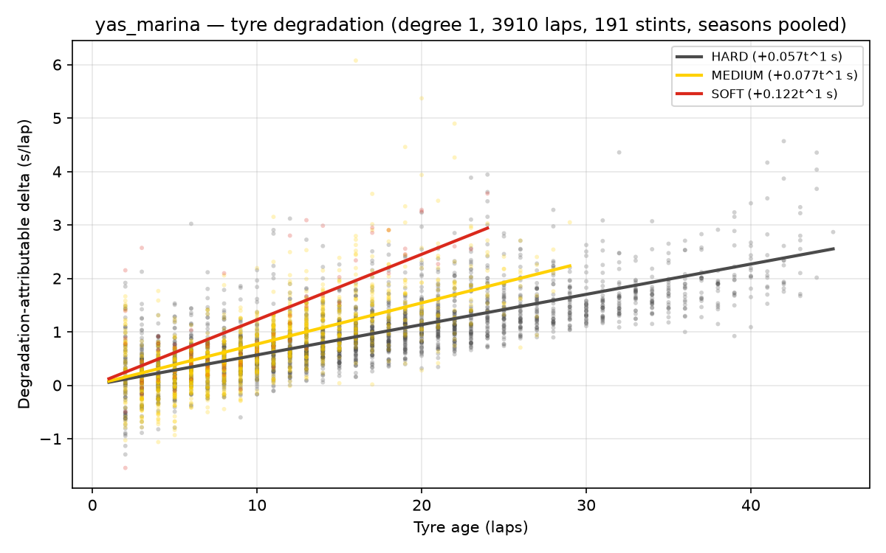

## zandvoort

Frame: 4188 pace laps -> 4188 dry -> 4153 after traffic trim -> 4108 in stints >= 5 laps (212 stints, 80 driver-races).

**Selected degree: 1** (CV RMSE 0.654s vs 0.672s for degree 2). Overall fit R² = 0.721 (inflated by fixed effects; see CV).

Fuel-burn proxy: -0.0416 s/lap [-0.0448, -0.0384].

Degradation coefficients (s per lap of tyre age, 95% CI):

| Compound | t^1 |
|---|---|
| HARD | +0.0345 [+0.0291, +0.0399] |
| MEDIUM | +0.0448 [+0.0390, +0.0507] |
| SOFT | +0.0290 [+0.0210, +0.0369] |

CV folds (degree 1):

| Test race | RMSE (s) | within-stint R² | laps | stints |
|---|---|---|---|---|
| 2022_zandvoort | 0.486 | -0.017 | 1014 | 73 |
| 2023_zandvoort | 1.078 | -0.000 | 753 | 39 |
| 2024_zandvoort | 0.535 | -0.057 | 1350 | 46 |
| 2025_zandvoort | 0.516 | -0.005 | 991 | 54 |

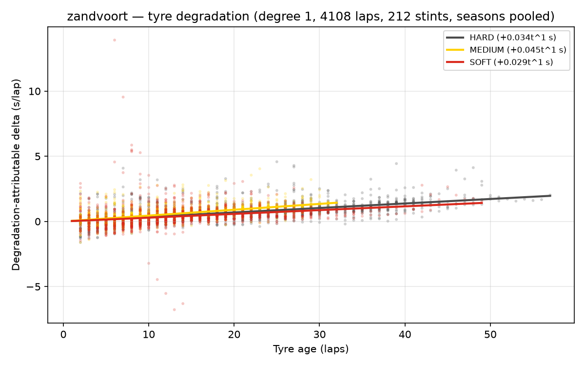

## Interpreting the CV numbers (read before using the coefficients)

- **CV RMSE (~0.55-1.3 s/lap)** is the lap-level noise any consumer of
  this model must expect around a pace prediction; Phase 4 uses it as
  the stochastic lap-noise scale per circuit.
- **Within-stint R² is frequently negative on real data**, while the
  identical pipeline scores ~0.85 on synthetic data at its noise floor
  (see `tests/test_degradation.py`). Meaning: a degradation trend
  fitted on two seasons often predicts a third season's within-stint
  evolution no better than a flat line. Season-specific conditions
  (temperatures, resurfacing, tyre-construction changes) materially
  move the true slope. This is a finding, not a failure — and it is
  the reason the simulator treats degradation as uncertain.
- **Consequence for Phase 4:** coefficients enter the simulator as
  distributions (via their CIs), never as trusted point values, and
  pit-window recommendations inherit that uncertainty.
- **Consequence for Phase 5:** real strategists' decisions must not be
  audited as if the true degradation slope had been knowable in-race.

## Does a pre-2026 fit predict the 2026 era?

The 2026 regulations (power unit, active aero + Manual Override
Mode, lighter/narrower cars, less fuel, narrower tyres) are a genuine
discontinuity, so the coefficients above are fit on 2022/2023/2024/2025 only and the new era is held out
entirely rather than pooled in. That turns a stated caveat into a measured
one: train on the old regulations, predict a new-era race, score on the same
within-stint demeaned residual as the CV folds above, so the numbers are
directly comparable to them.

| Circuit | Season | RMSE (s) | within-stint R² | pre-era fold range | Verdict |
|---|---|---|---|---|---|
| barcelona | 2026 | 0.691 | +0.167 | -0.146 to +0.100 | better than every pre-era fold |
| hungaroring | 2026 | 0.663 | +0.023 | -0.136 to +0.054 | inside the pre-era range |
| melbourne | 2026 | 0.933 | -0.776 | -0.452 to +0.483 | worse than every pre-era fold |
| miami | 2026 | 0.647 | -0.310 | -0.327 to +0.278 | inside the pre-era range |
| monaco | 2026 | 1.250 | -0.270 | -0.148 to +0.323 | worse than every pre-era fold |
| montreal | 2026 | 0.985 | +0.181 | -0.076 to +0.079 | better than every pre-era fold |
| red_bull_ring | 2026 | 0.508 | +0.219 | +0.101 to +0.228 | inside the pre-era range |
| shanghai | 2026 | 0.718 | +0.171 | -0.539 to -0.483 | better than every pre-era fold |
| silverstone | 2026 | 0.565 | -0.014 | -0.207 to +0.013 | inside the pre-era range |
| spa | 2026 | 0.634 | -0.003 | -0.369 to -0.038 | better than every pre-era fold |
| suzuka | 2026 | 0.594 | -0.008 | -0.582 to -0.043 | better than every pre-era fold |
| zandvoort | 2026 | 0.619 | -0.003 | -0.057 to -0.000 | inside the pre-era range |

The last two columns are the point: a new-era R² is only meaningful next to
how well the same model predicts *pre-era* seasons it also never saw, and by
that standard the result is genuinely split rather than uniformly bad. So the
era boundary shows up far more clearly in the **coefficients** than in
**predictive transfer**: pooling the new era into Suzuka's fit halves its
tyre-age slope (HARD +0.131 -> +0.066 s/lap) and flips the cross-validated
degree selection, which is why the fits above hold it out — yet the held-out
new-era race is not reliably harder to predict than another unseen old-era
season. That is consistent with this project's central finding that slopes
are unstable season to season regardless of regulation change.

Stated as a limitation rather than a conclusion: this is two races at two
circuits, one season into a new formula. It is enough to justify not pooling
coefficients across the boundary; it is not enough to claim the new era is
either harder or easier to predict, and this table will answer that properly
only once several new-era seasons exist.

## Is the instability an OLS artefact? A GP robustness check

A natural objection: the negative out-of-sample R² might be an artefact of
forcing a low-degree *polynomial* onto the tyre-age curve. To test that, a
nonparametric **Gaussian-process** degradation curve (RBF kernel, per-compound,
hyperparameters by marginal likelihood; `src/degradation/gp_model.py`) was run
through the *identical* leave-one-race-out within-stint protocol. On the same
demeaned metric the GP reduces to a 1-D curve in tyre age, so it can bend
freely where a polynomial cannot.

Result (77 folds across 26 circuits):

*12 fold(s) are excluded because the GP's marginal likelihood did not converge on them — a Cholesky factorisation that SciPy rejects. They are dropped from both sides of the comparison, so the two models are always scored on identical folds.*

| Model | Mean CV RMSE (s) | Folds won | Out-of-sample R² |
|---|---|---|---|
| OLS (fixed effects, degree 1) | 0.715 | 40 / 77 | 34 / 77 folds <= 0 |
| Gaussian process (nonparametric) | 0.720 | 37 / 77 | 36 / 77 folds <= 0 |

The GP is **statistically indistinguishable** from OLS: a -0.005 s/lap mean improvement on a 0.71 s/lap error (mean absolute per-fold difference 0.030 s), and both stay at or below zero R² out of sample on most folds. Added functional flexibility does **not** recover cross-season predictability.

**Conclusion:** the instability is a property of the *data* — the true
degradation slope genuinely moves between seasons — not of the OLS functional
form. This strengthens, rather than weakens, the decision to carry degradation
as a distribution into the simulator. OLS remains the reporting model (its
coefficients are directly interpretable and carry CIs); the GP stands as a
committed, reproducible robustness check.

## Online counterpart: a Kalman filter for in-race estimation

The model above is retrospective — it needs a full stint (indeed a full season)
before it can state a slope. A strategist needs the current tyres' degradation
rate *now*, updated every lap. `src/degradation/kalman.py` adds that online
counterpart: a local-linear-trend Kalman filter over state `[level, slope]`,
observing the pace offset each lap, returning the posterior slope and its
standard deviation after every lap.

On a real stint (ALO, HARD, 27 laps, Suzuka 2023) the online slope converges toward the
whole-stint OLS slope (+0.071 s/lap) while its uncertainty collapses
as laps arrive:

| After | Kalman slope (s/lap) |
|---|---|
| 5 laps | +0.062 ± 0.202 |
| 10 laps | +0.046 ± 0.071 |
| 27 laps | +0.072 ± 0.019 |

Unlike the static fit, the filter can also track a mid-stint change in the
degradation rate (the "cliff") rather than assuming one constant slope — see
`tests/test_kalman.py`. It complements, and does not replace, the batch model.

## Standard errors: why the intervals here are cluster-robust

Lap times inside one car's race are not independent observations. A car in
traffic, in a bad fuel phase, on a hot track, or with a driver having an
off stint produces a run of correlated residuals; and a car whose tyres
genuinely degrade faster than the field's average degrades faster on every
lap of the stint. The classical OLS formula assumes none of that and counts
the same information many times over, so it returns a standard error that
is too small. These fits therefore use cluster-robust standard errors
clustered by driver-race, with a t(G-1) reference distribution rather than
the normal.

The correction changes no point estimate — only what is claimed about their
precision. Measured on this run, per circuit and compound (SE_cl is the
classical standard error this replaced):

| circuit | compound | slope (s/lap) | 95% CI | SE | SE_cl | driver-races |
|---|---|---|---|---|---|---|
| austin | HARD | +0.05165 | [+0.04295, +0.06036] | 0.00437 | 0.00183 | 76 |
| austin | MEDIUM | +0.04355 | [+0.03711, +0.05000] | 0.00323 | 0.00177 | 76 |
| austin | SOFT | +0.06031 | [+0.04836, +0.07226] | 0.00600 | 0.00298 | 76 |
| bahrain | HARD | +0.13260 | [+0.11030, +0.15490] | 0.01120 | 0.00611 | 80 |
| bahrain | MEDIUM | +0.14101 | [+0.11630, +0.16573] | 0.01242 | 0.00743 | 80 |
| bahrain | SOFT | +0.11402 | [+0.09169, +0.13636] | 0.01122 | 0.00694 | 80 |
| baku | HARD | +0.02272 | [+0.01511, +0.03034] | 0.00382 | 0.00188 | 79 |
| baku | MEDIUM | +0.01307 | [+0.00222, +0.02391] | 0.00545 | 0.00323 | 79 |
| baku | SOFT | +0.01968 | [-0.00105, +0.04041] | 0.01041 | 0.02517 | 79 |
| barcelona | HARD | +0.07287 | [+0.05135, +0.09439] | 0.01081 | 0.00216 | 79 |
| barcelona | MEDIUM | +0.08177 | [+0.07035, +0.09319] | 0.00574 | 0.00190 | 79 |
| barcelona | SOFT | +0.08181 | [+0.07007, +0.09355] | 0.00590 | 0.00222 | 79 |
| hungaroring | HARD | +0.06052 | [+0.05219, +0.06885] | 0.00418 | 0.00166 | 78 |
| hungaroring | MEDIUM | +0.05925 | [+0.05227, +0.06624] | 0.00351 | 0.00187 | 78 |
| hungaroring | SOFT | +0.09075 | [+0.06646, +0.11504] | 0.01220 | 0.00465 | 78 |
| imola | HARD | +0.04230 | [+0.02964, +0.05496] | 0.00632 | 0.00238 | 58 |
| imola | MEDIUM | +0.01399 | [+0.00026, +0.02772] | 0.00686 | 0.00226 | 58 |
| imola | SOFT | -0.04960 | [-0.12247, +0.02328] | 0.03639 | 0.01966 | 58 |
| interlagos | HARD | +0.06488 | [+0.05894, +0.07082] | 0.00296 | 0.00553 | 53 |
| interlagos | MEDIUM | +0.05869 | [+0.05297, +0.06442] | 0.00285 | 0.00161 | 53 |
| interlagos | SOFT | +0.04453 | [+0.03757, +0.05149] | 0.00347 | 0.00182 | 53 |
| jeddah | HARD | +0.00905 | [-0.00041, +0.01850] | 0.00474 | 0.00226 | 74 |
| jeddah | MEDIUM | +0.01247 | [+0.00322, +0.02173] | 0.00464 | 0.00288 | 74 |
| jeddah | SOFT | -0.00126 | [-0.04706, +0.04453] | 0.02298 | 0.01101 | 74 |
| las_vegas | HARD | +0.03661 | [+0.02349, +0.04974] | 0.00655 | 0.00302 | 57 |
| las_vegas | MEDIUM | +0.04434 | [+0.03012, +0.05857] | 0.00710 | 0.00433 | 57 |
| losail | HARD | +0.00734 | [-0.02783, +0.04250] | 0.01754 | 0.01046 | 55 |
| losail | MEDIUM | +0.03939 | [+0.01504, +0.06374] | 0.01215 | 0.00716 | 55 |
| losail | SOFT | +0.21062 | [+0.08508, +0.33616] | 0.06262 | 0.02430 | 55 |
| melbourne | HARD | -0.00375 | [-0.01396, +0.00646] | 0.00509 | 0.00229 | 55 |
| melbourne | MEDIUM | +0.02377 | [+0.01127, +0.03627] | 0.00623 | 0.00405 | 55 |
| melbourne | SOFT | -0.17922 | [-0.36500, +0.00655] | 0.09266 | 0.06524 | 55 |
| mexico_city | HARD | +0.06146 | [+0.04551, +0.07741] | 0.00801 | 0.00402 | 76 |
| mexico_city | MEDIUM | +0.04553 | [+0.03249, +0.05858] | 0.00655 | 0.00380 | 76 |
| mexico_city | SOFT | +0.00751 | [-0.01172, +0.02674] | 0.00965 | 0.00559 | 76 |
| miami | HARD | +0.01937 | [+0.01277, +0.02597] | 0.00331 | 0.00130 | 77 |
| miami | MEDIUM | +0.02077 | [+0.01372, +0.02782] | 0.00354 | 0.00178 | 77 |
| miami | SOFT | +0.02708 | [+0.01123, +0.04294] | 0.00796 | 0.00627 | 77 |
| monaco | HARD | +0.01388 | [-0.00353, +0.03130] | 0.00873 | 0.00244 | 72 |
| monaco | MEDIUM | +0.01504 | [-0.00409, +0.03416] | 0.00959 | 0.00293 | 72 |
| monaco | SOFT | +0.05028 | [+0.00305, +0.09752] | 0.02369 | 0.01168 | 72 |
| montreal | HARD | +0.01875 | [+0.01099, +0.02651] | 0.00390 | 0.00149 | 78 |
| montreal | MEDIUM | -0.00102 | [-0.01965, +0.01762] | 0.00936 | 0.00275 | 78 |
| montreal | SOFT | +0.00834 | [-0.01695, +0.03363] | 0.01270 | 0.06136 | 78 |
| monza | HARD | +0.03472 | [+0.02612, +0.04332] | 0.00432 | 0.00148 | 77 |
| monza | MEDIUM | +0.03055 | [+0.02299, +0.03811] | 0.00379 | 0.00164 | 77 |
| monza | SOFT | +0.00647 | [-0.01045, +0.02339] | 0.00849 | 0.00538 | 77 |
| red_bull_ring | HARD | +0.06040 | [+0.05593, +0.06488] | 0.00225 | 0.00126 | 76 |
| red_bull_ring | MEDIUM | +0.05841 | [+0.05331, +0.06350] | 0.00256 | 0.00137 | 76 |
| red_bull_ring | SOFT | +0.04609 | [+0.01361, +0.07857] | 0.01630 | 0.00813 | 76 |
| ricard | HARD | +0.06723 | [+0.04063, +0.09384] | 0.01271 | 0.00415 | 20 |
| ricard | MEDIUM | +0.04975 | [+0.03299, +0.06651] | 0.00801 | 0.00461 | 20 |
| shanghai | HARD | +0.10890 | [+0.08102, +0.13677] | 0.01377 | 0.00569 | 39 |
| shanghai | MEDIUM | +0.13503 | [+0.08429, +0.18576] | 0.02506 | 0.00979 | 39 |
| shanghai | SOFT | +0.10477 | [-0.01681, +0.22636] | 0.06006 | 0.02920 | 39 |
| silverstone | HARD | +0.04426 | [+0.02236, +0.06616] | 0.01098 | 0.00689 | 71 |
| silverstone | MEDIUM | +0.05234 | [+0.03259, +0.07210] | 0.00991 | 0.00350 | 71 |
| silverstone | SOFT | +0.05462 | [+0.02902, +0.08022] | 0.01283 | 0.00653 | 71 |
| singapore | HARD | +0.05464 | [+0.04460, +0.06468] | 0.00503 | 0.00289 | 72 |
| singapore | MEDIUM | +0.02784 | [+0.01344, +0.04224] | 0.00722 | 0.00279 | 72 |
| singapore | SOFT | +0.00013 | [-0.02064, +0.02089] | 0.01041 | 0.00585 | 72 |
| spa | HARD | +0.15323 | [+0.10272, +0.20374] | 0.02535 | 0.01151 | 76 |
| spa | MEDIUM | +0.17659 | [+0.12242, +0.23077] | 0.02720 | 0.00890 | 76 |
| spa | SOFT | +0.10369 | [+0.02796, +0.17942] | 0.03801 | 0.01549 | 76 |
| suzuka | HARD | +0.13099 | [+0.09407, +0.16791] | 0.01842 | 0.00695 | 56 |
| suzuka | MEDIUM | +0.11858 | [+0.08305, +0.15410] | 0.01773 | 0.00827 | 56 |
| suzuka | SOFT | +0.07735 | [-0.01109, +0.16579] | 0.04413 | 0.01988 | 56 |
| yas_marina | HARD | +0.05670 | [+0.05153, +0.06187] | 0.00260 | 0.00124 | 79 |
| yas_marina | MEDIUM | +0.07703 | [+0.06647, +0.08759] | 0.00530 | 0.00188 | 79 |
| yas_marina | SOFT | +0.12250 | [+0.10722, +0.13777] | 0.00767 | 0.00661 | 79 |
| zandvoort | HARD | +0.03446 | [+0.02907, +0.03985] | 0.00271 | 0.00146 | 80 |
| zandvoort | MEDIUM | +0.04485 | [+0.03899, +0.05070] | 0.00294 | 0.00190 | 80 |
| zandvoort | SOFT | +0.02898 | [+0.02105, +0.03691] | 0.00398 | 0.00216 | 80 |

Against the classical formula these standard errors are a median 2.01x
larger (range 0.21x to 4.99x), though not uniformly, which weakens the
reading below.

Two figures quoted from experiments recorded elsewhere rather than
recomputed on this run, and marked as such. The estimator is validated by
coverage simulation in tests/test_robust_se.py: with independent errors it
costs nothing, and with the between-unit slope variation these data show,
the classical 95% interval covers 75% of the time while the cluster-robust
one holds 95%. And downstream, where the simulator draws each coefficient
from t(G-1) scaled by these standard errors, a sweep of 48 decision points
found the P10-P90 race-time band widening by a median of only 3% — that
spread is dominated by safety-car risk, not by coefficient uncertainty —
while the recommended pit lap changed in 16 of the 48. The time output was
never badly wrong; the decision output was.

## Limitations (stated, not hidden)

- **Fuel and tyre age are separated only through the fixed-effects
  structure** (stints starting at different lap numbers); the fuel
  slope is a proxy that also absorbs track evolution, which grips up
  over the race. The two cannot be fully disentangled from timing
  data alone.
- **Cluster-robust standard errors, clustered by driver-race** (see
  the inference section above). They correct the understatement the
  classical formula produced here, but they are consistent in the
  number of *clusters*, and 55-59 driver-races per circuit is
  comfortable rather than abundant.
- **Track temperature is not a regressor** in the MVP; its effect is
  absorbed by race fixed effects (between races) and residual noise
  (within a race).
- **Compound allocation is not random**: teams fit HARD when they
  plan long stints. Slopes are descriptive of observed usage, not
  causal effects of compound choice.
- Within-stint R² is low where degradation is genuinely small
  (street circuits): when the true signal is ~0.02 s/lap, noise
  dominates and R² near zero is the honest outcome, not a failure.
