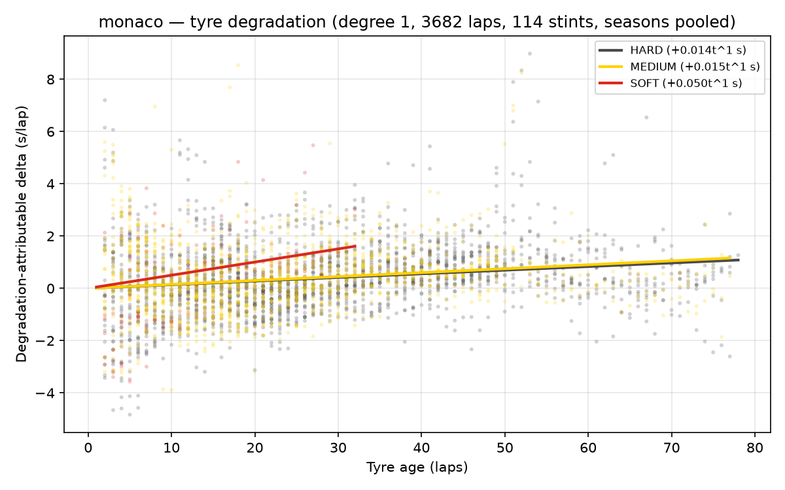
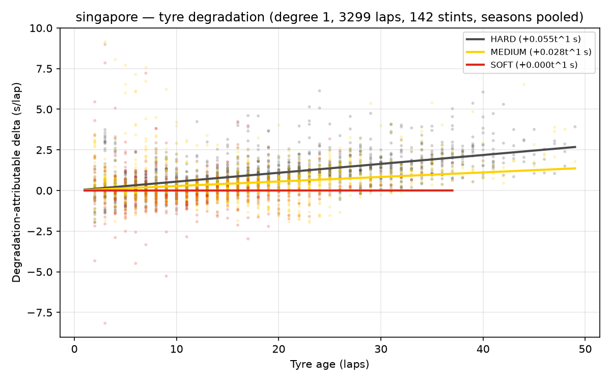
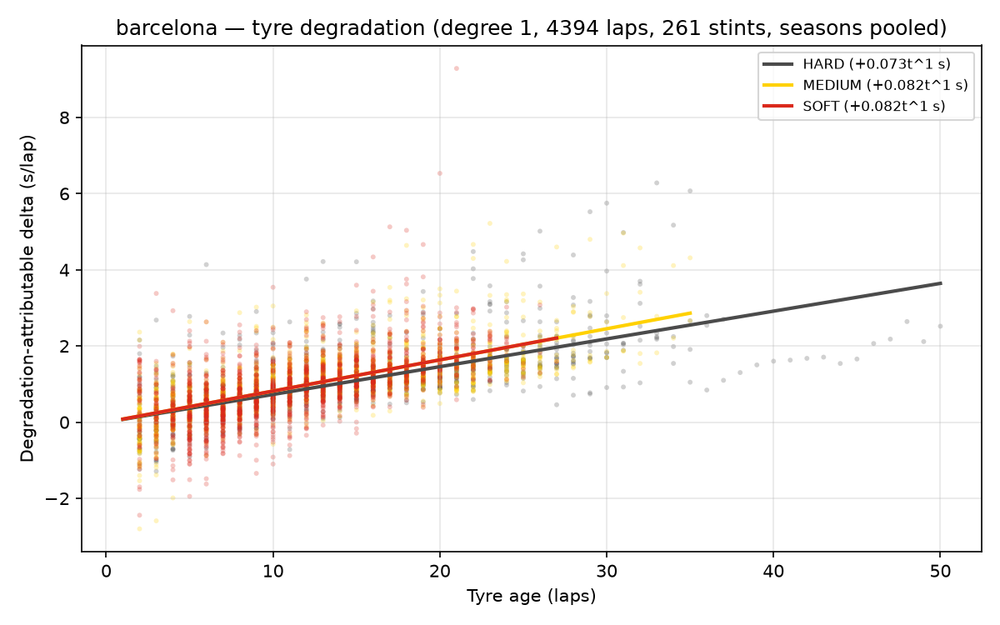
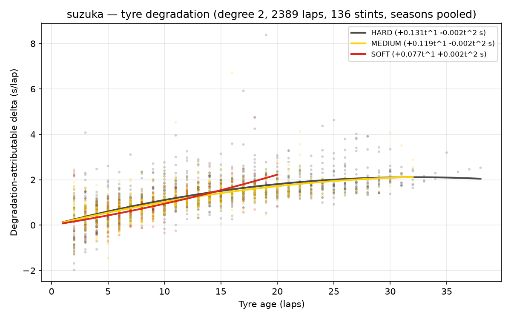

# Phase 2 — Tyre degradation model

Fixed-effects OLS per circuit (seasons pooled): `lap_time = a_driver_race + fuel*lap_number + deg_compound(tyre_age)`.
Degree (linear vs quadratic tyre-age term) selected per circuit by
leave-one-race-out CV RMSE on **within-stint demeaned** lap times —
the honest metric, since driver-race intercepts cannot transfer to an
unseen race. Data filters: pace laps, dry compounds, traffic trim at
1.1x driver median, stints with >= 5 laps.

## monaco

Frame: 3271 pace laps -> 3271 dry -> 3241 after traffic trim -> 3211 in stints >= 5 laps (95 stints, 55 driver-races).

**Selected degree: 2** (CV RMSE 1.262s vs 1.308s for degree 1). Overall fit R² = 0.616 (inflated by fixed effects; see CV).

Fuel-burn proxy: -0.0526 s/lap [-0.0675, -0.0376].

Degradation coefficients (s per lap of tyre age, 95% CI):

| Compound | t^1 | t^2 |
|---|---|---|
| HARD | +0.0474 [+0.0201, +0.0747] | -0.0005 [-0.0008, -0.0002] |
| MEDIUM | +0.0684 [+0.0344, +0.1023] | -0.0009 [-0.0014, -0.0004] |
| SOFT | +0.0521 [-0.1444, +0.2486] | +0.0008 [-0.0071, +0.0087] |

CV folds (degree 2):

| Test race | RMSE (s) | within-stint R² | laps | stints |
|---|---|---|---|---|
| 2023_monaco | 1.181 | -0.071 | 911 | 27 |
| 2024_monaco | 1.310 | 0.322 | 1156 | 22 |
| 2025_monaco | 1.295 | -0.030 | 1144 | 46 |

## singapore

Frame: 3032 pace laps -> 3032 dry -> 3031 after traffic trim -> 3027 in stints >= 5 laps (126 stints, 58 driver-races).

**Selected degree: 1** (CV RMSE 0.834s vs 0.859s for degree 2). Overall fit R² = 0.720 (inflated by fixed effects; see CV).

Fuel-burn proxy: -0.0498 s/lap [-0.0546, -0.0451].

Degradation coefficients (s per lap of tyre age, 95% CI):

| Compound | t^1 |
|---|---|
| HARD | +0.0568 [+0.0471, +0.0665] |
| MEDIUM | +0.0393 [+0.0276, +0.0510] |
| SOFT | +0.0195 [+0.0056, +0.0334] |

CV folds (degree 1):

| Test race | RMSE (s) | within-stint R² | laps | stints |
|---|---|---|---|---|
| 2023_singapore | 0.892 | -0.064 | 829 | 42 |
| 2024_singapore | 0.706 | -0.131 | 1093 | 41 |
| 2025_singapore | 0.905 | 0.026 | 1105 | 43 |

## barcelona

Frame: 3370 pace laps -> 3370 dry -> 3370 after traffic trim -> 3352 in stints >= 5 laps (191 stints, 59 driver-races).

**Selected degree: 2** (CV RMSE 0.565s vs 0.568s for degree 1). Overall fit R² = 0.792 (inflated by fixed effects; see CV).

Fuel-burn proxy: -0.0570 s/lap [-0.0592, -0.0548].

Degradation coefficients (s per lap of tyre age, 95% CI):

| Compound | t^1 | t^2 |
|---|---|---|
| HARD | +0.1111 [+0.0903, +0.1319] | -0.0014 [-0.0022, -0.0006] |
| MEDIUM | +0.1119 [+0.0887, +0.1350] | -0.0016 [-0.0023, -0.0008] |
| SOFT | +0.0875 [+0.0569, +0.1181] | -0.0002 [-0.0016, +0.0012] |

CV folds (degree 2):

| Test race | RMSE (s) | within-stint R² | laps | stints |
|---|---|---|---|---|
| 2023_barcelona | 0.537 | -0.034 | 1195 | 61 |
| 2024_barcelona | 0.597 | 0.023 | 1192 | 62 |
| 2025_barcelona | 0.562 | 0.059 | 965 | 68 |

## suzuka

Frame: 2418 pace laps -> 2418 dry -> 2412 after traffic trim -> 2389 in stints >= 5 laps (136 stints, 56 driver-races).

**Selected degree: 2** (CV RMSE 0.635s vs 0.666s for degree 1). Overall fit R² = 0.953 (inflated by fixed effects; see CV).

Fuel-burn proxy: -0.0811 s/lap [-0.0867, -0.0756].

Degradation coefficients (s per lap of tyre age, 95% CI):

| Compound | t^1 | t^2 |
|---|---|---|
| HARD | +0.1310 [+0.0941, +0.1679] | -0.0020 [-0.0030, -0.0011] |
| MEDIUM | +0.1186 [+0.0831, +0.1541] | -0.0016 [-0.0028, -0.0005] |
| SOFT | +0.0773 [-0.0111, +0.1658] | +0.0017 [-0.0044, +0.0077] |

CV folds (degree 2):

| Test race | RMSE (s) | within-stint R² | laps | stints |
|---|---|---|---|---|
| 2023_suzuka | 0.639 | -0.145 | 661 | 47 |
| 2024_suzuka | 0.620 | -0.043 | 739 | 48 |
| 2025_suzuka | 0.648 | -0.582 | 989 | 41 |

## Interpreting the CV numbers (read before using the coefficients)

- **CV RMSE (~0.55-1.3 s/lap)** is the lap-level noise any consumer of
  this model must expect around a pace prediction; Phase 4 uses it as
  the stochastic lap-noise scale per circuit.
- **Within-stint R² is frequently negative on real data**, while the
  identical pipeline scores ~0.85 on synthetic data at its noise floor
  (see `tests/test_degradation.py`). Meaning: a degradation trend
  fitted on two seasons often predicts a third season's within-stint
  evolution no better than a flat line. Season-specific conditions
  (temperatures, resurfacing, tyre-construction changes) materially
  move the true slope. This is a finding, not a failure — and it is
  the reason the simulator treats degradation as uncertain.
- **Consequence for Phase 4:** coefficients enter the simulator as
  distributions (via their CIs), never as trusted point values, and
  pit-window recommendations inherit that uncertainty.
- **Consequence for Phase 5:** real strategists' decisions must not be
  audited as if the true degradation slope had been knowable in-race.

## Does a pre-2026 fit predict the 2026 era?

The 2026 regulations (power unit, active aero + Manual Override
Mode, lighter/narrower cars, less fuel, narrower tyres) are a genuine
discontinuity, so the coefficients above are fit on 2023/2024/2025 only and the new era is held out
entirely rather than pooled in. That turns a stated caveat into a measured
one: train on the old regulations, predict a new-era race, score on the same
within-stint demeaned residual as the CV folds above, so the numbers are
directly comparable to them.

| Circuit | Season | RMSE (s) | within-stint R² | pre-era fold range | Verdict |
|---|---|---|---|---|---|
| monaco | 2026 | 1.203 | -0.177 | -0.071 to +0.322 | worse than every pre-era fold |
| suzuka | 2026 | 0.594 | -0.008 | -0.582 to -0.043 | better than every pre-era fold |

The last two columns are the point: a new-era R² is only meaningful next to
how well the same model predicts *pre-era* seasons it also never saw, and by
that standard the result is genuinely split rather than uniformly bad. So the
era boundary shows up far more clearly in the **coefficients** than in
**predictive transfer**: pooling the new era into Suzuka's fit halves its
tyre-age slope (HARD +0.131 -> +0.066 s/lap) and flips the cross-validated
degree selection, which is why the fits above hold it out — yet the held-out
new-era race is not reliably harder to predict than another unseen old-era
season. That is consistent with this project's central finding that slopes
are unstable season to season regardless of regulation change.

Stated as a limitation rather than a conclusion: this is two races at two
circuits, one season into a new formula. It is enough to justify not pooling
coefficients across the boundary; it is not enough to claim the new era is
either harder or easier to predict, and this table will answer that properly
only once several new-era seasons exist.

## Is the instability an OLS artefact? A GP robustness check

A natural objection: the negative out-of-sample R² might be an artefact of
forcing a low-degree *polynomial* onto the tyre-age curve. To test that, a
nonparametric **Gaussian-process** degradation curve (RBF kernel, per-compound,
hyperparameters by marginal likelihood; `src/degradation/gp_model.py`) was run
through the *identical* leave-one-race-out within-stint protocol. On the same
demeaned metric the GP reduces to a 1-D curve in tyre age, so it can bend
freely where a polynomial cannot.

Result (12 folds across 4 circuits, monaco, singapore, barcelona, suzuka):

| Model | Mean CV RMSE (s) | Folds won | Out-of-sample R² |
|---|---|---|---|
| OLS (fixed effects, degree 1) | 0.844 | 4 / 12 | 8 / 12 folds <= 0 |
| Gaussian process (nonparametric) | 0.838 | 8 / 12 | 9 / 12 folds <= 0 |

The GP is **statistically indistinguishable** from OLS: a +0.006 s/lap mean improvement on a 0.84 s/lap error (mean absolute per-fold difference 0.025 s), and both stay at or below zero R² out of sample on most folds. Added functional flexibility does **not** recover cross-season predictability.

**Conclusion:** the instability is a property of the *data* — the true
degradation slope genuinely moves between seasons — not of the OLS functional
form. This strengthens, rather than weakens, the decision to carry degradation
as a distribution into the simulator. OLS remains the reporting model (its
coefficients are directly interpretable and carry CIs); the GP stands as a
committed, reproducible robustness check.

## Online counterpart: a Kalman filter for in-race estimation

The model above is retrospective — it needs a full stint (indeed a full season)
before it can state a slope. A strategist needs the current tyres' degradation
rate *now*, updated every lap. `src/degradation/kalman.py` adds that online
counterpart: a local-linear-trend Kalman filter over state `[level, slope]`,
observing the pace offset each lap, returning the posterior slope and its
standard deviation after every lap.

On a real stint (ALO, HARD, 27 laps, Suzuka 2023) the online slope converges toward the
whole-stint OLS slope (+0.071 s/lap) while its uncertainty collapses
as laps arrive:

| After | Kalman slope (s/lap) |
|---|---|
| 5 laps | +0.062 ± 0.202 |
| 10 laps | +0.046 ± 0.071 |
| 27 laps | +0.072 ± 0.019 |

Unlike the static fit, the filter can also track a mid-stint change in the
degradation rate (the "cliff") rather than assuming one constant slope — see
`tests/test_kalman.py`. It complements, and does not replace, the batch model.

## Standard errors: why the intervals here are cluster-robust

Lap times inside one car's race are not independent observations. A car in
traffic, in a bad fuel phase, on a hot track, or with a driver having an
off stint produces a run of correlated residuals; and a car whose tyres
genuinely degrade faster than the field's average degrades faster on every
lap of the stint. The classical OLS formula assumes none of that and counts
the same information many times over, so it returns a standard error that
is too small. These fits therefore use cluster-robust standard errors
clustered by driver-race, with a t(G-1) reference distribution rather than
the normal.

The correction changes no point estimate — only what is claimed about their
precision. Measured on this run, per circuit and compound:

| circuit | compound | slope (s/lap) | 95% CI | SE | driver-races |
|---|---|---|---|---|---|
| monaco | HARD | +0.04743 | [+0.02011, +0.07474] | 0.01362 | 55 |
| monaco | MEDIUM | +0.06836 | [+0.03439, +0.10233] | 0.01694 | 55 |
| monaco | SOFT | +0.05210 | [-0.14439, +0.24859] | 0.09800 | 55 |
| singapore | HARD | +0.05681 | [+0.04711, +0.06650] | 0.00484 | 58 |
| singapore | MEDIUM | +0.03931 | [+0.02762, +0.05101] | 0.00584 | 58 |
| singapore | SOFT | +0.01949 | [+0.00556, +0.03341] | 0.00695 | 58 |
| barcelona | HARD | +0.11112 | [+0.09031, +0.13192] | 0.01039 | 59 |
| barcelona | MEDIUM | +0.11188 | [+0.08871, +0.13505] | 0.01157 | 59 |
| barcelona | SOFT | +0.08749 | [+0.05694, +0.11805] | 0.01527 | 59 |
| suzuka | HARD | +0.13099 | [+0.09407, +0.16791] | 0.01842 | 56 |
| suzuka | MEDIUM | +0.11858 | [+0.08305, +0.15410] | 0.01773 | 56 |
| suzuka | SOFT | +0.07735 | [-0.01109, +0.16579] | 0.04413 | 56 |

Against the classical formula these intervals are a median 2.23x wider
(range 1.48x to 2.93x), in the same direction at every circuit and for
every compound — which is what a real violation of the independence
assumption looks like, as opposed to noise. The estimator is validated by
coverage simulation in tests/test_robust_se.py: with independent errors it
costs nothing, and with the between-unit slope variation these data
actually show, the classical 95% interval covers 75% of the time while the
cluster-robust one holds 95%.

Downstream, the simulator draws each coefficient from t(G-1) scaled by
these standard errors. Across 48 decision points the P10-P90 race-time band
widens by a median of only 3% — the race-time distribution is dominated by
safety-car risk, not by coefficient uncertainty — but the recommended pit
lap changes in 16 of those 48 cases. The time output was never badly wrong;
the decision output was.

## Limitations (stated, not hidden)

- **Fuel and tyre age are separated only through the fixed-effects
  structure** (stints starting at different lap numbers); the fuel
  slope is a proxy that also absorbs track evolution, which grips up
  over the race. The two cannot be fully disentangled from timing
  data alone.
- **Cluster-robust standard errors, clustered by driver-race** (see
  the inference section above). They correct the understatement the
  classical formula produced here, but they are consistent in the
  number of *clusters*, and 55-59 driver-races per circuit is
  comfortable rather than abundant.
- **Track temperature is not a regressor** in the MVP; its effect is
  absorbed by race fixed effects (between races) and residual noise
  (within a race).
- **Compound allocation is not random**: teams fit HARD when they
  plan long stints. Slopes are descriptive of observed usage, not
  causal effects of compound choice.
- Within-stint R² is low where degradation is genuinely small
  (street circuits): when the true signal is ~0.02 s/lap, noise
  dominates and R² near zero is the honest outcome, not a failure.
